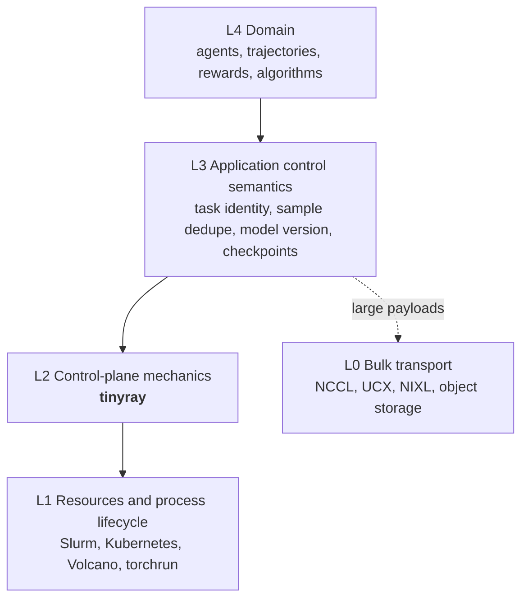

# Positioning

> Proposal; not the current implementation.

> tinyray is the layer between the scheduler and the application: identity,
> membership, reconciliation and discovery. Everything above it is domain
> semantics; everything below it is already solved.

## 1. Scope

This document fixes what tinyray owns and what it refuses. It is the boundary
that [02-architecture/01-layering.md](../02-architecture/01-layering.md)
formalises and that every module document is checked against.

## 2. The layer



The dotted line matters: L3 reaches L0 directly. Bulk data never enters L2.

## 3. Why L2 is the layer worth occupying

Two layers were considered and rejected.

**L1, process lifecycle.** An interface of `launch / stop / restart / status /
logs` over Kubernetes or Slurm. Rejected because it is already solved, by
systems with far more operational history than tinyray will ever have, and
because occupying it reintroduces the resource ownership that
[01-problem.md](01-problem.md) shows to be false at scale.

**L3, application semantics.** Task sharding, sample deduplication, policy
version windows. Rejected because these are the product. A framework that
defines what a task is has decided what experiments are possible.

L2 is what remains, and it is the layer that is currently written by hand, over
and over, inside every large control plane. Evidence from one such design, the
rl-bridge cell runtime proposal:

| Mechanism repeated by hand | Occurrences |
|---|---:|
| Logical identity requiring a generation and fencing check | **15 identity types** |
| Rejection of a stale generation | 5+ separate sections |
| Heartbeat aggregation | 3 tiers |
| Desired-versus-observed convergence | Stated once as a principle, implemented per component |
| Readiness that means more than "the port is open" | 3 places |

Fifteen hand-written generation checks is fifteen chances to write the check
that always passes. That class of bug does not appear in small tests — see
[06-testing/01-standard.md](../06-testing/01-standard.md) for a case where it
did not.

## 4. What tinyray owns

| Capability | Module |
|---|---|
| Logical slots, incarnations, fencing tokens | [01-identity](../03-modules/01-identity.md) |
| Hierarchical lease membership and expiry | [02-membership](../03-modules/02-membership.md) |
| Desired/observed reconciliation loops | [03-reconciliation](../03-modules/03-reconciliation.md) |
| Composable readiness predicates | [04-readiness](../03-modules/04-readiness.md) |
| Scoped discovery, bounded by the request | [05-discovery](../03-modules/05-discovery.md) |
| Admission control and backpressure primitives | [06-admission](../03-modules/06-admission.md) |
| Control RPC: framing, ordering, fencing, retry | [07-transport](../03-modules/07-transport.md) |
| Node-local process supervision and cleanup | [08-supervision](../03-modules/08-supervision.md) |

## 5. What tinyray refuses

Each refusal names the owner, so the boundary cannot erode quietly.

| Refused | Owner | Why |
|---|---|---|
| GPU and CPU allocation | L1 scheduler | Already allocated before tinyray is imported. Two ledgers disagree |
| Starting the job | L1 scheduler | `torchrun`, `srun` and Kubernetes own `__main__` |
| Gang placement | L1 scheduler | tinyray cannot place ten thousand ranks atomically because it places none. It can refuse to proceed until they have registered |
| Any tensor | L0 | See [02-architecture/04-planes.md](../02-architecture/04-planes.md) |
| Consensus storage | etcd | tinyray adapts to it; it does not reimplement Raft |
| Task identity, sharding, retry policy | L3 application | These define the experiment |
| Sample durability, deduplication, replay | L3 application | Tied to what a sample means |
| Model versions, weight manifests | L3 application | Tied to what a policy means |
| Checkpoints and step manifests | L3 application | Tied to what a step means |

## 6. Mechanism, not policy

The dividing line inside L2:

> tinyray provides the **mechanism**. The application chooses the **policy**.

| tinyray provides | The application decides |
|---|---|
| Leases that expire and fence | TTL; what expiry means for a task |
| Slots with incarnations | What a slot is; how many |
| A reconciliation loop | What desired and observed state contain |
| Readiness composition | Which predicates, at what thresholds |
| Scoped lookup | Which scope a worker needs |
| Bounded queues that reject | The bound, and what a rejection means |

A mechanism that also chooses policy is a framework, and a framework at L2
becomes an obstacle at L3.

## 7. Three ways to adopt it

Increasing intrusion. Most integrations should stop at the first.

**Level 1 — one line in an unmodified script.** The script keeps `__main__`,
its own `init_process_group`, its own model construction. tinyray adds a control
port and a registration.

```python
dist.init_process_group("nccl")     # yours
trainer = build_trainer()           # yours
tinyray.join(trainer, group="trainer")   # returns; does not block
```

**Level 2 — a supervised process.** tinyray starts a command it did not write,
watches it, detects readiness by observation, and cleans up its process tree.
For engines that are servers rather than libraries.

**Level 3 — a tinyray-owned process.** For code written for tinyray with no
framework of its own to defer to. Not the main line.

## 8. Relationship to rl-bridge

tinyray is L2; rl-bridge is L3 and L4. The mapping against the
[cell runtime proposal](../../../rl-bridge/docs/08-proposals/02-cell-based-high-availability-runtime.md):

| rl-bridge concept | Built on tinyray | tinyray does not know |
|---|---|---|
| `cell_generation`, `collector_generation`, `engine_generation` | Slot + Incarnation | What a collector is |
| Cell heartbeat aggregation, `CellSummary` | Hierarchical membership | The fields inside the summary |
| `desired_rollout_state` convergence | Reconciler | What rollout state means |
| Engine readiness including model version | Readiness composition | What a model version is |
| Collector to Ingest addressing | Scoped discovery | Why they talk |
| Collector admission on overload | Admission | The thresholds |
| `TaskShard`, `assignment_id`, lease policy | — | Entirely rl-bridge |
| `sample_group_id`, dedupe, WAL | — | Entirely rl-bridge |
| `WeightManifest`, `StepManifest` | — | Entirely rl-bridge |

The proposal's §23 places Ray at `RuntimeBackend: launch/stop/restart/status/logs`.
That is L1. tinyray declines that position for the reasons in §3.

## 9. Limitations and trade-offs

- **A library, not a system.** tinyray has no opinion about whether your cluster
  is healthy; it reports membership and lets you decide. Teams wanting a
  turnkey runtime will find this insufficient, correctly.
- **Two stores.** Linearizable state in etcd, soft state in tinyray's registry.
  One store is simpler; one store either melts (everything in etcd) or is
  unsafe (everything soft). The split is defended in
  [02-architecture/03-state-model.md](../02-architecture/03-state-model.md).
- **The boundary requires discipline.** Every convenience that leaks an L3
  concept into L2 makes the next one easier. The refusal table in §5 exists to
  be cited in review.

## 10. Source mapping

Proposed: `python/tinyray/identity.py`, `membership.py`, `reconcile.py`,
`readiness.py`, `discovery.py`, `admission.py`, `supervision.py`, and the
existing Rust transport under `crates/`.

To be removed: placement, the resource table and the launcher —
[08-project/01-status.md](../08-project/01-status.md).
