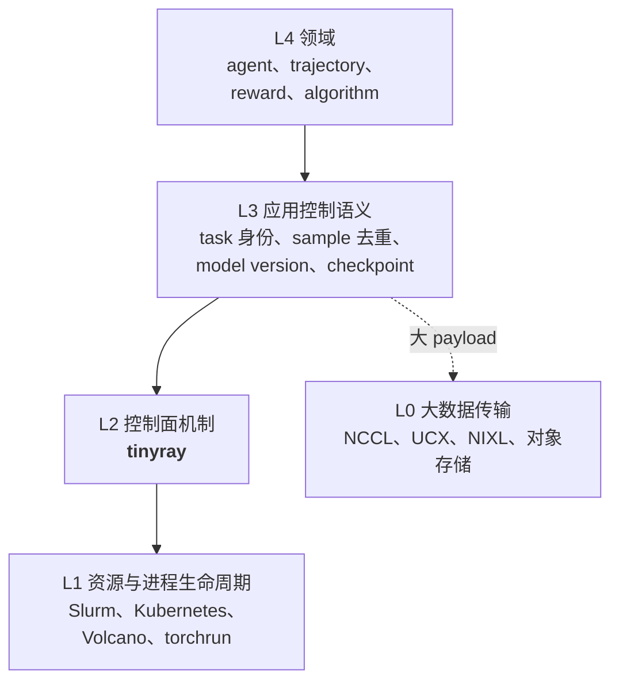

# 定位

> 提案；当前未实现。

> tinyray 处在调度器与应用之间：identity、membership、reconciliation 和 discovery。
> 它之上是领域语义，它之下已被解决。

## 1. 范围

本文确定 tinyray 负责什么、拒绝什么。这条边界由
[02-architecture/01-layering.md](../02-architecture/01-layering.md) 形式化，并作为每篇
模块文档的检查依据。

## 2. 所在层



虚线是关键：L3 直接连到 L0。大数据永不进入 L2。

## 3. 为什么值得占据 L2

考虑过并否决了另外两层。

**L1，进程生命周期。** 在 Kubernetes 或 Slurm 之上封装 `launch / stop / restart /
status / logs`。否决理由：这一层已经被运维history远超 tinyray 的系统解决了；而且占据它
就重新引入了 [01-problem.md](01-problem.md) 已证伪的资源所有权。

**L3，应用语义。** task 分片、sample 去重、policy version 窗口。否决理由：这些就是产品
本身。一个定义了“什么是 task”的框架，已经决定了哪些实验做得出来。

剩下的是 L2 —— 而这一层目前正在被每个大型控制面反复手写。来自一份此类设计（rl-bridge
Cell Runtime 提案）的证据：

| 被手写重复的机制 | 出现次数 |
|---|---:|
| 需要 generation 和 fencing 校验的逻辑 identity | **15 种 identity** |
| 拒绝过期 generation 的逻辑 | 5 处以上独立章节 |
| heartbeat 聚合 | 3 层 |
| desired 与 observed 收敛 | 作为原则写了一次，各组件各自实现 |
| 含义超出“端口打开了”的 Readiness | 3 处 |

十五份手写的 generation 校验，就是十五次写出“永远通过”的那份校验的机会。这类 bug 不会
在小规模测试里出现 —— [06-testing/01-standard.md](../06-testing/01-standard.md) 记录了
一次它确实没出现的情况。

## 4. tinyray 负责什么

| 能力 | 模块 |
|---|---|
| 逻辑 Slot、Incarnation、fencing token | [01-identity](../03-modules/01-identity.md) |
| 分层 lease membership 与过期 | [02-membership](../03-modules/02-membership.md) |
| desired/observed reconciliation 循环 | [03-reconciliation](../03-modules/03-reconciliation.md) |
| 可组合 Readiness 谓词 | [04-readiness](../03-modules/04-readiness.md) |
| 作用域 discovery，响应大小由请求决定 | [05-discovery](../03-modules/05-discovery.md) |
| Admission 与 backpressure 原语 | [06-admission](../03-modules/06-admission.md) |
| 控制 RPC：framing、顺序、fencing、retry | [07-transport](../03-modules/07-transport.md) |
| 节点内进程监督与清理 | [08-supervision](../03-modules/08-supervision.md) |

## 5. tinyray 拒绝什么

每条拒绝都指明归属，边界才不会悄悄侵蚀。

| 拒绝的事项 | 归属 | 原因 |
|---|---|---|
| GPU 与 CPU 分配 | L1 调度器 | tinyray 被 import 之前就已分配完毕。两本账只会互相矛盾 |
| 拉起作业 | L1 调度器 | `torchrun`、`srun` 和 Kubernetes 拥有 `__main__` |
| gang placement | L1 调度器 | tinyray 放置不了一万个 rank，因为它一个都不放置。它能做的是在这些 rank 注册齐之前拒绝往下走 |
| 任何 tensor | L0 | 见 [02-architecture/04-planes.md](../02-architecture/04-planes.md) |
| 共识存储 | etcd | tinyray 适配它，不重新实现 Raft |
| task 身份、分片、retry 策略 | L3 应用 | 这些定义了实验本身 |
| sample 持久化、去重、重放 | L3 应用 | 与“什么是 sample”绑定 |
| model version、weight manifest | L3 应用 | 与“什么是 policy”绑定 |
| checkpoint 与 step manifest | L3 应用 | 与“什么是 step”绑定 |

## 6. 只提供机制，不决定策略

L2 内部的分界线：

> tinyray 提供**机制**，应用选择**策略**。

| tinyray 提供 | 应用决定 |
|---|---|
| 会过期并 fencing 的 Lease | TTL 多长；过期对 task 意味着什么 |
| 带 Incarnation 的 Slot | Slot 是什么；有多少个 |
| reconciliation 循环 | desired 和 observed 里放什么 |
| Readiness 组合 | 用哪些谓词、阈值多少 |
| 作用域 lookup | 一个 worker 需要哪个作用域 |
| 会拒绝的有界队列 | 界限是多少；拒绝意味着什么 |

一个同时决定策略的机制就是框架，而 L2 上的框架会成为 L3 的障碍。

## 7. 三档接入方式

侵入性递增。多数集成停在第一档即可。

**第 1 档 —— 未修改脚本里加一行。** 脚本保留 `__main__`、自己的
`init_process_group`、自己的模型构建。tinyray 只增加一个控制端口和一次注册。

```python
dist.init_process_group("nccl")     # 你的
trainer = build_trainer()           # 你的
tinyray.join(trainer, group="trainer")   # 立即返回，不阻塞
```

**第 2 档 —— 被监督的进程。** tinyray 拉起一个它没写过的命令，监视它，通过观察判断
readiness，并清理其进程树。适用于以 server 而非 library 形态存在的引擎。

**第 3 档 —— tinyray 拥有的进程。** 适用于专为 tinyray 编写、没有自身框架需要让位的
代码。不是主线。

## 8. 与 rl-bridge 的关系

tinyray 是 L2，rl-bridge 是 L3 和 L4。对照
[Cell Runtime 提案](../../../rl-bridge/docs/08-proposals/02-cell-based-high-availability-runtime.md)：

| rl-bridge 概念 | 建立在 tinyray 之上 | tinyray 不知道的部分 |
|---|---|---|
| `cell_generation`、`collector_generation`、`engine_generation` | Slot + Incarnation | Collector 是什么 |
| Cell heartbeat 聚合、`CellSummary` | 分层 membership | summary 里的字段 |
| `desired_rollout_state` 收敛 | Reconciler | rollout state 的含义 |
| 含 model version 的 Engine readiness | Readiness 组合 | model version 是什么 |
| Collector 到 Ingest 的寻址 | 作用域 discovery | 它们为何通信 |
| Collector 过载时拒绝 | Admission | 阈值 |
| `TaskShard`、`assignment_id`、lease 策略 | —— | 完全属于 rl-bridge |
| `sample_group_id`、去重、WAL | —— | 完全属于 rl-bridge |
| `WeightManifest`、`StepManifest` | —— | 完全属于 rl-bridge |

该提案 §23 把 Ray 放在
`RuntimeBackend: launch/stop/restart/status/logs`，那是 L1。tinyray 基于 §3 的理由拒绝
这个位置。

## 9. 限制与取舍

- **是库，不是系统。** tinyray 对“你的集群是否健康”没有观点；它报告 membership，由你
  判断。想要开箱即用 runtime 的团队会觉得不够 —— 这个判断是对的。
- **两个存储。** 线性一致状态在 etcd，软状态在 tinyray 的 Registry。单一存储更简单，但
  要么会被压垮（全放 etcd），要么不安全（全放软状态）。拆分理由见
  [02-architecture/03-state-model.md](../02-architecture/03-state-model.md)。
- **边界需要纪律维护。** 每一个把 L3 概念泄漏进 L2 的便利，都会让下一个更容易发生。
  §5 的拒绝表就是用来在评审时引用的。

## 10. 源码映射

计划新增：`python/tinyray/identity.py`、`membership.py`、`reconcile.py`、
`readiness.py`、`discovery.py`、`admission.py`、`supervision.py`，以及 `crates/` 下已有的
Rust transport。

计划删除：placement、资源表和 launcher ——
[08-project/01-status.md](../08-project/01-status.md)。
