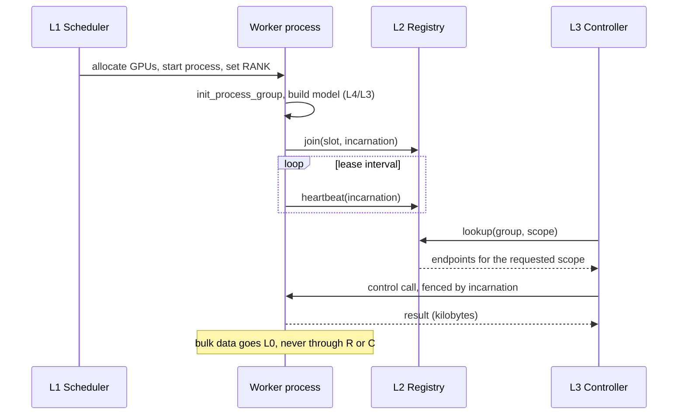

# Layering

> Proposal; not the current implementation.

> Five layers, and tinyray occupies exactly one. The boundary is enforced by
> naming, for every capability, which layer owns it.

## 1. Problem

Distributed ML systems conflate resource allocation, process lifecycle,
membership, and application semantics into one runtime. That works until any one
of them needs to scale independently — and at ten thousand GPUs all four do,
in different directions.

## 2. Goals

- Give every capability exactly one owning layer.
- Make the boundary checkable in review rather than a matter of taste.
- Let each layer be replaced without rewriting the others.

## 3. Non-goals

- Defining the layers below and above tinyray. They are described only to the
  extent needed to fix the boundary.
- Prescribing a scheduler, a transport or an application design.

## 4. Design

| Layer | Contents | Owner | Replaceable by |
|---|---|---|---|
| **L4** Domain | Agents, trajectory trees, rewards, algorithms | Application | — |
| **L3** Application control semantics | Task identity and sharding, sample deduplication, model version windows, checkpoints, step manifests | Application | — |
| **L2** Control-plane mechanics | Identity and fencing, membership and leases, reconciliation, readiness, discovery, admission, control RPC, node supervision | **tinyray** | Hand-written equivalent |
| **L1** Resources and process lifecycle | Node and GPU allocation, process start and stop, quotas, images | Slurm, Kubernetes, Volcano, Azure Jobs, `torchrun` | Each other |
| **L0** Bulk transport | Weights, samples, activations | NCCL, UCX, NIXL, object storage | Each other |

### 4.1 The two boundaries that matter

**L2 / L1.** tinyray never allocates or launches. It *observes* what L1 did —
reading `RANK`, `LOCAL_RANK`, `CUDA_VISIBLE_DEVICES` — and never writes them.

The exception is node-local supervision
([03-modules/08-supervision.md](../03-modules/08-supervision.md)): when L1 hands
tinyray a node and asks it to run several processes on it, tinyray supervises
them. It still does not decide *which* node or *how many* GPUs.

**L2 / L3.** tinyray provides mechanism; L3 provides policy and every domain
noun. If a tinyray API mentions a task, a sample, a model version or a
checkpoint, the boundary has been crossed.

### 4.2 Capability assignment

| Capability | Layer | Note |
|---|---|---|
| Which node runs what | L1 | tinyray reads the result |
| GPU assignment | L1 | Reported by tinyray, never chosen |
| Process start and stop | L1, or L2 within one node | See §4.1 |
| Process tree cleanup | L2 | L1 rarely does this correctly for a process it did not fork |
| Liveness of a worker | L2 | By lease, not by parenthood |
| Aggregating liveness upward | L2 | Hierarchical |
| Who exists and where | L2 | Scoped lookup |
| Instance identity across restarts | L2 | Slot + incarnation |
| Rejecting a stale writer | L2 | Fencing in the transport |
| Leader election | L2 adapter over etcd | tinyray wraps, does not implement |
| Desired configuration | L3 defines, L2 delivers | Schema is L3's |
| Convergence loop | L2 | The loop, not the state |
| "Is this worker ready" | L2 composes, L3 supplies predicates | |
| Refusing work when overloaded | L2 | The bound is L3's |
| Control messages | L2 | Kilobytes |
| Sample and weight bytes | L0 | Never through L2 |
| What a task is | L3 | |
| Retry and deduplication of work | L3 | tinyray provides at-most-once delivery of a *call*, not of a *task* |
| Durability of results | L3 | |

## 5. Normal flow

The diagram cannot show: the heartbeat is to the *cell*, not to a global
registry ([02-topology.md](02-topology.md)); the lookup is served from cache
when the registry is unreachable; and the control call is rejected if the
incarnation is stale.

## 6. State and ownership

| State | Owner | Layer | Persisted |
|---|---|---|---|
| Node and GPU allocation | Scheduler | L1 | Scheduler's store |
| Slot roster and endpoints | Registry | L2 | No — soft state |
| Incarnation per slot | Worker, recorded by registry | L2 | No |
| Cell leadership, desired configuration | Consensus store | L2 adapter | Yes |
| Task, sample, version, checkpoint state | Application | L3 | Application's store |

## 7. Correctness invariants

- No L2 interface accepts or returns a resource quantity.
- No L2 interface names a domain noun.
- No payload above the control-message bound crosses L2.
- L2 reads launcher environment variables and never writes them.
- Every L2 write carries an incarnation; receivers reject stale ones.
- L2 state, other than the consensus slice, is re-derivable from its owners
  within one lease period.

The first two are checked structurally by `tests/test_suite_quality.py`.

## 8. Failure and recovery

| Layer fails | Effect on tinyray | Effect on the job |
|---|---|---|
| L0 transport | None; tinyray does not use it | Application handles |
| L1 scheduler unreachable | No new processes start | Running work continues |
| L2 registry unreachable | Lookups served from cache | Continues; no membership changes |
| L2 consensus unreachable | No leadership or configuration change | Continues under the last known configuration |
| L3 controller down | tinyray unaffected | No new decisions |

That every row degrades rather than stops is the point of the layering.

## 9. Observability

Each layer reports separately, and tinyray does not aggregate other layers'
metrics. It exposes membership, lease, fencing and admission counters — see
[05-operations/03-observability.md](../05-operations/03-observability.md).

## 10. Trade-offs

- **More moving parts than a single runtime.** Four systems instead of one, and
  four failure modes to learn. Bought back by each being independently
  replaceable and independently tested.
- **tinyray cannot prevent resource conflicts.** With no ledger, two processes
  can be given the same GPU. The scheduler must prevent that; tinyray will
  report the collision but not stop it.
- **The boundary needs defending.** The easiest way to make an L3 problem go
  away is to add an L2 API for it. The capability table in §4.2 exists to be
  cited when that is proposed.

## 11. Implementation and testing

Structural tests assert the boundary rather than trusting review:

| Behaviour | Test |
|---|---|
| No public API accepts a resource quantity | `tests/test_suite_quality.py` |
| No public API names a domain noun | `tests/test_suite_quality.py` |
| Every control operation has a byte budget | `tests/test_driver_byte_budget.py` |
| Environment variables are read, never written | `tests/test_suite_quality.py` |
