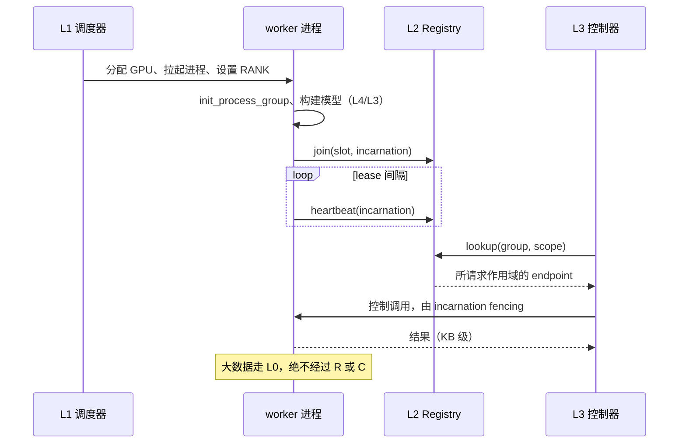

# 分层

> 提案；当前未实现。

> 五层，tinyray 只占其中一层。边界通过为每项能力指明归属层来强制。

## 1. 问题

分布式 ML 系统把资源分配、进程生命周期、membership 和应用语义混成一个 runtime。这在
其中任何一项需要独立扩展之前都能用 —— 而在万卡规模上，四项都需要，且方向各不相同。

## 2. 目标

- 每项能力恰好有一个归属层。
- 边界在评审中可核对，而不是靠品味。
- 每层可被替换而不需要重写其他层。

## 3. 非目标

- 定义 tinyray 之上和之下的层。它们只在确定边界所需的范围内被描述。
- 规定调度器、传输方式或应用设计。

## 4. 设计

| 层 | 内容 | 归属 | 可替换为 |
|---|---|---|---|
| **L4** 领域 | agent、trajectory tree、reward、algorithm | 应用 | —— |
| **L3** 应用控制语义 | task 身份与分片、sample 去重、model version 窗口、checkpoint、step manifest | 应用 | —— |
| **L2** 控制面机制 | identity 与 fencing、membership 与 lease、reconciliation、Readiness、discovery、Admission、控制 RPC、节点监督 | **tinyray** | 手写等价物 |
| **L1** 资源与进程生命周期 | 节点与 GPU 分配、进程启停、配额、镜像 | Slurm、Kubernetes、Volcano、Azure Jobs、`torchrun` | 彼此 |
| **L0** 大数据传输 | weight、sample、activation | NCCL、UCX、NIXL、对象存储 | 彼此 |

### 4.1 真正重要的两条边界

**L2 / L1。** tinyray 从不分配也不拉起。它**观察** L1 做了什么 —— 读取 `RANK`、
`LOCAL_RANK`、`CUDA_VISIBLE_DEVICES` —— 从不写入它们。

例外是节点内监督
（[03-modules/08-supervision.md](../03-modules/08-supervision.md)）：当 L1 把一个节点交给
tinyray 并要求在上面跑若干进程时，tinyray 监督这些进程。它仍然不决定**哪个**节点或
**多少**张 GPU。

**L2 / L3。** tinyray 提供机制，L3 提供策略和全部领域名词。如果某个 tinyray API 里出现
task、sample、model version 或 checkpoint，边界就已经被越过。

### 4.2 能力归属

| 能力 | 层 | 说明 |
|---|---|---|
| 哪个节点跑什么 | L1 | tinyray 读取结果 |
| GPU 分配 | L1 | tinyray 上报，从不选择 |
| 进程启停 | L1，或节点内的 L2 | 见 §4.1 |
| 进程树清理 | L2 | L1 对自己没 fork 的进程很少能做对 |
| worker 存活性 | L2 | 用 lease，不用父子关系 |
| 存活性向上聚合 | L2 | 分层 |
| 谁存在、在哪 | L2 | 作用域 lookup |
| 跨重启的实例 identity | L2 | Slot + Incarnation |
| 拒绝过期写入者 | L2 | transport 内的 fencing |
| leader 选举 | L2 适配 etcd | tinyray 封装，不实现 |
| desired 配置 | L3 定义，L2 投递 | schema 属于 L3 |
| 收敛循环 | L2 | 循环属于 L2，状态不属于 |
| “这个 worker 就绪了吗” | L2 组合，L3 提供谓词 | |
| 过载时拒绝工作 | L2 | 界限属于 L3 |
| 控制消息 | L2 | KB 级 |
| sample 与 weight 字节 | L0 | 绝不经过 L2 |
| task 是什么 | L3 | |
| 工作的 retry 与去重 | L3 | tinyray 提供**一次调用**的至多一次投递，不是**一个 task** 的 |
| 结果持久化 | L3 | |

## 5. 正常流程

图中无法表达：heartbeat 发往 **Cell** 而非全局 Registry
（[02-topology.md](02-topology.md)）；Registry 不可达时 lookup 由缓存服务；以及
Incarnation 过期时控制调用会被拒绝。

## 6. 状态与所有权

| State | Owner | 层 | Persisted |
|---|---|---|---|
| 节点与 GPU 分配 | 调度器 | L1 | 调度器的存储 |
| Slot 名册与 endpoint | Registry | L2 | 否 —— 软状态 |
| 每个 Slot 的 Incarnation | worker，由 Registry 记录 | L2 | 否 |
| Cell leadership、desired 配置 | 共识存储 | L2 适配层 | 是 |
| task、sample、version、checkpoint 状态 | 应用 | L3 | 应用的存储 |

## 7. 正确性不变量

- 没有任何 L2 接口接受或返回资源数量。
- 没有任何 L2 接口出现领域名词。
- 超过控制消息上限的 payload 不跨越 L2。
- L2 读取 launcher 环境变量，从不写入。
- 每次 L2 写入都携带 Incarnation；接收端拒绝过期的。
- 除共识那一片之外，L2 状态都能由其 owner 在一个 lease 周期内重建。

前两条由 `tests/test_suite_quality.py` 结构性检查。

## 8. 故障与恢复

| 失效的层 | 对 tinyray 的影响 | 对作业的影响 |
|---|---|---|
| L0 传输 | 无；tinyray 不使用它 | 由应用处理 |
| L1 调度器不可达 | 无法拉起新进程 | 运行中的工作继续 |
| L2 Registry 不可达 | lookup 走缓存 | 继续；membership 不变更 |
| L2 共识不可达 | leadership 与配置无法变更 | 在最后已知配置下继续 |
| L3 控制器宕机 | tinyray 不受影响 | 不做新决策 |

每一行都是降级而非停止 —— 这正是分层的目的。

## 9. 可观测性

每层各自上报，tinyray 不聚合其他层的指标。它暴露 membership、lease、fencing 和
Admission 计数器，见
[05-operations/03-observability.md](../05-operations/03-observability.md)。

## 10. 取舍

- **组件数比单一 runtime 多。** 四个系统而不是一个，四套故障模式要学。换回来的是每个都
  可独立替换、独立测试。
- **tinyray 无法阻止资源冲突。** 没有账本，两个进程可能拿到同一张 GPU。必须由调度器阻止；
  tinyray 会报告冲突但不会阻止它。
- **边界需要防守。** 让一个 L3 问题消失的最简单办法就是给它加一个 L2 API。§4.2 的能力表
  就是用来在有人提出时引用的。

## 11. 实现与测试

用结构性测试断言边界，而不是依赖评审：

| Behavior | Test file |
|---|---|
| 没有公共 API 接受资源数量 | `tests/test_suite_quality.py` |
| 没有公共 API 出现领域名词 | `tests/test_suite_quality.py` |
| 每个控制操作都有字节预算 | `tests/test_driver_byte_budget.py` |
| 环境变量只读不写 | `tests/test_suite_quality.py` |
