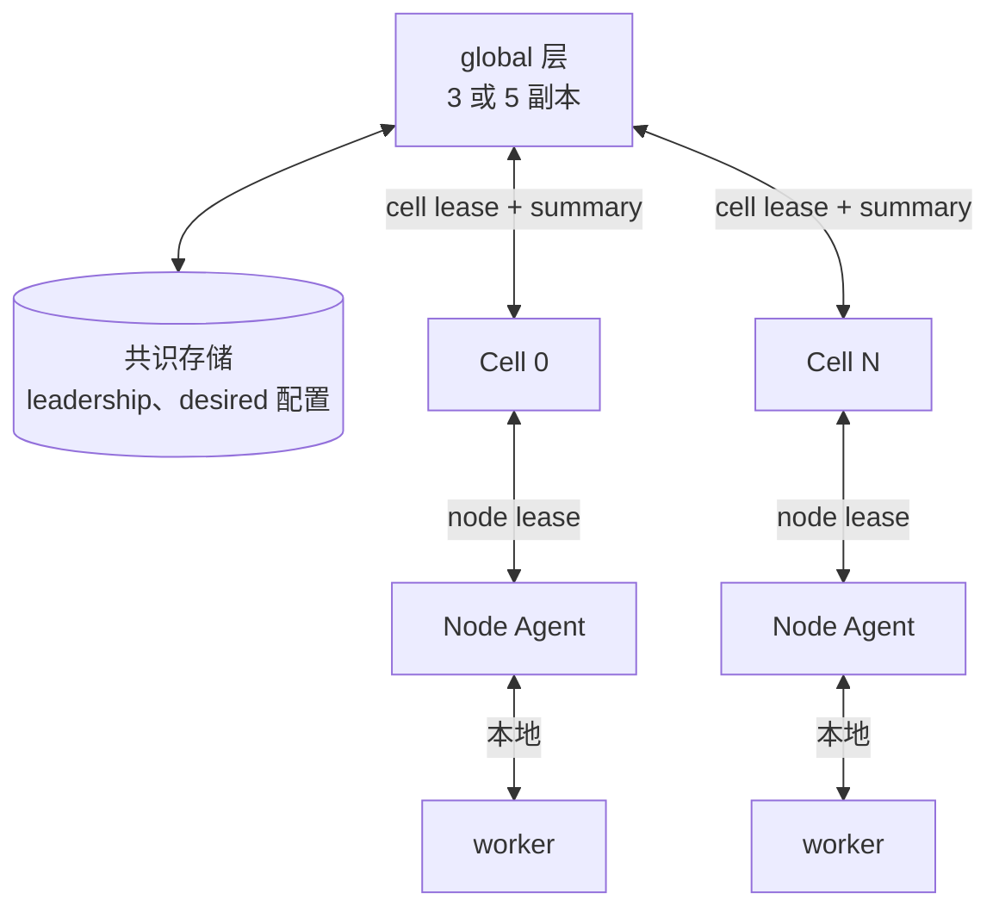
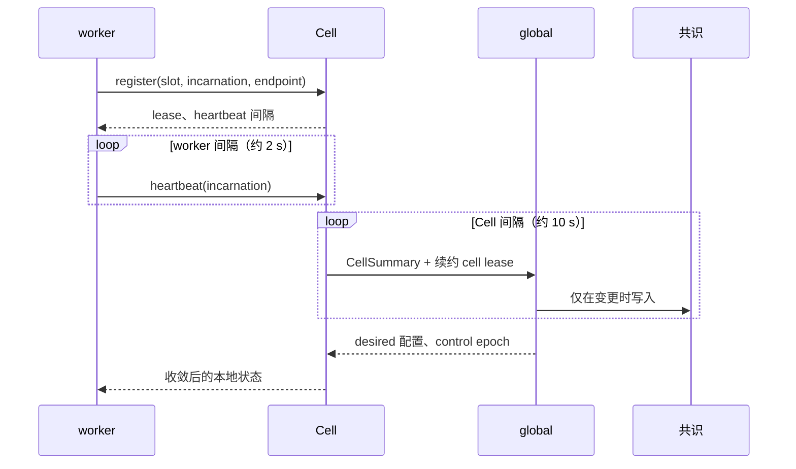

# 拓扑

> 提案；当前未实现。

> 三层 —— worker、Cell、global —— 因为每一个不允许随集群增长的量，都由一条层边界限制住。

## 1. 问题

扁平控制面让三个量与集群规模成正比：一个进程收到的 heartbeat 数、一个进程知道的
endpoint 数、一个进程发出的调用数。万卡下三者都是致命的，实测见
[01-overview/01-problem.md](../01-overview/01-problem.md)。

## 2. 目标

- 每个扇出都由层限制，而不是由集群规模限制。
- 故障单元小于作业。
- 共识存储的写入速率与 worker 数无关。

## 3. 非目标

- 选定 Cell 大小。这是每次部署的容量规划决定，见 §4.2。
- 定义 Cell 内跑什么。tinyray 不知道。

## 4. 设计

### 4.1 各层职责

| 层 | 知道 | 扇出 | 持有 |
|---|---|---|---|
| **global** | Cell | O(cells) | leadership、desired 配置、Cell 名册 |
| **Cell** | 自己的节点与 worker | O(每 Cell worker 数) | worker membership、本地状态 |
| **Node Agent** | 自己的进程 | O(每节点进程数) | 进程监督、本地健康 |
| **worker** | 自己作用域内的 peer | O(scope) | 自己的注册 |

使这套成立的不变量：

> 任何一层寻址的成员数都不超过该层自身的成员数。

### 4.2 Cell 大小

Cell 是故障与 membership 单元。tinyray 不选择它的大小，但记录各方作用力：

| 因素 | Cell 太小 | Cell 太大 |
|---|---|---|
| Cell 控制器数量 | 增多 | 减少 |
| 跨 Cell 流量 | 增多 | 减少 |
| 单 Cell 故障爆炸半径 | 更小 | 更大 |
| 与网络 fabric 的局部性 | 可能被切碎 | 可能跨越多个故障域 |
| 共识写入速率 | 更高 | 更低 |

**建议**：Cell 边界应与 **collective communicator 作用域**重合。

理由不是美学。NCCL 不容错：一个 rank 的死亡会毒化它所在的 communicator，其余每个 rank
都会阻塞在下一次 collective 上。如果控制单元与 communicator 作用域不同，一次死亡要么
跨掉多个控制单元，要么留下一个半死的。两者重合时，一次死亡就是一次 Cell 重建，其余
Cell 完全不会察觉。

**推导**，5,000 张 rollout GPU、每 Cell 128 GPU：40 个 Cell；损失一个 Cell 相当于 2.56%
的 rollout 容量。

### 4.3 共识存储为何撑得住

**推导**共识存储负载，10,000 个 worker，每 Cell 128 GPU：

| 设计 | lease 持有者 | 10 s 续约速率 |
|---|---:|---:|
| 扁平，每 worker | 10,000 | 1,000/s |
| 分层，每 Cell | 约 78 | 7.8/s |

Kubernetes 官方支持 5,000 节点，并把节点 lease 记录为 etcd 压力来源
（[大集群指南](https://kubernetes.io/docs/setup/best-practices/cluster-large/)）。扁平
设计要的是该节点预算的两倍，还要叠加在集群自身负载之上；分层设计要的是一个舍入误差。

worker heartbeat 终止于 Cell，并按每 Cell 每周期一份 summary 向上聚合。

### 4.4 退化拓扑

同一份代码必须在所有规模上运行，否则开发时面对的就不是生产时的那个系统。

| 部署 | global | Cell | Node Agent |
|---|---|---|---|
| 笔记本单进程 | 进程内 | 1 | 0 |
| 单节点多进程 | 进程内 | 1 | 1 |
| 小集群 | 1 副本 | 每节点 1 | 每节点 1 |
| 生产 | 3 或 5 副本 + 共识 | 每故障域 1 | 每节点 1 |

层是被**折叠**，不是被移除。`tinyray.join()` 在四种形态下完全一致。

## 5. 正常流程

图中无法表达：worker heartbeat 永不到达 global；Cell summary 大小与 worker 数无关；
global 只在 membership 或配置变更时写共识，而不是每个周期都写。

## 6. 状态与所有权

| State | Owner | 层 | Persisted | 可重建自 |
|---|---|---|---|---|
| worker 注册 | worker | Cell | 否 | 一次 heartbeat |
| Cell membership | Cell | Cell | 否 | 一轮 heartbeat |
| Cell summary | Cell | global | 否 | 一个 Cell 周期 |
| Cell 名册 | global | 共识 | 是 | 否 |
| leadership | 共识 | 共识 | 是 | 否 |
| desired 配置 | 应用经 global | 共识 | 是 | 否 |

“可重建自”这一列就是设计本身：共识线以下全是软状态，所以复制它不需要达成一致。见
[03-state-model.md](03-state-model.md)。

## 7. 正确性不变量

- 任何一层都不为“比自己子层更低的层”保存 per-member 记录。
- Cell 控制器不持有任何其 worker 无法重新告知它的状态。重启后的控制器在一个 heartbeat
  周期后即正确。
- 共识写入是 O(membership 变更 + 配置变更)，绝不是 O(worker × 时间)。
- 失去 lease 的 Cell 停止接受新工作，但不停止已有工作。
- lease 过期的 worker 从 lookup 中移除，无论是否有任何东西在监督它的进程。

## 8. 故障与恢复

| 故障 | 检测方 | 时限 | 影响 |
|---|---|---|---|
| worker 死亡 | 其 Cell 的 lease 过期 | worker TTL | 从 lookup 移除；Cell 容量下降 |
| Node Agent 死亡 | node lease 过期 | node TTL | 其进程被回收 |
| Cell 控制器死亡 | standby 以新 generation 接管 | Cell TTL | Cell 短暂不再调度；运行中工作继续 |
| Cell 与 global 分区 | cell lease 过期 | Cell TTL | Cell 完成有效工作，不再申请新的 |
| global leader 死亡 | 共识 leader 选举 | 选举超时 | 不做配置变更；Cell 继续 |
| 共识不可用 | 客户端 | —— | leadership 与配置不可变更；其余一切继续 |

每一行都是降级，没有一行会停掉作业。

## 9. 可观测性

按层上报，不跨层聚合：

| 层 | 上报 |
|---|---|
| worker | 自身 readiness、队列、inflight、Admission |
| Cell | ready 容量、lease 过期数、membership 抖动、控制延迟 |
| global | 存活 Cell 数、不可用容量、leader 变更、共识写入速率 |

## 10. 取舍

- **检测更慢。** worker 死亡到达 global 需要 worker TTL 加一个 Cell 周期，而非立即。
  可接受：global 不需要快速知道，而需要快速知道的 Cell 在一个 TTL 内就知道了。
- **Cell 控制器是局部单点。** 没有控制器的 Cell 不再调度新工作。缓解手段是软状态使
  standby 接管很便宜，以及运行中的工作不受影响。
- **Cell 大小是一个没有默认值的真实决定。** 选错的代价是控制器泛滥或爆炸半径过大。
  §4.2 给出的是作用力，不是答案。

## 11. 实现与测试

| Behavior | Test file |
|---|---|
| worker heartbeat 永不到达 global 层 | `tests/test_membership.py` |
| Cell summary 大小与 worker 数无关 | `tests/test_membership.py` |
| 共识写入速率与 worker 数无关 | `tests/test_fake_cluster.py` |
| 重启的 Cell 控制器仅靠 heartbeat 恢复 | `tests/test_chaos.py` |
| 四种部署形态运行同一份 worker 代码 | `tests/test_deployment_shapes.py` |

规模验证在真实硬件之前先用模拟 worker 完成 ——
[06-testing/02-fake-cluster.md](../06-testing/02-fake-cluster.md)。
