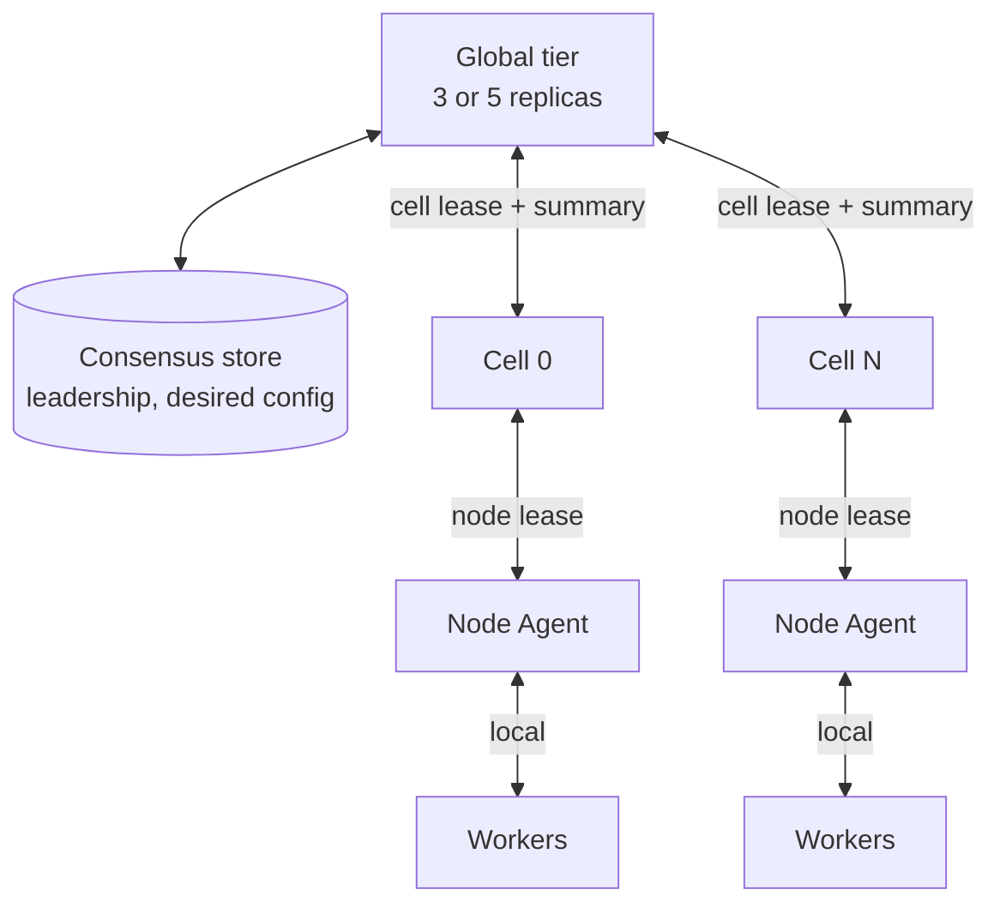
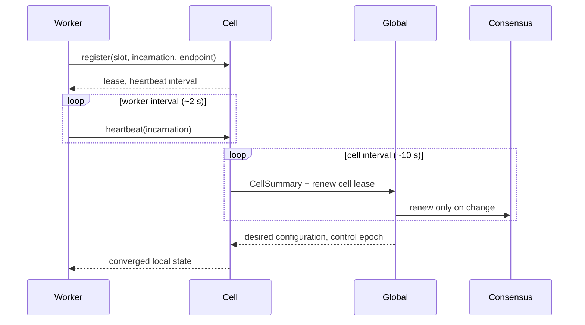

# Topology

> Proposal; not the current implementation.

> Three tiers — worker, cell, global — because every quantity that must not grow
> with the cluster is bounded by a tier boundary.

## 1. Problem

A flat control plane makes three quantities proportional to cluster size: the
number of heartbeats one process receives, the number of endpoints one process
knows, and the number of calls one process makes. At ten thousand workers all
three are fatal; the measurements are in
[01-overview/01-problem.md](../01-overview/01-problem.md).

## 2. Goals

- Bound every fan-out by a tier, not by the cluster.
- Make the failure unit smaller than the job.
- Keep the consensus store's write rate independent of worker count.

## 3. Non-goals

- Choosing the cell size. That is a capacity-planning decision per deployment;
  see §4.2.
- Defining what runs inside a cell. tinyray does not know.

## 4. Design

### 4.1 What each tier is responsible for

| Tier | Knows about | Fan-out | Holds |
|---|---|---|---|
| **Global** | Cells | O(cells) | Leadership, desired configuration, cell roster |
| **Cell** | Its nodes and workers | O(workers per cell) | Worker membership, local state |
| **Node Agent** | Its own processes | O(processes per node) | Process supervision, local health |
| **Worker** | Its scoped peers | O(scope) | Its own registration |

The invariant that makes this work:

> No tier addresses more members than its own tier contains.

### 4.2 Cell sizing

The cell is the failure and membership unit. tinyray does not choose its size,
but records the forces:

| Factor | Cell too small | Cell too large |
|---|---|---|
| Number of cell controllers | More | Fewer |
| Cross-cell traffic | More | Less |
| Blast radius of one cell failure | Smaller | Larger |
| Locality with the network fabric | May be cut across | May span fault domains |
| Consensus write rate | Higher | Lower |

**Recommendation**: the cell boundary should coincide with the **collective
communicator scope**.

The reason is not aesthetic. NCCL is not fault tolerant: a rank's death poisons
its communicator, and every surviving rank blocks at the next collective. If the
control unit and the communicator scope differ, one death either crosses several
control units or leaves one half-dead. When they coincide, one death is one cell
rebuild and the other cells never notice.

**Derived**, at 5,000 rollout GPUs and 128 GPUs per cell: 40 cells; one cell
lost is 2.56% of rollout capacity.

### 4.3 Why the consensus store survives

**Derived** load on the consensus store, 10,000 workers, 128 GPUs per cell:

| Design | Lease holders | Renewals at 10 s |
|---|---:|---:|
| Flat, per worker | 10,000 | 1,000/s |
| Hierarchical, per cell | ~78 | 7.8/s |

Kubernetes officially supports 5,000 nodes and documents node leases as a source
of etcd pressure ([large-cluster
guidance](https://kubernetes.io/docs/setup/best-practices/cluster-large/)). The
flat design asks for twice that node budget, in addition to whatever the cluster
is already doing. The hierarchical one asks for a rounding error.

Worker heartbeats terminate at the cell and are aggregated into one summary per
cell per interval.

### 4.4 Degenerate topologies

The same code must run at every scale, or development happens against a
different system than production.

| Deployment | Global | Cells | Node Agents |
|---|---|---|---|
| Laptop, one process | In-process | 1 | 0 |
| Single node, several processes | In-process | 1 | 1 |
| Small cluster | 1 replica | 1 per node | 1 per node |
| Production | 3 or 5 replicas + consensus | 1 per fault domain | 1 per node |

A tier is collapsed, never removed. `tinyray.join()` is identical in all four.

## 5. Normal flow

The diagram cannot show: worker heartbeats never reach Global; the cell summary
is fixed-size regardless of worker count; and Global writes to consensus only
when membership or configuration changes, not per interval.

## 6. State and ownership

| State | Owner | Tier | Persisted | Rebuildable |
|---|---|---|---|---|
| Worker registration | Worker | Cell | No | One heartbeat |
| Cell membership | Cell | Cell | No | One heartbeat round |
| Cell summary | Cell | Global | No | One cell interval |
| Cell roster | Global | Consensus | Yes | No |
| Leadership | Consensus | Consensus | Yes | No |
| Desired configuration | Application via Global | Consensus | Yes | No |

The rebuildable column is the design: everything below the consensus line is
soft state, which is why replication of it needs no agreement. See
[03-state-model.md](03-state-model.md).

## 7. Correctness invariants

- No tier holds a per-member record for a tier below its children.
- A cell controller holds no state its workers cannot re-assert. A restarted
  controller is correct after one heartbeat period.
- Consensus writes are O(membership changes + configuration changes), never
  O(workers x time).
- A cell that loses its lease stops accepting new work; it does not stop
  existing work.
- A worker whose lease expires is removed from lookups, regardless of whether
  anything supervises its process.

## 8. Failure and recovery

| Failure | Detected by | Bound | Effect |
|---|---|---|---|
| Worker dies | Lease expiry at its cell | Worker TTL | Removed from lookups; cell capacity drops |
| Node Agent dies | Node lease expiry | Node TTL | Its processes are reclaimed |
| Cell controller dies | Standby takes over with a new generation | Cell TTL | Cell schedules nothing briefly; running work continues |
| Cell partitioned from Global | Cell lease expiry | Cell TTL | Cell finishes valid work, requests none |
| Global leader dies | Consensus leader election | Election timeout | No configuration changes; cells continue |
| Consensus unavailable | Client | — | No leadership or configuration change; everything else continues |

Every row degrades. None stops the job.

## 9. Observability

Per tier, not aggregated across tiers:

| Tier | Reports |
|---|---|
| Worker | Own readiness, admission state, incarnation |
| Cell | Ready capacity, lease expiries, membership churn, control latency |
| Global | Live cells, unavailable capacity, leader changes, consensus write rate |

## 10. Trade-offs

- **Detection is slower.** Worker death reaches Global in worker TTL + cell
  interval, not immediately. Accepted: Global does not need to know quickly, and
  the cell — which does — knows in one TTL.
- **A cell controller is a local single point.** A cell without its controller
  schedules nothing new. Mitigated by soft state making standby takeover cheap,
  and by running work continuing regardless.
- **Cell sizing is a real decision with no default.** Getting it wrong costs
  either controller sprawl or blast radius. §4.2 gives the forces, not an answer.

## 11. Implementation and testing

| Behaviour | Test |
|---|---|
| Worker heartbeats never reach the global tier | `tests/test_membership.py` |
| Cell summary size is independent of worker count | `tests/test_membership.py` |
| Consensus write rate is independent of worker count | `tests/test_fake_cluster.py` |
| A restarted cell controller recovers from heartbeats alone | `tests/test_chaos.py` |
| All four deployment shapes run the same worker code | `tests/test_deployment_shapes.py` |

Scale validation runs against simulated workers before real hardware —
[06-testing/02-fake-cluster.md](../06-testing/02-fake-cluster.md).
