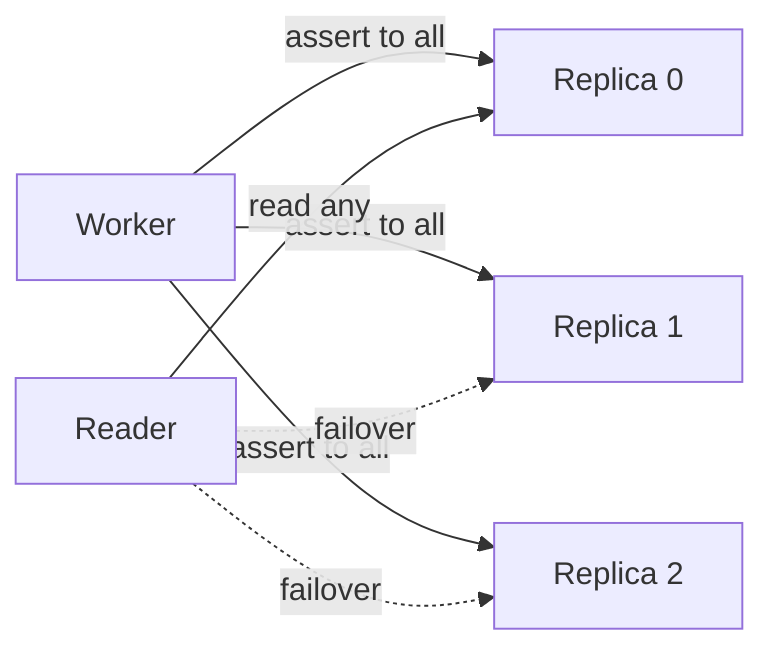

# State model

> Proposal; not the current implementation.

> Two stores, split by one test: can the state's owner re-assert it? If yes it
> is soft and needs no agreement. If no it needs consensus.

## 1. Problem

Putting all control state in a consensus store does not scale: every write
commits through Raft, and ten thousand workers renewing leases exceeds the
budget of a supported Kubernetes cluster
([01-overview/01-problem.md §6](../01-overview/01-problem.md#6-leases-must-not-go-to-a-consensus-store)).

Putting none of it in consensus is unsafe: leadership and ownership have no
owner to re-assert them, and two writers both believing they are authoritative
corrupt state.

## 2. Goals

- One rule for deciding where a piece of state lives.
- Consensus write rate independent of worker count.
- Replication of the soft slice with no log, no leader and no agreement.
- Availability of reads when both stores are unreachable.

## 3. Non-goals

- Implementing consensus. tinyray adapts to etcd or an equivalent.
- Durability of application state. That is L3's.

## 4. Design

### 4.1 The rule

> If the state has an owner that re-asserts it on a timer, it is **soft**.
> Otherwise it needs **consensus**.

A soft store that loses everything is correct again one lease period later,
because every fact regenerates from the process that owns it. That is what makes
replication cheap: run several replicas, have owners assert to all of them, read
from any. They converge without talking to each other.

State with no owner — leadership, partition ownership, desired configuration —
cannot regenerate. It needs a log and agreement.

### 4.2 The split

| State | Consistency | Store | Write rate | Rebuildable from |
|---|---|---|---|---|
| Leadership | Linearizable | Consensus | Election events | — |
| Control epoch | Linearizable | Consensus | Epoch changes | — |
| Cell roster and lease | Linearizable | Consensus | Membership changes | — |
| Desired configuration | Linearizable | Consensus | Configuration changes | — |
| Partition or shard ownership | Linearizable | Consensus | Ownership changes | — |
| Cell incarnation counter | Linearizable | Consensus | Cell restarts | — |
| Worker registration and endpoint | Eventual | Soft registry | Per heartbeat | The worker |
| Worker incarnation | Eventual | Soft registry | Per registration | The worker |
| Worker readiness | Eventual | Soft registry | Per heartbeat | The worker |
| Cell summary and capacity | Eventual | Soft registry | Per cell interval | The cell |
| Observed state generally | Eventual | Soft registry | Per heartbeat | Its owner |
| Metrics | Eventual | External TSDB | Continuous | — |

**Derived** consensus write rate at 10,000 workers, 128 GPUs per cell: cell
lease renewals only, ~78 holders, **7.8 writes/s**, against 1,000/s for the flat
design.

### 4.3 Soft replication



- **Writes go everywhere.** A registration is sent to every replica and succeeds
  if any accepted it. A replica that was down catches up on the next heartbeat.
- **Reads take any replica**, preferring the last one that answered.
- **Replicas never talk to each other.** There is nothing to agree about.

A replica that starts empty is fully populated within one heartbeat interval.

### 4.4 Reads survive total loss

Readers cache lookups. When no replica answers, the cached answer is returned
and the staleness is reported.

**Measured** on the prototype: with every replica killed, workers continued to
address each other from cache and peer calls succeeded. The failure that matters
is not "the registry lost a record" but "the registry is unreachable and the job
stopped" — and a stale endpoint is worth far more than a stopped job.

Safety comes from fencing rather than freshness: a stale endpoint that has been
reused by a new incarnation rejects the call
([03-modules/01-identity.md](../03-modules/01-identity.md)).

### 4.5 What must never enter either store

| Never stored | Where it goes |
|---|---|
| Tensors, samples, weights | L0 transport or application storage |
| Per-worker heartbeats above the cell | Aggregated into a cell summary |
| Raw logs | Object storage, asynchronously |
| Application domain state | The application's own store |

## 5. Normal flow

```mermaid
sequenceDiagram
    participant W as Worker
    participant S as Soft registry replicas
    participant L as Leader (global)
    participant KV as Consensus

    W->>S: register(slot, incarnation) to all replicas
    loop heartbeat
        W->>S: assert liveness
    end
    L->>KV: acquire leadership, read desired config
    KV-->>L: config + fencing token
    L->>S: publish desired state (soft, re-published on change)
    Note over S: reader caches; total loss falls back to cache
```

The diagram cannot show: replicas do not exchange messages; a write succeeds if
any replica accepted; and a reader that finds no replica uses cache rather than
failing.

## 6. State and ownership

| State | Owner | Created | Updated by | Read by | Lifetime | Persisted |
|---|---|---|---|---|---|---|
| Worker registration | Worker | `join()` | Worker heartbeat | Peers, cell | Until lease expiry | No |
| Cell summary | Cell | Cell start | Cell interval | Global | Until cell lease expiry | No |
| Leadership | Global replica set | Election | Election | All tiers | Until lease loss | Yes |
| Desired configuration | Application | Configuration write | Leader only | Cells | Experiment | Yes |
| Cell roster | Global leader | Cell registration | Leader only | Global | Experiment | Yes |

## 7. Correctness invariants

- Every soft record is re-asserted by its owner within one lease period.
- The soft store is never the only copy of anything that cannot be regenerated.
- Consensus writes are O(membership changes + configuration changes).
- Consensus mutation happens only through the current leader, carrying a fencing
  token.
- A reader serving from cache reports that it did so.
- A soft replica losing all state converges within one lease period without
  contacting another replica.

## 8. Failure and recovery

| Failure | Effect | Recovery |
|---|---|---|
| One soft replica lost | Reads fail over | Repopulated in one heartbeat interval |
| All soft replicas lost | Reads from cache; no membership changes observed | Repopulated on restart within one interval |
| Consensus unavailable | No leadership change, no configuration change | Resumes; leader re-validates its fencing token |
| Consensus lost entirely | Leadership and desired configuration lost | Restore from backup, or restart the experiment; cells continue in the meantime |
| Leader partitioned | Its fencing token becomes stale | Writes rejected; a new leader is elected |

The asymmetry is deliberate: the soft store is designed to be lost, the
consensus store is not, and the consensus store is small enough to protect.

## 9. Observability

| Metric | Meaning |
|---|---|
| `registry_replica_failures` | Failovers between replicas |
| `registry_served_from_stale` | Reads answered from cache — non-zero means unreachable replicas |
| `registry_cache_hits` | Reads not requiring a round trip |
| `consensus_writes_total` | Must be independent of worker count |
| `lease_expiries_total` | Membership churn |
| `fencing_rejections_total` | Stale writers being refused |

`consensus_writes_total` growing with worker count means the split has been
violated somewhere.

## 10. Trade-offs

- **Two stores to operate.** Bought back by neither being asked to do the other's
  job. One store either melts or is unsafe.
- **Soft state admits stale reads.** Fencing makes them safe, not free: the call
  fails and is retried against a fresh lookup.
- **A worker's incarnation is not globally unique.** It only orders that slot,
  because global uniqueness would need coordination and the ordering is all that
  fencing requires. The construction is in
  [03-modules/01-identity.md](../03-modules/01-identity.md).
- **Membership changes are visible late.** Up to one lease period, plus one cache
  TTL. Applications needing faster notification should watch rather than poll —
  [03-modules/05-discovery.md](../03-modules/05-discovery.md).

## 11. Implementation and testing

| Behaviour | Test |
|---|---|
| A replica that lost everything converges within one lease | `tests/test_membership.py` |
| Reads survive the loss of every replica | `tests/test_chaos.py` |
| Replicas exchange no messages | `tests/test_membership.py` |
| Consensus write rate does not track worker count | `tests/test_fake_cluster.py` |
| A stale leader's write is rejected | `tests/test_identity.py` |

The claim that replication needs no agreement is only credible if tested with at
least two replicas and with replicas killed —
[06-testing/03-chaos.md](../06-testing/03-chaos.md) explains why that is stated
so explicitly.
