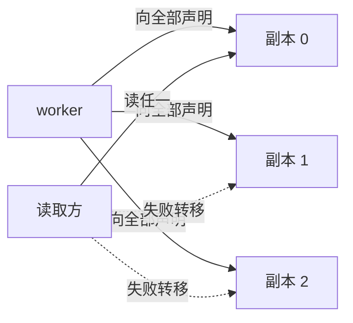
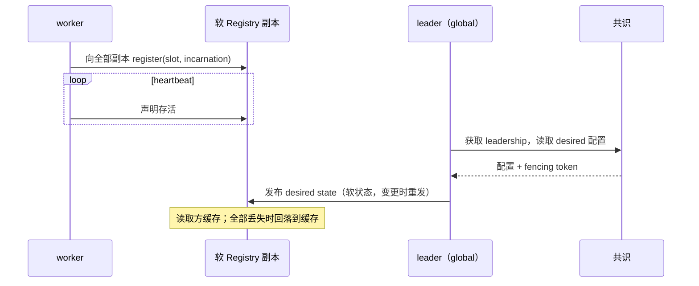

# 状态模型

> 提案；当前未实现。

> 两个存储，用一个判据划分：这份状态的 owner 能不能重新声明它？能，就是软状态，不需要
> 达成一致；不能，就需要共识。

## 1. 问题

把全部控制状态放进共识存储扩展不了：每次写入都要走 Raft 提交，而一万个 worker 续约
lease 超出一个受支持 Kubernetes 集群的预算
（[01-overview/01-problem.md §6](../01-overview/01-problem.md#6-lease-不能放进共识存储)）。

一点都不放进共识则不安全：leadership 和所有权没有 owner 可以重新声明，两个都认为自己
有权威的写入者会破坏状态。

## 2. 目标

- 用一条规则决定一份状态放在哪里。
- 共识写入速率与 worker 数无关。
- 软状态那一片的复制不需要日志、leader 或一致性协议。
- 两个存储都不可达时读仍然可用。

## 3. 非目标

- 实现共识。tinyray 适配 etcd 或等价物。
- 应用状态的持久化。那是 L3 的。

## 4. 设计

### 4.1 规则

> 若状态有 owner 定时重新声明它，就是**软状态**；否则需要**共识**。

丢光一切的软状态存储在一个 lease 周期后即恢复正确，因为每个事实都由拥有它的进程重新
生成。这正是复制便宜的原因：跑若干副本，owner 向全部副本声明，从任一副本读取。它们不
互相通信也能收敛。

没有 owner 的状态 —— leadership、分区所有权、desired 配置 —— 无法自行重生，需要日志和
一致性协议。

### 4.2 拆分

| State | Consistency | 存储 | 写入速率 | 可重建自 |
|---|---|---|---|---|
| leadership | linearizable | 共识 | 选举事件 | —— |
| control epoch | linearizable | 共识 | epoch 变更 | —— |
| Cell 名册与 lease | linearizable | 共识 | membership 变更 | —— |
| desired 配置 | linearizable | 共识 | 配置变更 | —— |
| 分区/分片所有权 | linearizable | 共识 | 所有权变更 | —— |
| Cell Incarnation 计数器 | linearizable | 共识 | Cell 重启 | —— |
| worker 注册与 endpoint | eventual | 软 Registry | 每次 heartbeat | 该 worker |
| worker Incarnation | eventual | 软 Registry | 每次注册 | 该 worker |
| worker readiness | eventual | 软 Registry | 每次 heartbeat | 该 worker |
| Cell summary 与容量 | eventual | 软 Registry | 每个 Cell 周期 | 该 Cell |
| 一般的 observed state | eventual | 软 Registry | 每次 heartbeat | 其 owner |
| 指标 | eventual | 外部 TSDB | 持续 | —— |

**推导**共识写入速率，10,000 worker、每 Cell 128 GPU：只有 cell lease 续约，约 78 个
持有者，**7.8 次写入/s**，对比扁平设计的 1,000 次/s。

### 4.3 软状态复制

- **写入发往全部副本。** 一次注册发给每个副本，任一接受即成功。曾宕机的副本在下一次
  heartbeat 时补齐。
- **读取取任一副本**，优先上次应答过的那个。
- **副本之间从不通信。** 没有任何需要达成一致的东西。

一个空启动的副本在一个 heartbeat 间隔内被填满。

### 4.4 全部丢失时读仍然可用

读取方缓存 lookup 结果。当没有副本应答时，返回缓存结果并上报其陈旧性。

原型上**实测**：杀掉全部副本后，worker 仍能互相寻址，工作不受影响。真正重要的失败不是
“Registry 丢了一条记录”，而是“Registry 不可达导致作业停了” —— 一个陈旧的 endpoint 远比
一个停掉的作业有价值。

安全性来自 fencing 而非新鲜度：一个被新 Incarnation 复用的陈旧 endpoint 会拒绝该调用
（[03-modules/01-identity.md](../03-modules/01-identity.md)）。

### 4.5 两个存储都绝不接受的内容

| 绝不存储 | 去向 |
|---|---|
| tensor、sample、weight | L0 传输或应用存储 |
| Cell 之上的 per-worker heartbeat | 聚合成 Cell summary |
| 原始日志 | 异步进入对象存储 |
| 应用领域状态 | 应用自己的存储 |

## 5. 正常流程

图中无法表达：副本之间不交换消息；任一副本接受即写入成功；找不到副本的读取方使用缓存
而不是失败。

## 6. 状态与所有权

| State | Owner | Created | Updated by | Read by | Lifetime | Persisted |
|---|---|---|---|---|---|---|
| worker 注册 | worker | `join()` | worker heartbeat | peer、Cell | 直到 lease 过期 | 否 |
| Cell summary | Cell | Cell 启动 | Cell 周期 | global | 直到 cell lease 过期 | 否 |
| leadership | global 副本集 | 选举 | 选举 | 所有层 | 直到失去 | 是 |
| desired 配置 | 应用 | 配置写入 | 仅 leader | Cell | 实验期 | 是 |
| Cell 名册 | global leader | Cell 注册 | 仅 leader | global | 实验期 | 是 |

## 7. 正确性不变量

- 每条软记录都由其 owner 在一个 lease 周期内重新声明。
- 软存储绝不是任何无法重生之物的唯一副本。
- 共识写入是 O(membership 变更 + 配置变更)。
- 共识变更只经由当前 leader，并携带 fencing token。
- 由缓存服务的读取必须上报这一事实。
- 丢光全部状态的软副本在一个 lease 周期内收敛，无需联系其他副本。

## 8. 故障与恢复

| 故障 | 影响 | 恢复 |
|---|---|---|
| 单个软副本丢失 | 读取失败转移 | 一个 heartbeat 间隔内重新填充 |
| 全部软副本丢失 | 读走缓存；观察不到 membership 变更 | 重启后一个间隔内重新填充 |
| 共识不可用 | 无 leadership 变更、无配置变更 | 恢复后 leader 重新校验 fencing token |
| 共识完全丢失 | leadership 与 desired 配置丢失 | 从备份恢复，或重启实验；期间 Cell 继续运行 |
| leader 被分区 | 其 fencing token 变为过期 | 写入被拒绝；选出新 leader |

这种不对称是有意的：软存储被设计成可以丢，共识存储不可以 —— 而共识存储小到足以保护。

## 9. 可观测性

| Metric | Meaning |
|---|---|
| `registry_replica_failures` | 副本间失败转移次数 |
| `registry_served_from_stale` | 由缓存应答的读取 —— 非零表示副本不可达 |
| `registry_cache_hits` | 免去往返的读取 |
| `consensus_writes_total` | 必须与 worker 数无关 |
| `lease_expiries_total` | membership 抖动 |
| `fencing_rejections_total` | 被拒绝的过期写入者 |

`consensus_writes_total` 随 worker 数增长，说明拆分在某处被违反了。

## 10. 取舍

- **要运维两个存储。** 换回来的是两者都不必做对方的工作。单一存储要么被压垮，要么不安全。
- **软状态允许陈旧读。** fencing 使其安全，但不免费：调用失败后需重新 lookup 再重试。
- **worker 的 Incarnation 不是全局唯一的。** 它只为该 Slot 排序，因为全局唯一需要协调，
  而 fencing 只需要排序。构造方式见
  [03-modules/01-identity.md](../03-modules/01-identity.md)。
- **membership 变更可见得较晚。** 最多一个 lease 周期加一个缓存 TTL。需要更快通知的应用
  应使用 watch 而非轮询 —— [03-modules/05-discovery.md](../03-modules/05-discovery.md)。

## 11. 实现与测试

| Behavior | Test file |
|---|---|
| 丢光状态的副本在一个 lease 内收敛 | `tests/test_membership.py` |
| 全部副本丢失后读仍可用 | `tests/test_chaos.py` |
| 副本之间不交换消息 | `tests/test_membership.py` |
| 共识写入速率不随 worker 数变化 | `tests/test_fake_cluster.py` |
| 过期 leader 的写入被拒绝 | `tests/test_identity.py` |

“复制不需要达成一致”这个论断，只有在**至少两个副本**且**测试中杀掉副本**的条件下才可信
—— [06-testing/03-chaos.md](../06-testing/03-chaos.md) 解释了为何要把这一点写得这么明确。
