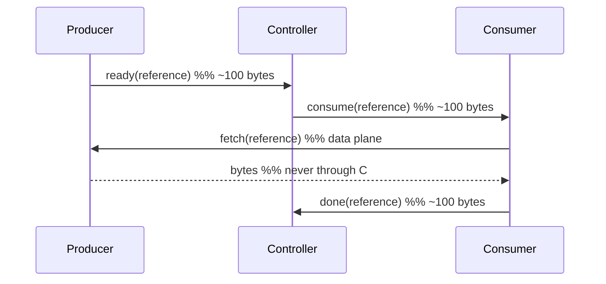

# Control and data planes

> Proposal; not the current implementation.

> One rule: the control plane carries names, never payloads. Everything else in
> this document follows from it.

## 1. Problem

Control and data planes are easy to separate on a diagram and easy to merge in
code. The merge happens by accident — a status check that fetches the object to
see whether it exists, a broadcast that ships the weights because the connection
was already open — and it is invisible in tests, because the *answers* stay
correct while only the cost changes.

## 2. Goals

- Bound what the control plane may carry, numerically.
- Make a violation fail a test rather than a review.
- Let the data plane be anything the framework prefers.

## 3. Non-goals

- Providing a data plane. tinyray has none.
- Optimising bulk transfer. That is NCCL, UCX, NIXL or object storage.

## 4. Design

### 4.1 The rule

> A control message carries an identifier, a decision or a status. If a message
> grows with the size of the work, it belongs to the data plane.

The distinguishing question is not the byte count of one message but whether the
size is **bounded by the protocol** or **by the workload**.

### 4.2 The two planes

| | Control plane | Data plane |
|---|---|---|
| Carries | Registrations, leases, decisions, references, status | Weights, samples, activations, checkpoints |
| Owner | tinyray | The framework |
| Transport | HTTP/1.1 with framing | NCCL, UCX, NIXL, object storage, shared filesystem |
| Message size | Bounded by protocol | Bounded by workload |
| Topology | Hierarchical | Point-to-point or collective |
| Failure | Retryable where idempotent | Application's concern |
| Passes through a controller | Yes | **Never** |

### 4.3 The failure this rule exists to prevent

**Measured**: a readiness check answered "is this result ready?" by fetching the
result and discarding it — 237 ms for a settled 200 MB payload. With a
status-only request, 0.14 ms.

Every functional test passed. The answer was right; only the cost was wrong. An
invariant verified at one call site is not an invariant, which is why §4.4
exists.

### 4.4 Byte budgets

Every control operation declares a maximum, asserted by a test:

| Operation | Budget | Scales with |
|---|---:|---|
| `register` | 1 KB | Nothing |
| `heartbeat` | 256 B | Nothing |
| `lookup` (scoped to k members) | 128 B x k | The request, not the cluster |
| Cell summary | 2 KB | Nothing |
| Control call dispatch | 4 KB + arguments | The caller's arguments |
| Reference passing | 128 B per reference | Number of references |

A meta-test requires that every operation touching the wire *has* a budget.
Adding that meta-test to the previous implementation immediately found three
operations with none.

### 4.5 References instead of values

When a control message must refer to bulk data, it carries a reference: an
identifier plus the address of the process holding it. The consumer fetches from
the producer over the data plane.

**Measured**, an earlier pipeline experiment: 13.6 MB moved between workers
while **868 bytes** crossed the driver for an entire training loop.

tinyray defines the reference format and nothing about the transfer.

## 5. Normal flow

The diagram cannot show: the controller never opens the payload; the fetch may
use any transport; and if the producer dies before the fetch, the consumer
learns from the control plane and the application decides what that means.

## 6. State and ownership

| State | Owner | Plane | Persisted |
|---|---|---|---|
| Reference (id + holder) | Producer, published via control | Control | No |
| The bytes | Producer | Data | Application's choice |
| Transfer progress | Participants | Data | No |
| Completion status | Application | Control | Application's store |

tinyray owns the first row only.

## 7. Correctness invariants

- No control message exceeds its declared budget.
- No control message size grows with the workload.
- No bulk payload passes through any controller tier.
- A control-plane failure never corrupts data-plane state; it only delays a
  decision.
- A reference names its holder, so a consumer never needs a controller to fetch.

## 8. Failure and recovery

| Failure | Control plane | Data plane |
|---|---|---|
| Control message lost | Retried if idempotent | Unaffected |
| Controller down | No new decisions | Transfers in flight continue |
| Producer dies before fetch | Consumer notified | Bytes lost; application decides |
| Data transfer fails | Reported as status | Application retries |

The independence is the value: a control-plane outage delays decisions and does
not destroy work.

## 9. Observability

Per peer, on every control connection:

| Metric | Purpose |
|---|---|
| `control_bytes_sent`, `control_bytes_received` | Enforces §4.4 in production, not only in tests |
| `control_requests_total`, `control_retries_total` | Retry pressure |
| `control_latency_p99` | Health |

A byte counter rising with workload size means a payload has entered the control
plane. That is the alert worth having.

## 10. Trade-offs

- **tinyray cannot optimise the data path.** By design. A framework that moves
  data badly will not be rescued here.
- **Reference passing needs the producer alive.** No replication is provided;
  durability is L3's, and tinyray reports the loss rather than preventing it.
- **The budgets are arbitrary until measured.** The numbers in §4.4 are chosen
  to be comfortably above current usage and comfortably below anything
  workload-shaped. They are **to be measured** on the target cluster.

## 11. Implementation and testing

| Behaviour | Test |
|---|---|
| Each operation stays inside its budget | `tests/test_driver_byte_budget.py` |
| Every wire-touching operation has a budget | `tests/test_suite_quality.py` |
| A readiness check does not transfer the payload | `tests/test_driver_byte_budget.py` |
| Peer transfer does not pass through a controller | `tests/test_membership.py` |
| Budgets hold as payload size grows | `tests/test_driver_byte_budget.py` |

The last row is the one that matters: a budget checked at one payload size is a
budget that will be violated at another.
