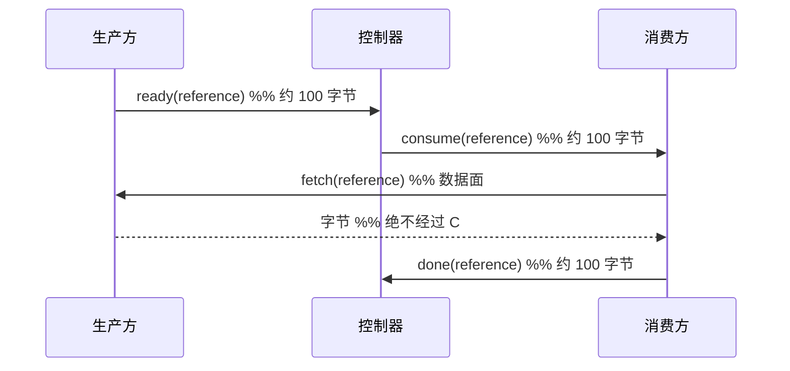

# 控制面与数据面

> 提案；当前未实现。

> 一条规则：控制面搬运名字，不搬运 payload。本文其余内容都由它推出。

## 1. 问题

控制面和数据面在图上很容易分开，在代码里很容易合并。合并是意外发生的 —— 一次为了确认
对象是否存在而取回了对象的状态检查，一次因为连接已经打开就顺手发了权重的广播 —— 而且在
测试里不可见，因为**答案**始终正确，变的只有代价。

## 2. 目标

- 用数字界定控制面允许搬运什么。
- 让违规使测试失败，而不是靠评审发现。
- 允许数据面是框架偏好的任何东西。

## 3. 非目标

- 提供数据面。tinyray 没有。
- 优化大数据传输。那是 NCCL、UCX、NIXL 或对象存储的事。

## 4. 设计

### 4.1 规则

> 控制消息携带标识、决策或状态。若一条消息的大小随工作量增长，它属于数据面。

区分的问题不是单条消息的字节数，而是它的大小**由协议限定**还是**由工作负载限定**。

### 4.2 两个面

| | 控制面 | 数据面 |
|---|---|---|
| 搬运 | 注册、lease、决策、引用、状态 | weight、sample、activation、checkpoint |
| 归属 | tinyray | 框架 |
| 传输 | 带 framing 的 HTTP/1.1 | NCCL、UCX、NIXL、对象存储、共享文件系统 |
| 消息大小 | 由协议限定 | 由工作负载限定 |
| 拓扑 | 分层 | 点对点或 collective |
| 失败 | 幂等处可 retry | 应用的事 |
| 经过控制器 | 是 | **绝不** |

### 4.3 这条规则要防的那次故障

**实测**：一次 readiness 检查通过取回结果再丢弃来回答“这个结果好了吗” —— 一个已就绪的
200 MB payload 耗时 237 ms。改为只问状态后是 0.14 ms。

所有功能测试都通过了。答案是对的，只有代价是错的。**在一个调用点验证过的不变量不是
不变量**，这就是 §4.4 存在的原因。

### 4.4 字节预算

每个控制操作声明一个上限，并由测试断言：

| 操作 | 预算 | 随什么增长 |
|---|---:|---|
| `register` | 1 KB | 不增长 |
| `heartbeat` | 256 B | 不增长 |
| `lookup`（作用域为 k 个成员） | 128 B × k | 请求，而非集群 |
| Cell summary | 2 KB | 不增长 |
| 控制调用派发 | 4 KB + 参数 | 调用方的参数 |
| 引用传递 | 每个引用 128 B | 引用数量 |

一条元测试要求每个接触 wire 的操作**都必须有**预算。把这条元测试加到此前的实现上，
立刻找出三个没有预算的操作。

### 4.5 传引用而不是传值

当一条控制消息必须指向大数据时，它携带一个引用：一个标识加上持有它的进程地址。消费方
经数据面从生产方取回。

**实测**，一次早期流水线实验：13.6 MB 在 worker 之间移动，而整个训练循环经过 driver 的
只有 **868 字节**。

tinyray 定义引用格式，对传输过程不作任何规定。

## 5. 正常流程

图中无法表达：控制器从不打开 payload；fetch 可用任意传输方式；若生产方在 fetch 之前
死亡，消费方从控制面得知，由应用决定这意味着什么。

## 6. 状态与所有权

| State | Owner | 面 | Persisted |
|---|---|---|---|
| 引用（id + 持有者） | 生产方，经控制面发布 | 控制面 | 否 |
| 字节本身 | 生产方 | 数据面 | 由应用选择 |
| 传输进度 | 参与方 | 数据面 | 否 |
| 完成状态 | 应用 | 控制面 | 应用的存储 |

tinyray 只拥有第一行。

## 7. 正确性不变量

- 没有控制消息超出其声明预算。
- 没有控制消息的大小随工作量增长。
- 没有大 payload 经过任何控制器层。
- 控制面故障绝不破坏数据面状态，只延迟一个决策。
- 引用指明其持有者，因此消费方取数据从不需要控制器。

## 8. 故障与恢复

| 故障 | 控制面 | 数据面 |
|---|---|---|
| 控制消息丢失 | 幂等则 retry | 不受影响 |
| 控制器宕机 | 不做新决策 | 进行中的传输继续 |
| 生产方在 fetch 前死亡 | 通知消费方 | 字节丢失；由应用决定 |
| 数据传输失败 | 作为状态上报 | 应用重试 |

这种独立性正是价值所在：控制面故障延迟决策，但不摧毁已完成的工作。

## 9. 可观测性

每个控制连接上按 peer 统计：

| Metric | 用途 |
|---|---|
| `control_bytes_sent`、`control_bytes_received` | 在生产环境而不只在测试中强制 §4.4 |
| `control_requests_total`、`control_retries_total` | retry 压力 |
| `control_latency_p99` | 健康度 |

字节计数随工作负载大小增长，就意味着有 payload 进入了控制面。这是值得设告警的那一条。

## 10. 取舍

- **tinyray 无法优化数据路径。** 这是有意的。一个数据搬得差的框架不会在这里被拯救。
- **传引用需要生产方存活。** 不提供任何复制；持久化是 L3 的，tinyray 报告丢失而不是
  预防它。
- **在实测之前，这些预算是任意的。** §4.4 的数字选得远高于当前用量、远低于任何随工作量
  变化的东西。它们在目标集群上**待测**。

## 11. 实现与测试

| Behavior | Test file |
|---|---|
| 每个操作都在预算内 | `tests/test_driver_byte_budget.py` |
| 每个接触 wire 的操作都有预算 | `tests/test_suite_quality.py` |
| readiness 检查不传输 payload | `tests/test_driver_byte_budget.py` |
| peer 传输不经过控制器 | `tests/test_membership.py` |
| payload 增大时预算依然成立 | `tests/test_driver_byte_budget.py` |

最后一行才是关键：只在一个 payload 大小上检查过的预算，是一个会在另一个大小上被违反的
预算。
