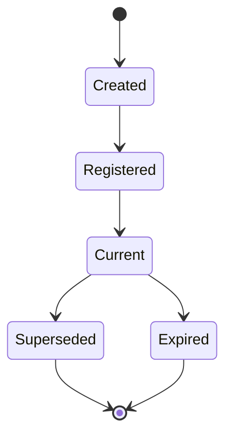
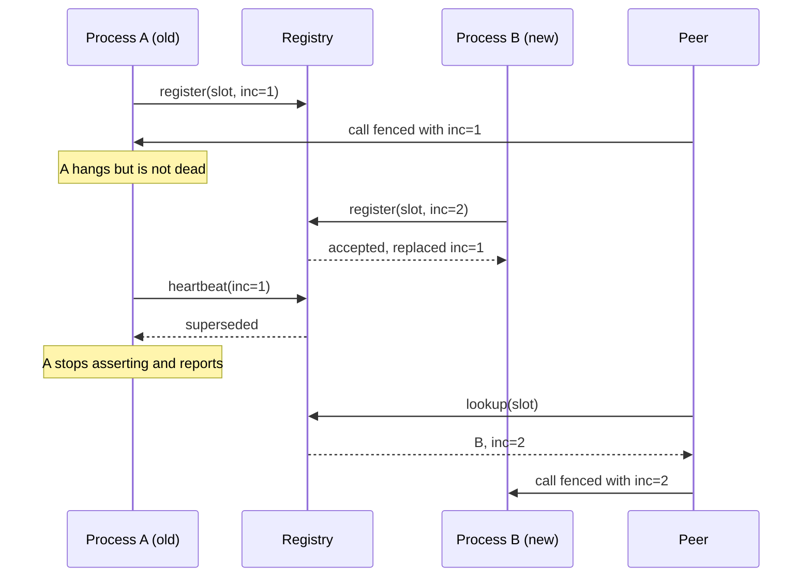

# Identity

> Proposal; not the current implementation.

> A name identifies a slot; an incarnation identifies the process currently
> filling it. Every cross-process write carries one, and receivers reject the
> stale.

## 1. Scope

Logical naming, incarnation generation, and fencing enforcement. Proposed source:
`python/tinyray/identity.py` and the fencing check inside the transport.

## 2. Responsibilities

- Define a stable logical name for a role in the cluster.
- Issue an incarnation each time a process fills that role.
- Attach the incarnation to every outbound write.
- Reject an inbound write carrying a superseded incarnation.
- Report supersession to the process that has been replaced.

## 3. Non-responsibilities

| Not done here | Owner |
|---|---|
| Deciding how many slots exist | Application (L3) |
| Restarting a process | [08-supervision](08-supervision.md) or L1 |
| Storing which incarnation is current | [02-membership](02-membership.md) |
| Leader election | [03-reconciliation](03-reconciliation.md), over consensus |
| What to do about being superseded | Application, via callback |

## 4. Position in the system

Every other module depends on this one. Membership records incarnations,
discovery returns them, transport enforces them, reconciliation fences with
them.

## 5. Dependencies

- A monotonic local clock for the worker-level incarnation.
- A consensus counter for cell-level and leader-level incarnations
  ([02-architecture/03-state-model.md](../02-architecture/03-state-model.md)).

## 6. Public contract

| Interface | Input | Output | Side effect | Blocking | Failure |
|---|---|---|---|---|---|
| `Slot(kind, **coords)` | Role and coordinates | Slot | None | No | `ValueError` on malformed coordinates |
| `Slot.incarnate()` | — | Incarnation | None | No | None |
| `Incarnation.token()` | — | Comparable token | None | No | None |
| `fence(inbound, current)` | Two tokens | `Accept` / `Stale` / `Unknown` | None | No | None |
| `on_superseded(callback)` | Callable | — | Registers a hook | No | None |

```python
slot = tinyray.Slot("collector", cell="c07", index=3)
me = slot.incarnate()
str(slot)   # "collector/c07/3"        stable across restarts
me.token()  # "collector/c07/3@1739... " unique to this process
```

## 7. State ownership

| State | Owner | Created | Updated by | Read by | Lifetime | Persisted |
|---|---|---|---|---|---|---|
| Slot name | Application | At construction | Never | Everyone | Experiment | No |
| Incarnation | The process filling the slot | At `incarnate()` | Never | Membership, transport | Process | No |
| Current incarnation per slot | Registry | At registration | Later registration | Fencing | Until lease expiry | No |
| Cell/leader incarnation counter | Consensus | At first election | Each takeover | Fencing | Experiment | Yes |

An incarnation is immutable. A process that needs a new one is a new process.

## 8. Lifecycle



- **Current** — the registry holds this incarnation for the slot.
- **Superseded** — a later incarnation took the slot. Writes are rejected.
- **Expired** — the lease lapsed. Writes are rejected until re-registration.

The distinction matters: superseded means *someone else has it*, expired means
*nobody has it*. The first must not re-register blindly; the second must.

## 9. Main flow



The diagram cannot show: A's in-flight call to a third party is rejected on
arrival because it carries inc=1; and the registry never asked whether A was
alive — it only recorded that B arrived later.

## 10. Concurrency and distributed semantics

**Incarnation construction.** Worker-level incarnations are built from a
monotonic local source and need only be **ordered within one slot**, never
globally unique. Two different slots may hold equal tokens; nothing compares
across slots.

Cell-level and leader-level incarnations come from a consensus counter, because
those must survive a total loss of the soft store.

**Comparison.** Tokens are compared for equality, not ordering, on the receive
path. Ordering is used only by the registry when deciding which registration
wins, and there "the later arrival wins" is by arrival, not by token value —
which keeps the design free of clock assumptions.

**Fencing is applied by the transport**, not by each caller. Fifteen hand-written
checks is fifteen chances to write the one that always passes.

## 11. Correctness invariants

- A slot name never encodes placement — no node, no device, no address.
- An incarnation is never reused by a different process.
- A write carrying a superseded incarnation is rejected, at every tier.
- A superseded process never re-registers automatically; it reports instead.
- An expired process re-registers rather than exiting.
- Fencing is enforced by the receiver, never assumed by the sender.

## 12. Failure handling

| Failure | Detected by | Response |
|---|---|---|
| Slow process resumes after replacement | Heartbeat returns superseded | Stops asserting; invokes `on_superseded` |
| Registry never saw the registration | Heartbeat returns unknown | Re-registers |
| Two processes register the same slot | Registry | Later wins; earlier learns on next heartbeat |
| Registry lost all state | Heartbeat returns unknown | Everyone re-registers within one interval |
| Stale call arrives at a peer | Transport fencing | Rejected with a fencing error |

**What a superseded process does** is the application's decision. tinyray
defaults to logging at critical severity and invoking the callback; it does not
terminate the process, because a library that calls `os._exit` inside a training
job is worse than the problem it solves.

The default is safe because supersession already stops the *addressing*: peers
look up the new incarnation and the old one's writes are fenced out. The
callback exists for applications that also want the process gone.

## 13. Configuration

| Field | Type | Default | Validation | Reader | Effect |
|---|---|---|---|---|---|
| `on_superseded` | callable or None | None | Callable | Membership heartbeat | Invoked once on supersession |
| `fence_mode` | `strict` / `warn` | `strict` | Enum | Transport | `warn` logs instead of rejecting; for migration only |

`fence_mode=warn` exists so an existing system can adopt fencing incrementally
and observe what would have been rejected. It is not a production setting.

## 14. Observability

| Metric | Producer | Meaning |
|---|---|---|
| `identity_incarnations_total` | Worker | Restarts of this slot |
| `fencing_rejections_total` | Receiver | Stale writers refused |
| `identity_superseded_total` | Worker | Times this process was replaced |
| `identity_reregistrations_total` | Worker | Recoveries from an unknown lease |

A non-zero `fencing_rejections_total` in steady state means processes are being
replaced while still running — expected during restarts, worth investigating
otherwise.

## 15. Testing

| Behaviour | Test file | Test case | Level |
|---|---|---|---|
| Later registration supersedes earlier | `tests/test_identity.py` | `test_later_registration_wins` | Unit |
| Superseded heartbeat is reported, not raised | `tests/test_identity.py` | `test_superseded_is_reported` | Unit |
| Superseded process does not re-register | `tests/test_identity.py` | `test_superseded_does_not_reregister` | Unit |
| Unknown lease triggers re-registration | `tests/test_identity.py` | `test_unknown_lease_reregisters` | Unit |
| Stale call is rejected by a peer | `tests/test_identity.py` | `test_peer_rejects_stale_incarnation` | Integration |
| Fencing needs no caller cooperation | `tests/test_suite_quality.py` | `test_fencing_is_in_the_transport` | Structural |
| Split brain during restart | `tests/test_chaos.py` | `test_restart_while_old_process_lives` | Chaos |

The chaos case is the one that matters, and it must run with the old process
**still alive** — a test that kills the old process first proves nothing about
fencing.

## 16. Limitations and trade-offs

- **Fencing does not stop a superseded process from doing local damage.** It
  stops it being addressed and stops its writes landing. A process still holding
  a GPU or a communicator rank is L1's and the application's problem.
- **Worker incarnations rely on a monotonic local clock.** A clock stepping
  backwards across a restart could produce a token that compares equal to its
  predecessor's. Mitigated by including the process id, and by the registry
  deciding by arrival order rather than token value.
- **`fence_mode=warn` is unsafe** and exists only for migration.

## 17. Source mapping

Proposed: `python/tinyray/identity.py`; fencing enforcement in
`crates/tinyray-runtime/src/actor.rs` and the client path.

Related: [02-membership](02-membership.md) records the current incarnation;
[04-protocols/03-control-rpc.md](../04-protocols/03-control-rpc.md) carries it.
