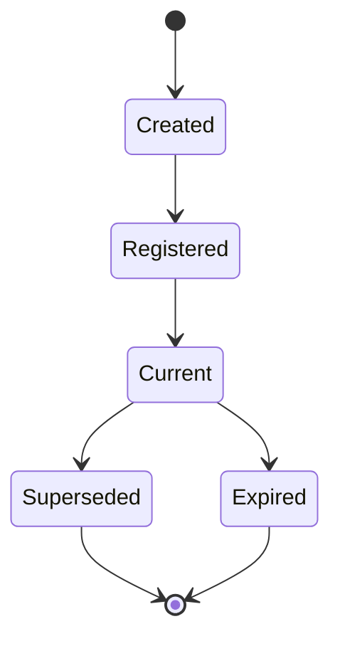
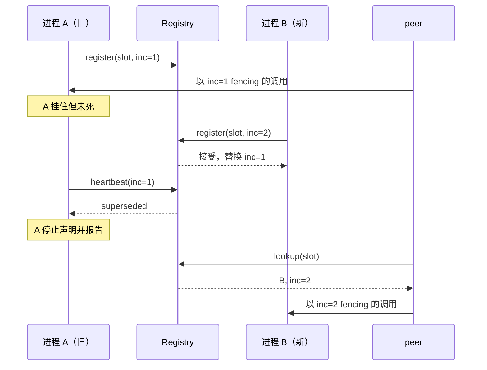

# Identity

> 提案；当前未实现。

> 名字标识一个 Slot，Incarnation 标识当前占据它的进程。每次跨进程写入都携带 Incarnation，
> 接收端拒绝过期的。

## 1. 范围

逻辑命名、Incarnation 生成，以及 fencing 的强制执行。计划源码：
`python/tinyray/identity.py`，以及 transport 内的 fencing 校验。

## 2. 职责

- 为集群中的一个角色定义稳定的逻辑名。
- 每次有进程占据该角色时颁发一个 Incarnation。
- 把 Incarnation 附加到每次对外写入上。
- 拒绝携带已被取代 Incarnation 的入站写入。
- 向被取代的进程报告这一事实。

## 3. 非职责

| 不在此处做 | 归属 |
|---|---|
| 决定有多少个 Slot | 应用（L3） |
| 重启进程 | [08-supervision](08-supervision.md) 或 L1 |
| 存储当前 Incarnation 是哪个 | [02-membership](02-membership.md) |
| leader 选举 | [03-reconciliation](03-reconciliation.md)，基于共识 |
| 被取代后该做什么 | 应用，经回调 |

## 4. 系统位置

其他每个模块都依赖它。membership 记录 Incarnation，discovery 返回它，transport 强制它，
reconciliation 用它做 fencing。

## 5. 依赖

- 一个单调的本地时钟，用于 worker 级 Incarnation。
- 一个共识计数器，用于 Cell 级和 leader 级 Incarnation
  （[02-architecture/03-state-model.md](../02-architecture/03-state-model.md)）。

## 6. 公共契约

| Interface | Input | Output | Side effect | Blocking | Failure |
|---|---|---|---|---|---|
| `Slot(kind, **coords)` | 角色与坐标 | Slot | 无 | 否 | 坐标非法时 `ValueError` |
| `Slot.incarnate()` | —— | Incarnation | 无 | 否 | 无 |
| `Incarnation.token()` | —— | 可比较 token | 无 | 否 | 无 |
| `fence(inbound, current)` | 两个 token | `Accept` / `Stale` / `Unknown` | 无 | 否 | 无 |
| `on_superseded(callback)` | 可调用对象 | —— | 注册钩子 | 否 | 无 |

```python
slot = tinyray.Slot("collector", cell="c07", index=3)
me = slot.incarnate()
str(slot)   # "collector/c07/3"        跨重启稳定
me.token()  # "collector/c07/3@1739..." 本进程唯一
```

## 7. 状态所有权

| State | Owner | Created | Updated by | Read by | Lifetime | Persisted |
|---|---|---|---|---|---|---|
| Slot 名 | 应用 | 构造时 | 从不 | 所有人 | 实验期 | 否 |
| Incarnation | 占据该 Slot 的进程 | `incarnate()` 时 | 从不 | membership、transport | 进程期 | 否 |
| 每个 Slot 的当前 Incarnation | Registry | 注册时 | 后续注册 | fencing | 直到 lease 过期 | 否 |
| Cell/leader Incarnation 计数器 | 共识 | 首次选举 | 每次接管 | fencing | 实验期 | 是 |

Incarnation 不可变。需要新 Incarnation 的进程就是一个新进程。

## 8. 生命周期



- **Current** —— Registry 为该 Slot 持有此 Incarnation。
- **Superseded** —— 更晚的 Incarnation 拿走了该 Slot，写入被拒绝。
- **Expired** —— lease 失效，写入被拒绝直到重新注册。

区别很重要：superseded 意味着**别人拿走了**，expired 意味着**没人拿着**。前者绝不能盲目
重新注册，后者必须重新注册。

## 9. 主流程



图中无法表达：A 发往第三方的在途调用因携带 inc=1 而在到达时被拒；Registry 从未询问过 A
是否存活 —— 它只记录了 B 来得更晚。

## 10. 并发与分布式语义

**Incarnation 构造。** worker 级 Incarnation 由单调本地来源构造，只需**在单个 Slot 内
有序**，绝不需要全局唯一。两个不同 Slot 的 token 可以相等，因为没有任何地方跨 Slot 比较。

Cell 级和 leader 级 Incarnation 来自共识计数器，因为它们必须在软存储全量丢失后仍然存活。

**比较。** 接收路径上 token 只比较相等性，不比较大小。大小只在 Registry 判定哪次注册
胜出时使用，而那里用的是**到达顺序**而非 token 数值 —— 这使设计不依赖任何时钟假设。

**fencing 由 transport 施加**，不由各调用点施加。十五份手写校验就是十五次写出“永远通过”
那份的机会。

## 11. 正确性不变量

- Slot 名从不编码位置 —— 不含节点、设备、地址。
- Incarnation 绝不被另一个进程复用。
- 携带已取代 Incarnation 的写入在每一层都被拒绝。
- 被取代的进程绝不自动重新注册，而是报告。
- 过期的进程重新注册，而不是退出。
- fencing 由接收端强制，绝不由发送端假定。

## 12. 故障处理

| 故障 | 检测方 | 响应 |
|---|---|---|
| 慢进程在被替换后恢复 | heartbeat 返回 superseded | 停止声明；触发 `on_superseded` |
| Registry 从未见过该注册 | heartbeat 返回 unknown | 重新注册 |
| 两个进程注册同一 Slot | Registry | 后者胜出；前者在下次 heartbeat 得知 |
| Registry 丢失全部状态 | heartbeat 返回 unknown | 所有人在一个间隔内重新注册 |
| 过期调用到达 peer | transport fencing | 以 fencing 错误拒绝 |

**被取代的进程该做什么**由应用决定。tinyray 默认以 critical 级别记录日志并触发回调，
不终止进程 —— 一个在训练作业里调用 `os._exit` 的库，比它要解决的问题更糟。

这个默认值是安全的，因为取代本身已经停止了**寻址**：peer 会查到新的 Incarnation，旧进程
的写入被 fence 出去。回调留给同时希望旧进程消失的应用。

## 13. 配置

| Field | Type | Default | Validation | Reader | Effect |
|---|---|---|---|---|---|
| `on_superseded` | callable 或 None | None | 可调用 | membership heartbeat | 取代发生时触发一次 |
| `fence_mode` | `strict` / `warn` | `strict` | 枚举 | transport | `warn` 只记录不拒绝；仅用于迁移 |

`fence_mode=warn` 的存在是为了让已有系统能渐进接入 fencing 并观察哪些会被拒绝。它不是
生产设置。

## 14. 可观测性

| Metric | Producer | Meaning |
|---|---|---|
| `identity_incarnations_total` | worker | 该 Slot 的重启次数 |
| `fencing_rejections_total` | 接收端 | 被拒的过期写入者 |
| `identity_superseded_total` | worker | 本进程被替换的次数 |
| `identity_reregistrations_total` | worker | 从 unknown lease 恢复的次数 |

稳态下 `fencing_rejections_total` 非零，意味着有进程在仍然运行时被替换 —— 重启期间属于
预期，其余时候值得调查。

## 15. 测试

| Behavior | Test file | Test case | Level |
|---|---|---|---|
| 后注册取代先注册 | `tests/test_identity.py` | `test_later_registration_wins` | Unit |
| superseded 被上报而非抛出 | `tests/test_identity.py` | `test_superseded_is_reported` | Unit |
| 被取代的进程不重新注册 | `tests/test_identity.py` | `test_superseded_does_not_reregister` | Unit |
| unknown lease 触发重新注册 | `tests/test_identity.py` | `test_unknown_lease_reregisters` | Unit |
| peer 拒绝过期调用 | `tests/test_identity.py` | `test_peer_rejects_stale_incarnation` | Integration |
| fencing 不需要调用方配合 | `tests/test_suite_quality.py` | `test_fencing_is_in_the_transport` | Structural |
| 重启期间的脑裂 | `tests/test_chaos.py` | `test_restart_while_old_process_lives` | Chaos |

chaos 那条是关键，而且必须在旧进程**仍然存活**的条件下运行 —— 先杀掉旧进程的测试证明不了
任何关于 fencing 的事。

## 16. 限制与取舍

- **fencing 阻止不了被取代的进程在本地造成破坏。** 它阻止的是该进程被寻址、其写入落地。
  仍占着 GPU 或 communicator rank 的进程是 L1 和应用的问题。
- **worker Incarnation 依赖单调本地时钟。** 跨重启回拨的时钟可能产生与前身相等的 token。
  缓解手段是把 pid 纳入构造，以及 Registry 按到达顺序而非 token 数值判定。
- **`fence_mode=warn` 不安全**，只用于迁移。

## 17. 源码映射

计划：`python/tinyray/identity.py`；fencing 强制位于
`crates/tinyray-runtime/src/actor.rs` 及客户端路径。

相关：[02-membership](02-membership.md) 记录当前 Incarnation；
[04-protocols/03-control-rpc.md](../04-protocols/03-control-rpc.md) 携带它。
