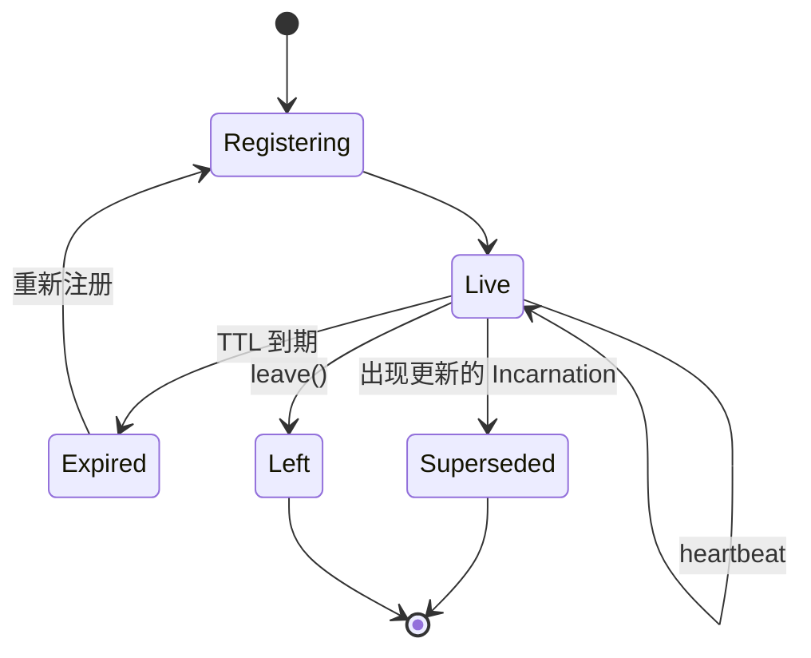
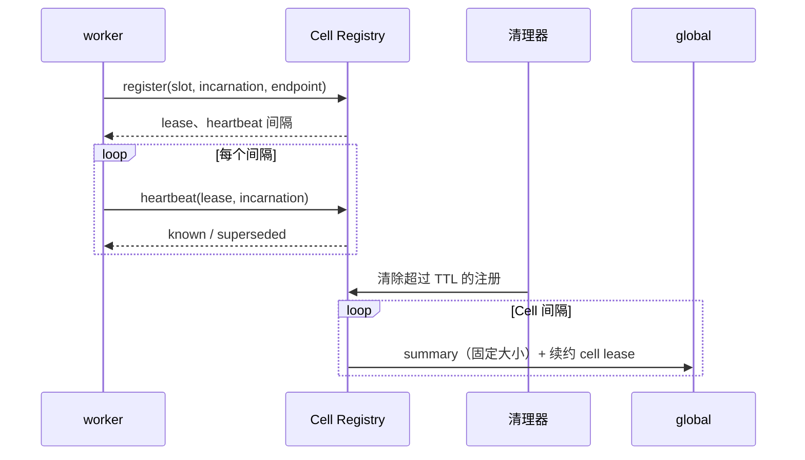

# Membership

> 提案；当前未实现。

> worker 向自己的 Cell 声明存活，Cell 向共识声明存活。缺席是唯一的死亡信号，因为没有
> 任何东西在监督一个它没有拉起的进程。

## 1. 范围

注册、lease 续约、过期，以及向上聚合。计划源码：`python/tinyray/membership.py` 和
Registry 服务。

## 2. 职责

- 接受一个 worker 对某 Slot 和 Incarnation 的注册。
- 在 worker 持续声明期间保持其有效。
- worker 停止声明时将其移除。
- 把 worker 存活性聚合成每 Cell 一份固定大小的 summary。
- 无需达成一致即可复制，且在无副本应答时仍能服务读取。

## 3. 非职责

| 不在此处做 | 归属 |
|---|---|
| 拉起或重启 worker | L1，或 [08-supervision](08-supervision.md) |
| 决定 lease 过期对工作意味着什么 | 应用（L3） |
| 选择 Slot 布局 | 应用（L3） |
| leadership | [03-reconciliation](03-reconciliation.md)，基于共识 |
| 一个存活的 worker 是否**可用** | [04-readiness](04-readiness.md) |

最后一行的边界值得写明：membership 回答“这个进程在不在”，Readiness 回答“该不该给它派活”。
把两者混同的结果是：只要事件循环还能应答就返回 `ok` 的健康检查。

## 4. 系统位置

控制面的底层。discovery 读它，reconciliation 与它比较，Admission 经它上报。

## 5. 依赖

- [01-identity](01-identity.md) 提供 Slot 与 Incarnation。
- [07-transport](07-transport.md) 提供 RPC。
- 一个共识存储，仅用于 Cell 级 lease。

## 6. 公共契约

| Interface | Input | Output | Side effect | Blocking | Failure |
|---|---|---|---|---|---|
| `join(target, slot, parent=None)` | 被服务对象、Slot、Cell 地址 | `Membership` | 开控制端口；注册；启动 heartbeat | **否** | 超出启动窗口后 `RegistryUnavailable` |
| `Membership.leave()` | —— | —— | 注销 | 短暂 | 从不抛出 |
| `Membership.state` | —— | `Current` / `Superseded` / `Expired` | 无 | 否 | 无 |
| `Registry.register(...)` | Slot、Incarnation、endpoint、meta | Lease | 记录 | 否 | 无 |
| `Registry.heartbeat(lease, incarnation)` | lease、Incarnation | `known`、`superseded` | 续约 | 否 | 无 |
| `Registry.lookup(group, scope)` | group 与作用域 | 成员 | 清理过期项 | 否 | 无 |
| `Registry.summary()` | —— | 固定大小 summary | 无 | 否 | 无 |

`join` 不阻塞。控制端口跑在自己的线程上，因为 `__main__` 属于框架
（[01-overview/03-principles.md](../01-overview/03-principles.md) P3）。

## 7. 状态所有权

| State | Owner | Created | Updated by | Read by | Lifetime | Persisted |
|---|---|---|---|---|---|---|
| 注册记录 | worker | `join()` | worker heartbeat | peer、Cell | lease TTL | 否 |
| lease 截止时间 | Registry | 注册时 | heartbeat | 清理器 | 直到过期 | 否 |
| membership 版本号 | Registry | 首次注册 | 仅 membership 变更 | watcher | Registry 进程期 | 否 |
| Cell summary | Cell | Cell 启动 | Cell 周期 | global | cell lease TTL | 否 |

**membership 版本号只在 membership 变更时前进。** heartbeat 绝不能推进它，否则每个
watcher 都会按每 worker 每 heartbeat 的频率重新拉取 —— 一个藏在看似线性的设计里的二次
复杂度。

## 8. 生命周期

## 9. 主流程

图中无法表达：heartbeat 永不到达 global；无论该 Cell 有十个还是一万个 worker，summary
大小相同；Registry 从不探测 worker，只观察缺席。

## 10. 并发与分布式语义

**写入发往每个副本。** 任一副本接受即注册成功。曾宕机的副本在下次 heartbeat 补齐，这正是
副本无需达成一致的原因
（[02-architecture/03-state-model.md](../02-architecture/03-state-model.md)）。

**读取取任一副本**，优先上次应答过的，无人应答时回落到缓存。

**heartbeat 间隔是 TTL 的三分之一**，因此连续丢两次也不会驱逐一个健康的 worker。

**驱逐通过扫描完成**，所以 worker 可能比其 TTL 多存活最多一个扫描间隔。这是有界且被上报
的，不是被隐藏的。

**被取代时不自动重新注册。** 一个被取代的 worker 若重新注册，会与其后继无休止地争夺，
交替发布一个已死的地址。unknown 意味着重新注册，superseded 意味着停止。

## 11. 正确性不变量

- 存活性由 owner 声明；没有任何东西从父子进程关系推断它。
- worker heartbeat 终止于 Cell。
- Cell summary 大小与 worker 数无关。
- membership 版本号只在 membership 变更时改变。
- 对一个 Slot 的注册替换先前那条；一个 Slot 绝不同时有两条存活记录。
- 丢光全部状态的 Registry 副本在一个 lease 周期内收敛。
- 由缓存服务的 lookup 必须上报这一事实。
- 共识看到 O(cells) 个 lease，绝不是 O(workers)。

## 12. 故障处理

| 故障 | 检测方 | 时限 | 响应 |
|---|---|---|---|
| worker 死亡 | lease 过期 | TTL + 扫描 | 从 lookup 移除 |
| worker 挂住但进程还在 | lease 过期 | TTL + 扫描 | 移除；Readiness 本应更早发现 |
| worker 被分区 | lease 过期 | TTL + 扫描 | 移除；重连后重新注册 |
| 单副本宕机 | 客户端失败转移 | 一次请求 | 读写继续 |
| 全部副本宕机 | 客户端 | 一次请求 | 读走缓存；membership 变更不可见 |
| Registry 空重启 | heartbeat 返回 unknown | 一个间隔 | 所有人重新注册 |
| Cell 失去 lease | global | Cell TTL | Cell 不接受新工作；运行中工作继续 |

**heartbeat 线程吞掉一切异常。** 一个与 Registry 失联的 sidecar 绝不能成为训练作业停止的
原因。最坏的诚实结果是 peer 寻址到一个陈旧 endpoint，而 fencing 使其安全。

## 13. 配置

| Field | Type | Default | Validation | Reader | Effect |
|---|---|---|---|---|---|
| `lease_ttl` | 秒 | 30 | > 3 × heartbeat | Registry | 到驱逐的时间 |
| `heartbeat_interval` | 秒 | `ttl / 3` | > 0 | worker | 声明频率 |
| `sweep_interval` | 秒 | 5 | > 0 | Registry | 驱逐粒度 |
| `cache_ttl` | 秒 | 5 | >= 0 | 客户端 | lookup 新鲜度 |
| `startup_window` | 秒 | 300 | > 0 | worker | 等待尚未启动的 Registry 多久 |
| `registry` | 地址 | 环境变量 `TINYRAY_REGISTRY` | 非空 | 客户端 | 副本列表 |

`startup_window` 存在是因为 Slurm 以任意顺序拉起 rank；一个因为启动太早而放弃的 worker
会把启动变成竞态。

每个时间常量都可由环境变量覆盖，使测试能在秒级触达 deadline。**只在生产值上运行过的
常量，是一个没人测过的常量。**

## 14. 可观测性

| Metric | Producer | Meaning |
|---|---|---|
| `membership_registrations_total` | Registry | 加入次数，含重新注册 |
| `membership_evictions_total` | Registry | lease 过期数 |
| `membership_live` | Registry | 当前成员数 |
| `membership_version` | Registry | 只在抖动时变化 |
| `heartbeat_failures_total` | worker | 从 worker 侧看 Registry 不可达 |
| `registry_served_from_stale` | 客户端 | 由缓存服务的读取 |
| `cell_summary_bytes` | Cell | 不得随 worker 数变化 |

## 15. 测试

| Behavior | Test file | Test case | Level |
|---|---|---|---|
| 沉默的 worker 被驱逐 | `tests/test_membership.py` | `test_silent_worker_is_evicted` | Unit |
| 持续 heartbeat 的 worker 存活 | `tests/test_membership.py` | `test_heartbeat_keeps_alive` | Unit |
| heartbeat 不推进版本号 | `tests/test_membership.py` | `test_version_moves_only_on_change` | Unit |
| 重启是替换而非重复 | `tests/test_membership.py` | `test_restart_replaces_entry` | Unit |
| unknown lease 触发重新注册 | `tests/test_membership.py` | `test_unknown_lease_reregisters` | Unit |
| summary 大小与成员数无关 | `tests/test_membership.py` | `test_summary_size_is_bounded` | Unit |
| 无 launcher 时 worker 自注册 | `tests/test_membership.py` | `test_join_without_launcher` | Integration |
| 失去一个副本可存活 | `tests/test_chaos.py` | `test_replica_failover` | Chaos |
| 失去全部副本不停止工作 | `tests/test_chaos.py` | `test_total_registry_loss` | Chaos |
| 无监督者时仍能发现死亡 | `tests/test_chaos.py` | `test_expiry_without_supervisor` | Chaos |

副本相关测试必须**至少两个副本，并且杀掉其中一个**。单副本测试证明不了任何关于可用性的
事 —— 此前的原型通过了全部单副本测试，而两个副本因共享 identity 而永久损坏
（[08-project/02-decisions.md](../08-project/02-decisions.md)）。

## 16. 限制与取舍

- **检测不是即时的。** 最多 `lease_ttl + sweep_interval`。缩短 TTL 会在 GC 停顿期间驱逐
  健康 worker；这个折中是部署决定。
- **陈旧读是可能的**，最多 `cache_ttl`，全部副本宕机时无上界。fencing 使其安全但不免费。
- **Registry 不验证任何东西。** 一个注册了自己无法服务的 endpoint 的 worker，会一直挂在
  名单上直到 lease 过期。答案是 Readiness，不是 membership。
- **变更无通知。** watcher 带版本号轮询。基于推送的 watch 在
  [roadmap](../08-project/03-roadmap.md) 上。

## 17. 源码映射

计划：`python/tinyray/membership.py`、`python/tinyray/registry.py`。

相关：[01-identity](01-identity.md) 说明注册了什么，[05-discovery](05-discovery.md)
说明如何读取，
[04-protocols/02-membership-protocol.md](../04-protocols/02-membership-protocol.md)
是 wire 契约。
