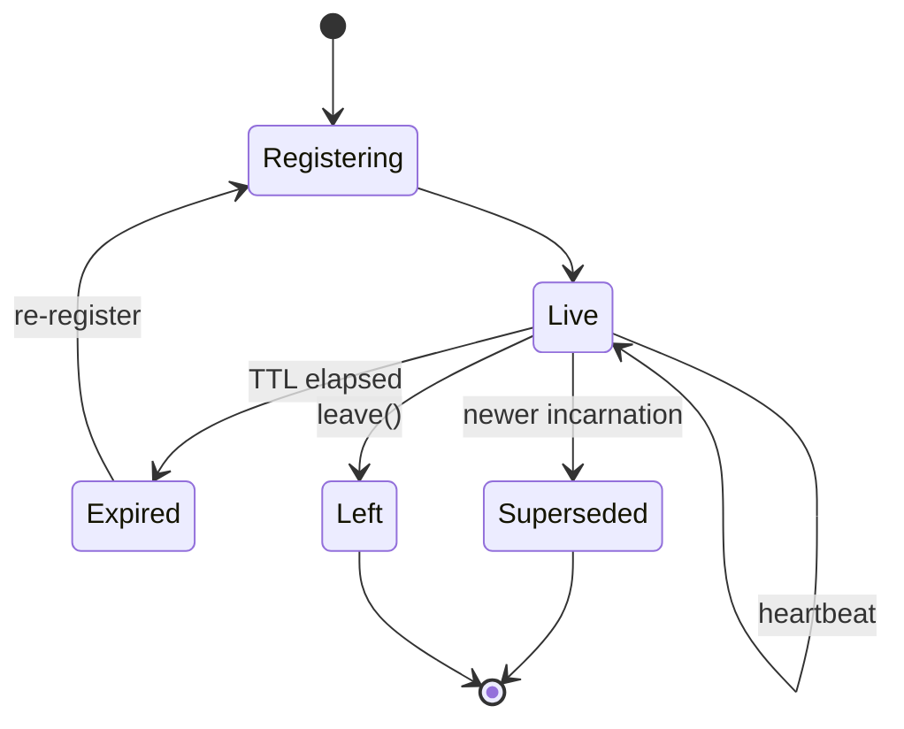
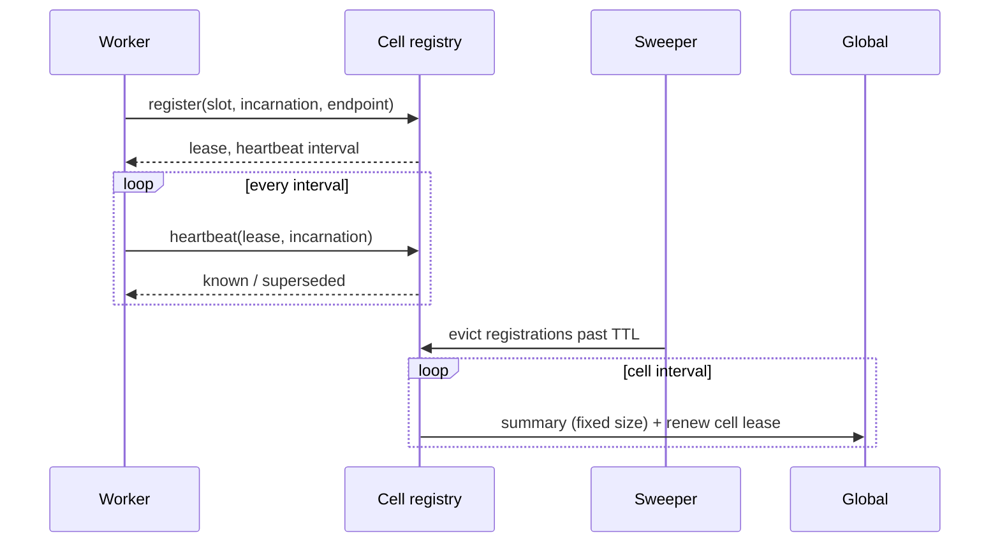

# Membership

> Proposal; not the current implementation.

> Workers assert their own liveness against their cell; cells assert theirs
> against consensus. Absence is the only death signal, because nothing supervises
> a process it did not start.

## 1. Scope

Registration, lease renewal, expiry, and upward aggregation. Proposed source:
`python/tinyray/membership.py` and the registry service.

## 2. Responsibilities

- Accept a worker's registration for a slot and incarnation.
- Keep it alive while the worker asserts it.
- Remove it when the worker stops.
- Aggregate worker liveness into one fixed-size summary per cell.
- Replicate without agreement, and serve reads when no replica answers.

## 3. Non-responsibilities

| Not done here | Owner |
|---|---|
| Starting or restarting a worker | L1, or [08-supervision](08-supervision.md) |
| Deciding what a lease expiry means for work | Application (L3) |
| Choosing the slot layout | Application (L3) |
| Leadership | [03-reconciliation](03-reconciliation.md), over consensus |
| Whether a live worker is *useful* | [04-readiness](04-readiness.md) |

The last row is a boundary worth stating: membership answers "is this process
present", readiness answers "should it be given work". Conflating them produced
a health check that returned `ok` whenever the event loop could still reply.

## 4. Position in the system

The bottom of the control plane. Discovery reads it, reconciliation compares
against it, admission is reported through it.

## 5. Dependencies

- [01-identity](01-identity.md) for slots and incarnations.
- [07-transport](07-transport.md) for the RPC.
- A consensus store, for cell-level leases only.

## 6. Public contract

| Interface | Input | Output | Side effect | Blocking | Failure |
|---|---|---|---|---|---|
| `join(target, slot, parent=None)` | Served object, slot, cell address | `Membership` | Serves a control port; registers; starts heartbeat | **No** | `RegistryUnavailable` after the startup window |
| `Membership.leave()` | — | — | Deregisters | Brief | Never raises |
| `Membership.state` | — | `Current` / `Superseded` / `Expired` | None | No | None |
| `Registry.register(...)` | Slot, incarnation, endpoint, meta | Lease | Records | No | None |
| `Registry.heartbeat(lease, incarnation)` | Lease, incarnation | `known`, `superseded` | Refreshes | No | None |
| `Registry.lookup(group, scope)` | Group and scope | Members | Sweeps expired | No | None |
| `Registry.summary()` | — | Fixed-size summary | None | No | None |

`join` does not block. The control port runs on its own thread, because
`__main__` belongs to the framework
([01-overview/03-principles.md](../01-overview/03-principles.md) P3).

## 7. State ownership

| State | Owner | Created | Updated by | Read by | Lifetime | Persisted |
|---|---|---|---|---|---|---|
| Registration | Worker | `join()` | Worker heartbeat | Peers, cell | Lease TTL | No |
| Lease deadline | Registry | Registration | Heartbeat | Sweeper | Until expiry | No |
| Membership version | Registry | First registration | Membership change only | Watchers | Registry process | No |
| Cell summary | Cell | Cell start | Cell interval | Global | Cell lease TTL | No |

**Membership version moves only when membership does.** A heartbeat must not
bump it, or every watcher re-fetches once per heartbeat per worker — a quadratic
that hides inside a linear-looking design.

## 8. Lifecycle

## 9. Main flow

The diagram cannot show: heartbeats never reach Global; the summary is the same
size whether the cell holds ten workers or ten thousand; and the registry never
probes the worker — it only observes absence.

## 10. Concurrency and distributed semantics

**Writes go to every replica.** A registration succeeds if any replica accepted
it. A replica that was down catches up on the next heartbeat, which is why
replicas need no agreement
([02-architecture/03-state-model.md](../02-architecture/03-state-model.md)).

**Reads take any replica**, preferring the last that answered, and fall back to
cache when none does.

**Heartbeat interval is one third of the TTL**, so two consecutive losses do not
evict a healthy worker.

**Eviction is by sweep**, so a worker can outlive its TTL by up to one sweep
interval. Bounded and reported, not hidden.

**Re-registration is not automatic on supersession.** A superseded worker that
re-registers would fight its successor forever, alternately resurrecting a dead
address. Unknown means re-register; superseded means stop.

## 11. Correctness invariants

- Liveness is asserted by the owner; nothing infers it from process parenthood.
- Worker heartbeats terminate at the cell.
- The cell summary size is independent of worker count.
- Membership version changes only on membership change.
- A registration for a slot replaces the previous one; a slot never has two live
  entries.
- A registry replica that loses all state converges within one lease period.
- A lookup served from cache reports that it was.
- Consensus sees O(cells) leases, never O(workers).

## 12. Failure handling

| Failure | Detected by | Bound | Response |
|---|---|---|---|
| Worker dies | Lease expiry | TTL + sweep | Removed from lookups |
| Worker hangs but process lives | Lease expiry | TTL + sweep | Removed; readiness would have caught it sooner |
| Worker partitioned | Lease expiry | TTL + sweep | Removed; it re-registers on reconnect |
| One replica down | Client failover | One request | Reads and writes continue |
| All replicas down | Client | One request | Reads from cache; membership changes invisible |
| Registry restarted empty | Heartbeat returns unknown | One interval | Everyone re-registers |
| Cell loses its lease | Global | Cell TTL | Cell accepts no new work; running work continues |

**The heartbeat thread swallows everything.** A sidecar losing contact with the
registry must never be why a training job stops. The worst honest outcome is
peers addressing a stale endpoint, which fencing makes safe.

## 13. Configuration

| Field | Type | Default | Validation | Reader | Effect |
|---|---|---|---|---|---|
| `lease_ttl` | seconds | 30 | > 3 x heartbeat | Registry | Time to eviction |
| `heartbeat_interval` | seconds | `ttl / 3` | > 0 | Worker | Assertion rate |
| `sweep_interval` | seconds | 5 | > 0 | Registry | Eviction granularity |
| `cache_ttl` | seconds | 5 | >= 0 | Client | Lookup freshness |
| `startup_window` | seconds | 300 | > 0 | Worker | How long to wait for a registry that has not started |
| `registry` | addresses | env `TINYRAY_REGISTRY` | Non-empty | Client | Replica list |

`startup_window` exists because Slurm starts ranks in whatever order it likes; a
worker that gave up because it was early would make startup a race.

Every timing constant is overridable from the environment, so a test can reach
the deadline in seconds. A constant that only ever runs at its production value
is a constant nobody tests.

## 14. Observability

| Metric | Producer | Meaning |
|---|---|---|
| `membership_registrations_total` | Registry | Joins, including re-registrations |
| `membership_evictions_total` | Registry | Leases expired |
| `membership_live` | Registry | Current members |
| `membership_version` | Registry | Changes only on churn |
| `heartbeat_failures_total` | Worker | Registry unreachable from a worker |
| `registry_served_from_stale` | Client | Reads from cache |
| `cell_summary_bytes` | Cell | Must not track worker count |

## 15. Testing

| Behaviour | Test file | Test case | Level |
|---|---|---|---|
| A silent worker is evicted | `tests/test_membership.py` | `test_silent_worker_is_evicted` | Unit |
| A heartbeating worker survives | `tests/test_membership.py` | `test_heartbeat_keeps_alive` | Unit |
| Version does not move on heartbeat | `tests/test_membership.py` | `test_version_moves_only_on_change` | Unit |
| Restart replaces, not duplicates | `tests/test_membership.py` | `test_restart_replaces_entry` | Unit |
| Unknown lease re-registers | `tests/test_membership.py` | `test_unknown_lease_reregisters` | Unit |
| Summary size independent of members | `tests/test_membership.py` | `test_summary_size_is_bounded` | Unit |
| Workers self-register with no launcher | `tests/test_membership.py` | `test_join_without_launcher` | Integration |
| Losing one replica is survivable | `tests/test_chaos.py` | `test_replica_failover` | Chaos |
| Losing every replica does not stop work | `tests/test_chaos.py` | `test_total_registry_loss` | Chaos |
| A death is noticed with nothing supervising | `tests/test_chaos.py` | `test_expiry_without_supervisor` | Chaos |

The replica tests must run with **at least two replicas, and must kill one**. A
single-replica test proves nothing about availability — the previous prototype
passed every single-replica test while two replicas were permanently broken by a
shared identity ([08-project/02-decisions.md](../08-project/02-decisions.md)).

## 16. Limitations and trade-offs

- **Detection is not instant.** Up to `lease_ttl + sweep_interval`. Shortening
  the TTL evicts healthy workers during a garbage-collection pause; the tradeoff
  is a deployment decision.
- **Stale reads are possible** for up to `cache_ttl`, and unbounded when every
  replica is down. Fencing makes them safe, not free.
- **The registry does not verify anything.** A worker that registers an endpoint
  it cannot serve stays listed until its lease expires. Readiness is the answer,
  not membership.
- **No notification on change.** Watchers poll with a version. A push-based watch
  is on the [roadmap](../08-project/03-roadmap.md).

## 17. Source mapping

Proposed: `python/tinyray/membership.py`, `python/tinyray/registry.py`.

Related: [01-identity](01-identity.md) for what is registered,
[05-discovery](05-discovery.md) for reading it,
[04-protocols/02-membership-protocol.md](../04-protocols/02-membership-protocol.md)
for the wire contract.
