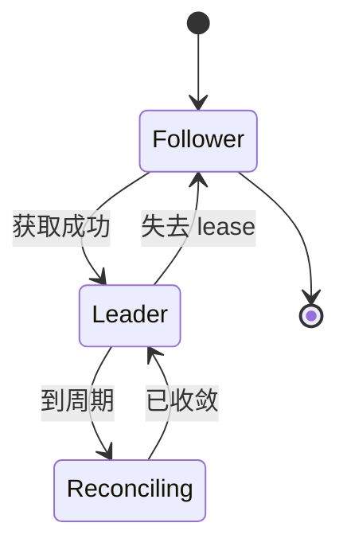
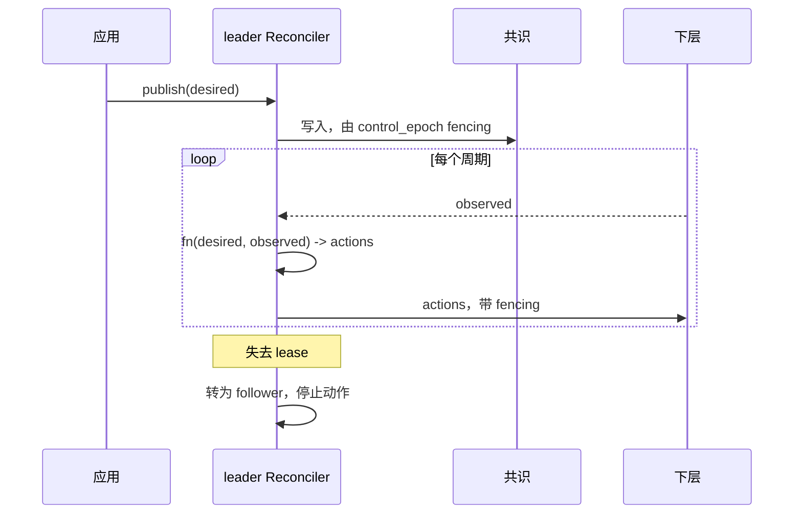

# Reconciliation

> 提案；当前未实现。

> 控制器发布它想要的，worker 上报实际的，一个循环消除差距。没有任何东西依赖某条命令是否
> 送达。

## 1. 范围

desired/observed 收敛循环、leadership 获取，以及 epoch fencing。计划源码：
`python/tinyray/reconcile.py`。

## 2. 职责

- 由当前 leader 持有 fencing token 发布 desired state。
- 从下层收集 observed state。
- 反复且幂等地运行收敛函数。
- 当某操作需要固定成员集时，把健康 membership 冻结成一个 epoch。
- 经共识适配层获取并续约 leadership。

## 3. 非职责

| 不在此处做 | 归属 |
|---|---|
| desired 或 observed state 的 schema | 应用（L3） |
| 收敛意味着什么 | 应用（L3） |
| 实现共识 | etcd 或等价物 |
| 判定 membership | [02-membership](02-membership.md) |
| 执行实际工作 | 应用 |

tinyray 提供循环，应用提供两端状态以及中间那个函数。

## 4. 系统位置

位于 membership 之上、应用控制器之下。每个指挥下层的层都运行一个 Reconciler。

## 5. 依赖

- [01-identity](01-identity.md) 提供 fencing token。
- [02-membership](02-membership.md) 提供 observed state。
- 一个共识存储，用于 leadership 和 desired state。

## 6. 公共契约

| Interface | Input | Output | Side effect | Blocking | Failure |
|---|---|---|---|---|---|
| `Reconciler(desired_key, observed_source, fn, interval)` | 键与函数 | Reconciler | 无 | 否 | `ValueError` |
| `Reconciler.start()` | —— | —— | 在线程上运行循环 | 否 | 无 |
| `Reconciler.publish(state)` | desired state | 版本号 | 写入共识 | 是 | `NotLeader`、`ConsensusUnavailable` |
| `Reconciler.epoch(min_ready)` | 最小成员数 | `Epoch` | 冻结 membership | 否 | `InsufficientCapacity` |
| `leadership(name)` | 名称 | 上下文管理器 | 获取并续约 | 进入时阻塞 | `ConsensusUnavailable` |

```python
@tinyray.reconciler(desired="rollout/desired", observed=cell.summary, interval=2.0)
def converge(desired, observed):
    ...  # 完全属于应用
```

## 7. 状态所有权

| State | Owner | Created | Updated by | Read by | Lifetime | Persisted |
|---|---|---|---|---|---|---|
| desired state | 应用，经 leader | 发布时 | 仅 leader | 下层 | 实验期 | 是 |
| control epoch | leader | 选举时 | 每次选举 | 所有写入者 | 实验期 | 是 |
| membership epoch | Reconciler | `epoch()` 时 | 每次冻结 | 参与者 | 一次操作 | 否 |
| observed state | 下层 | 持续 | 其 owner | Reconciler | 一个周期 | 否 |
| leadership lease | 共识 | 选举时 | 续约 | 所有层 | 直到失去 | 是 |

## 8. 生命周期



follower 不运行收敛也不发布。它读取 desired state 并服务 lookup，因此一次 leader 选举
不会停止读取。

## 9. 主流程



图中无法表达：action 是幂等的，因此丢失的 action 会在下个周期重发；过期 leader 的写入被
`control_epoch` 拒绝；没有 leader 期间下层继续工作。

## 10. 并发与分布式语义

**收敛是幂等且反复执行的。** 没有任何东西依赖命令送达。丢掉的 action 下个周期重发，这就
免去了控制路径上的投递保证需求。

**只有 leader 动作。** follower 只观察。每次变更都携带 `control_epoch`，恢复的旧 leader
会发现自己的 epoch 已过期。

**epoch 使“全体成员”变得安全。** 当某操作确实需要每个参与者时 —— 例如建立 collective
communicator —— Reconciler 把健康 membership 冻结成一个 epoch。该操作要求**该 epoch 内**
的全部成员，而不是配置中曾经出现过的全部成员。返回的成员加入下一个 epoch。

这就是 [P5](../01-overview/03-principles.md) 与 collective 共存的方式：P5 管 membership，
不管 collective。

**leader 切换有一个窗口**，等于一个 lease TTL，通常 10 到 15 秒。设计要求没有任何决策
需要亚 lease 级延迟；如果每轮迭代的循环需要 leader，说明分层错了。

## 11. 正确性不变量

- 收敛函数是幂等的。
- 只有当前 leader 变更 desired state。
- 每次变更携带 control epoch；接收端拒绝过期 epoch。
- observed state 绝不由读取它的那一层写入。
- epoch 的成员集在冻结时固定，绝不增长。
- 没有全局操作等待当前 epoch 之外的成员。
- 失去 leadership 后在一个周期内停止动作。

## 12. 故障处理

| 故障 | 检测方 | 响应 |
|---|---|---|
| leader 死亡 | 共识 lease | 选出新 leader；epoch 递增 |
| leader 被分区 | 自身续约失败 | 在其 lease 于别处过期之前主动下台 |
| 旧 leader 返回 | epoch 校验 | 写入被拒；转为 follower |
| 共识不可用 | 客户端 | 不发布、不选举；下层继续 |
| 收敛函数抛出 | 循环 | 记录日志，下周期重试；绝不杀死循环 |
| observed state 不可用 | 循环 | 跳过本周期；不基于不完整数据动作 |

最后一行是有意的：基于不完整观察动作，正是控制器把一个健康集群缩容到零的方式。

## 13. 配置

| Field | Type | Default | Validation | Reader | Effect |
|---|---|---|---|---|---|
| `interval` | 秒 | 2.0 | > 0 | Reconciler | 收敛频率 |
| `leader_ttl` | 秒 | 15 | > 3 × renew | 共识适配层 | 切换窗口 |
| `leader_renew` | 秒 | `ttl / 3` | > 0 | leader | 续约频率 |
| `min_ready_fraction` | 比例 | 0.9 | 0..1 | `epoch()` | 低于此值拒绝冻结 |
| `consensus` | 地址 | 环境变量 `TINYRAY_CONSENSUS` | 使用时非空 | 适配层 | 存储位置 |

## 14. 可观测性

| Metric | Producer | Meaning |
|---|---|---|
| `reconcile_iterations_total` | Reconciler | 循环进度 |
| `reconcile_errors_total` | Reconciler | 收敛函数失败次数 |
| `reconcile_skipped_total` | Reconciler | 因观察不完整跳过的周期 |
| `leader_changes_total` | 适配层 | 选举抖动 |
| `leader_is_current` | 适配层 | leader 上为 1 |
| `epoch_current` | Reconciler | membership epoch |
| `epoch_freeze_failures_total` | Reconciler | 低于 `min_ready_fraction` |

## 15. 测试

| Behavior | Test file | Test case | Level |
|---|---|---|---|
| 收敛是幂等的 | `tests/test_reconcile.py` | `test_repeated_convergence_is_stable` | Unit |
| follower 不动作 | `tests/test_reconcile.py` | `test_follower_is_passive` | Unit |
| 过期 leader 的写入被拒 | `tests/test_reconcile.py` | `test_stale_epoch_rejected` | Unit |
| 观察不完整时跳过周期 | `tests/test_reconcile.py` | `test_partial_observation_skipped` | Unit |
| epoch 排除后加入的成员 | `tests/test_reconcile.py` | `test_epoch_membership_is_frozen` | Unit |
| 抛异常的函数不杀死循环 | `tests/test_reconcile.py` | `test_loop_survives_exceptions` | Unit |
| leader 切换时下层继续运行 | `tests/test_chaos.py` | `test_leader_failover` | Chaos |
| 返回的旧 leader 被 fence | `tests/test_chaos.py` | `test_old_leader_returns` | Chaos |

最后一条必须在旧 leader **仍然存活且仍在尝试写入**的条件下运行。

## 16. 限制与取舍

- **收敛是轮询而非推送。** 延迟由 `interval` 限定。watch 更快，在
  [roadmap](../08-project/03-roadmap.md) 上。
- **leader 切换会冻结决策**最多 `leader_ttl`。这只有在每轮迭代循环不需要 leader 时才可
  接受 —— 这是应用必须遵守而 tinyray 无法强制的约束。
- **收敛函数是无界的应用代码。** 慢函数会拖慢循环。tinyray 计时并上报，但不中断它。
- **leadership 硬依赖共识。** 没有共识存储的部署靠配置指定单 leader，无法防止出现两个。

## 17. 源码映射

计划：`python/tinyray/reconcile.py`、`python/tinyray/consensus.py`。

相关：[02-architecture/03-state-model.md](../02-architecture/03-state-model.md)
说明什么该放进共识。
