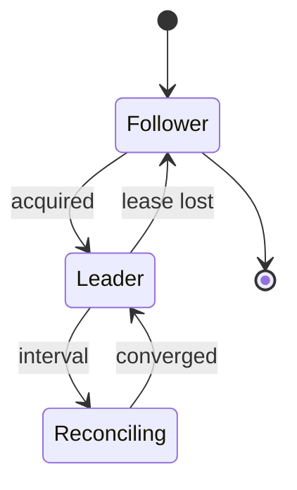
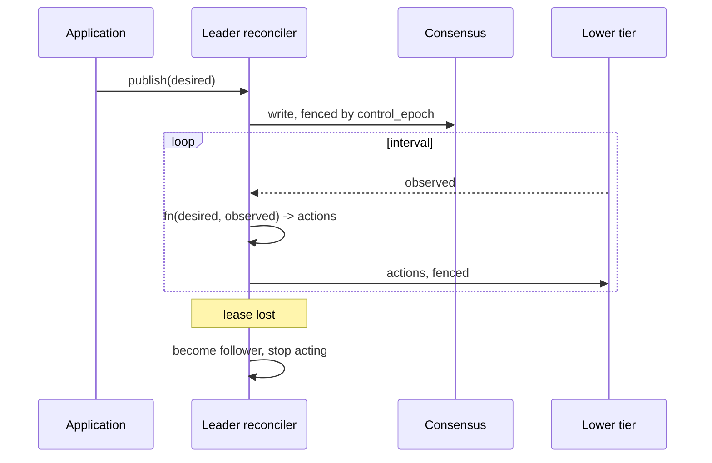

# Reconciliation

> Proposal; not the current implementation.

> The controller publishes what it wants; workers report what is. A loop closes
> the gap. Nothing depends on a command having arrived.

## 1. Scope

The desired/observed convergence loop, leadership acquisition, and epoch
fencing. Proposed source: `python/tinyray/reconcile.py`.

## 2. Responsibilities

- Publish desired state under a fencing token held by the current leader.
- Collect observed state from the tier below.
- Run a convergence function, repeatedly and idempotently.
- Freeze healthy membership into an epoch when an operation needs a fixed set.
- Acquire and renew leadership through a consensus adapter.

## 3. Non-responsibilities

| Not done here | Owner |
|---|---|
| The schema of desired or observed state | Application (L3) |
| What convergence means | Application (L3) |
| Implementing consensus | etcd or equivalent |
| Deciding membership | [02-membership](02-membership.md) |
| Executing the work | Application |

tinyray provides the loop. The application provides both states and the function
between them.

## 4. Position in the system

Sits above membership and below the application controller. Every tier that
directs a tier below it runs a reconciler.

## 5. Dependencies

- [01-identity](01-identity.md) for fencing tokens.
- [02-membership](02-membership.md) for observed state.
- A consensus store for leadership and desired state.

## 6. Public contract

| Interface | Input | Output | Side effect | Blocking | Failure |
|---|---|---|---|---|---|
| `Reconciler(desired_key, observed_source, fn, interval)` | Keys and a function | Reconciler | None | No | `ValueError` |
| `Reconciler.start()` | — | — | Runs the loop on a thread | No | None |
| `Reconciler.publish(state)` | Desired state | Version | Writes to consensus | Yes | `NotLeader`, `ConsensusUnavailable` |
| `Reconciler.epoch(min_ready)` | Minimum members | `Epoch` | Freezes membership | No | `InsufficientCapacity` |
| `leadership(name)` | Name | Context manager | Acquires and renews | Yes on entry | `ConsensusUnavailable` |

```python
@tinyray.reconciler(desired="rollout/desired", observed=cell.summary, interval=2.0)
def converge(desired, observed):
    ...  # entirely the application's
```

## 7. State ownership

| State | Owner | Created | Updated by | Read by | Lifetime | Persisted |
|---|---|---|---|---|---|---|
| Desired state | Application, via leader | Publish | Leader only | Lower tiers | Experiment | Yes |
| Control epoch | Leader | Election | Each election | All writers | Experiment | Yes |
| Membership epoch | Reconciler | `epoch()` | Each freeze | Participants | One operation | No |
| Observed state | Lower tier | Continuously | Its owner | Reconciler | One interval | No |
| Leadership lease | Consensus | Election | Renewal | All tiers | Until lost | Yes |

## 8. Lifecycle



A follower runs no convergence and publishes nothing. It reads desired state and
serves lookups, so a leader election does not stop reads.

## 9. Main flow



The diagram cannot show: actions are idempotent, so a lost action is repeated
next interval; a stale leader's write is rejected by `control_epoch`; and the
lower tier keeps working while no leader exists.

## 10. Concurrency and distributed semantics

**Convergence is idempotent and repeated.** Nothing depends on a command
arriving. A dropped action is reissued next interval, which removes the need for
delivery guarantees on the control path.

**Only the leader acts.** Followers observe. Every mutation carries
`control_epoch`, and a recovered old leader finds its epoch stale.

**Epochs make "all members" safe.** Where an operation genuinely needs every
participant — building a collective communicator, for instance — the reconciler
freezes healthy membership into an epoch. The operation requires all members *of
that epoch*, not all members ever configured. A member that returns joins the
next epoch.

This is how [P5](../01-overview/03-principles.md) coexists with collectives:
P5 governs membership, not the collective.

**Leader failover has a window** of one lease TTL, typically 10 to 15 seconds.
The design requires that no decision be needed at sub-lease latency; if the
per-iteration loop needs the leader, the layering is wrong.

## 11. Correctness invariants

- Convergence functions are idempotent.
- Only the current leader mutates desired state.
- Every mutation carries the control epoch; receivers reject stale epochs.
- Observed state is never written by the tier that reads it.
- An epoch's membership is fixed at freeze time and never grows.
- No global operation waits for a member outside the current epoch.
- Losing leadership stops action within one interval.

## 12. Failure handling

| Failure | Detected by | Response |
|---|---|---|
| Leader dies | Consensus lease | New leader elected; epoch incremented |
| Leader partitioned | Its own renewal failure | Steps down before its lease expires elsewhere |
| Old leader returns | Epoch check | Writes rejected; becomes follower |
| Consensus unavailable | Client | No publishing, no election; lower tiers continue |
| Convergence function raises | Loop | Logged, retried next interval; never kills the loop |
| Observed state unavailable | Loop | Skips this interval; does not act on partial data |

The last row is deliberate: acting on incomplete observation is how a controller
scales a healthy cluster to zero.

## 13. Configuration

| Field | Type | Default | Validation | Reader | Effect |
|---|---|---|---|---|---|
| `interval` | seconds | 2.0 | > 0 | Reconciler | Convergence rate |
| `leader_ttl` | seconds | 15 | > 3 x renew | Consensus adapter | Failover window |
| `leader_renew` | seconds | `ttl / 3` | > 0 | Leader | Renewal rate |
| `min_ready_fraction` | ratio | 0.9 | 0..1 | `epoch()` | Refuses to freeze below this |
| `consensus` | addresses | env `TINYRAY_CONSENSUS` | Non-empty when used | Adapter | Store location |

## 14. Observability

| Metric | Producer | Meaning |
|---|---|---|
| `reconcile_iterations_total` | Reconciler | Loop progress |
| `reconcile_errors_total` | Reconciler | Convergence function failures |
| `reconcile_skipped_total` | Reconciler | Intervals with incomplete observation |
| `leader_changes_total` | Adapter | Election churn |
| `leader_is_current` | Adapter | 1 on the leader |
| `epoch_current` | Reconciler | Membership epoch |
| `epoch_freeze_failures_total` | Reconciler | Below `min_ready_fraction` |

## 15. Testing

| Behaviour | Test file | Test case | Level |
|---|---|---|---|
| Convergence is idempotent | `tests/test_reconcile.py` | `test_repeated_convergence_is_stable` | Unit |
| A follower does not act | `tests/test_reconcile.py` | `test_follower_is_passive` | Unit |
| A stale leader's write is rejected | `tests/test_reconcile.py` | `test_stale_epoch_rejected` | Unit |
| Incomplete observation skips the interval | `tests/test_reconcile.py` | `test_partial_observation_skipped` | Unit |
| An epoch excludes members that join later | `tests/test_reconcile.py` | `test_epoch_membership_is_frozen` | Unit |
| A raising function does not kill the loop | `tests/test_reconcile.py` | `test_loop_survives_exceptions` | Unit |
| Leader failover leaves lower tiers running | `tests/test_chaos.py` | `test_leader_failover` | Chaos |
| Old leader returning is fenced | `tests/test_chaos.py` | `test_old_leader_returns` | Chaos |

The last case must run with the old leader **still alive and still trying**.

## 16. Limitations and trade-offs

- **Convergence is polled, not pushed.** Latency is bounded by `interval`. A
  watch would be faster; it is on the [roadmap](../08-project/03-roadmap.md).
- **Leader failover freezes decisions** for up to `leader_ttl`. Acceptable only
  because the per-iteration loop does not require the leader — a constraint the
  application must honour and tinyray cannot enforce.
- **The convergence function is unbounded application code.** A slow one delays
  the loop. tinyray times it and reports; it does not interrupt it.
- **Consensus is a hard dependency for leadership.** A deployment without one is
  single-leader by configuration, with no protection against two.

## 17. Source mapping

Proposed: `python/tinyray/reconcile.py`, `python/tinyray/consensus.py`.

Related: [02-architecture/03-state-model.md](../02-architecture/03-state-model.md)
for what belongs in consensus.
