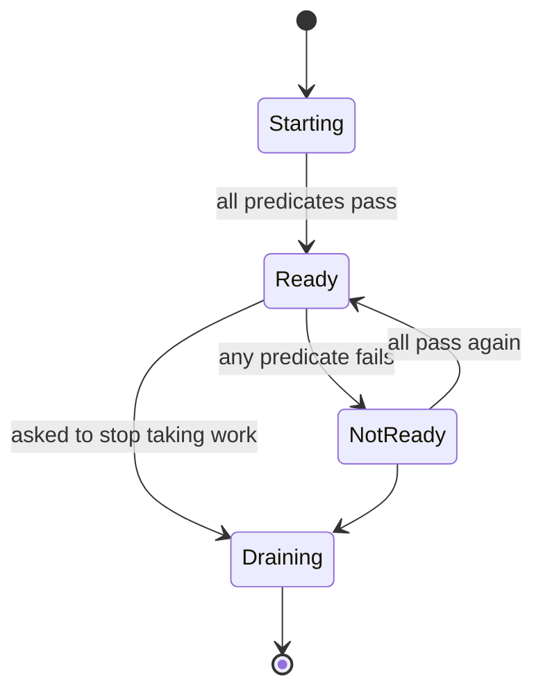
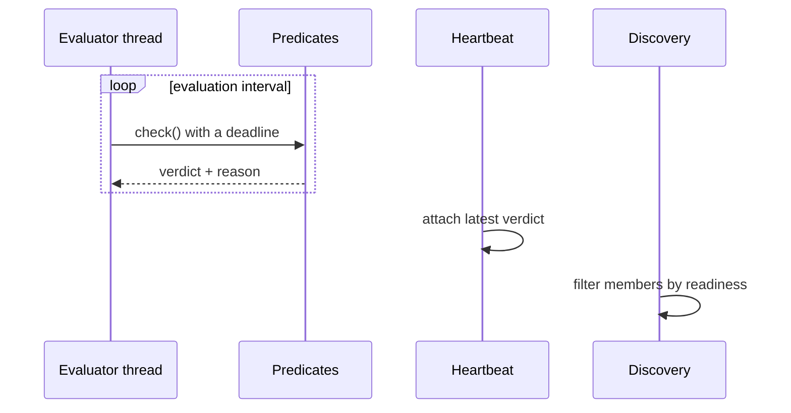

# Readiness

> Proposal; not the current implementation.

> Membership says a process exists. Readiness says it should be given work.
> Conflating them produces a health check that returns `ok` while the worker is
> useless.

## 1. Scope

Composable readiness predicates, their evaluation, and their publication.
Proposed source: `python/tinyray/readiness.py`.

## 2. Responsibilities

- Compose predicates into one readiness verdict.
- Evaluate them off the path they are measuring.
- Publish the verdict, and the reason when it is negative.
- Provide generic predicates: process alive, port open, HTTP status, log match,
  queue depth, event-loop lag.

## 3. Non-responsibilities

| Not done here | Owner |
|---|---|
| Domain predicates — model version, KV cache, sample spool | Application (L3) |
| Deciding what to do about unreadiness | Application (L3) |
| Restarting an unready worker | [08-supervision](08-supervision.md) or L1 |
| Liveness | [02-membership](02-membership.md) |

## 4. Position in the system

Between membership and discovery. A member that is live but unready is present
in membership and excluded from a ready-filtered lookup.

## 5. Dependencies

- [02-membership](02-membership.md) to publish the verdict with the heartbeat.
- Nothing else. Predicates must not require the control plane.

## 6. Public contract

| Interface | Input | Output | Side effect | Blocking | Failure |
|---|---|---|---|---|---|
| `readiness(*predicates)` | Predicates | `Readiness` | None | No | `TypeError` |
| `Readiness.evaluate()` | — | `Verdict(ready, reasons)` | Runs predicates | Bounded | Never raises |
| `Predicate.check()` | — | `bool` or `(bool, str)` | Predicate's own | Bounded | Treated as not ready |
| `Readiness.publish(membership)` | Membership | — | Attaches to heartbeat | No | None |

```python
tinyray.readiness(
    tinyray.ProcessAlive(),
    tinyray.HttpOk("/health", timeout=1.0),
    tinyray.QueueBelow(lambda: queue.qsize(), 1000),
    tinyray.EventLoopLagBelow(0.2),
    ModelVersionInWindow(...),      # the application's
)
```

## 7. State ownership

| State | Owner | Created | Updated by | Read by | Lifetime | Persisted |
|---|---|---|---|---|---|---|
| Predicate list | Worker | At construction | Never | Evaluator | Process | No |
| Latest verdict | Worker | First evaluation | Each evaluation | Heartbeat, `/introspect` | Until next | No |
| Reasons | Worker | On a negative verdict | Each evaluation | Operators | Until next | No |
| Published readiness | Registry | Heartbeat | Heartbeat | Discovery | Lease TTL | No |

## 8. Lifecycle



`Draining` is distinct from `NotReady`: draining is intentional and finishes
existing work; not-ready is a fault.

## 9. Main flow



The diagram cannot show: the evaluator runs on its own thread, so a stalled
worker still produces a verdict; a predicate exceeding its deadline counts as
not ready; and the heartbeat publishes the *last* verdict rather than triggering
a fresh evaluation.

## 10. Concurrency and distributed semantics

**Evaluation happens off the path being measured.** A readiness check on the
same event loop it is measuring cannot detect that the loop is stuck — the
canonical failure of internal watchdogs. The evaluator runs on a dedicated
thread; the transport that serves `/health` is native and does not need the GIL
([07-transport](07-transport.md)).

**Every predicate has a deadline.** A hanging predicate is a not-ready verdict,
never a hanging evaluator.

**Predicates are independent** and evaluated every interval regardless of earlier
failures, because the reasons together are the diagnosis. Short-circuiting saves
microseconds and loses the operator's information.

**Verdicts are published, not polled.** Discovery reads what the heartbeat
carried. A ready-filtered lookup is as fresh as the last heartbeat.

## 11. Correctness invariants

- Readiness is separate from liveness; a member may be live and not ready.
- A predicate that times out yields not ready.
- A negative verdict always carries at least one reason.
- Evaluation never blocks the worker's own work.
- Evaluation is never on the path it measures.
- A worker that has never evaluated is not ready.

The last one matters at startup: default-ready means work is dispatched to a
worker that has not finished loading.

## 12. Failure handling

| Failure | Detected by | Response |
|---|---|---|
| Predicate raises | Evaluator | Not ready, exception as reason |
| Predicate hangs | Deadline | Not ready, timeout as reason |
| Evaluator thread dies | Heartbeat sees a stale verdict | Verdict ages out; treated as not ready |
| Worker never becomes ready | Application | tinyray reports; escalation is L3's |
| All members unready | Discovery | Ready-filtered lookup returns empty; the caller decides |

tinyray never restarts a worker for being unready. It reports; L3 or L1 acts.

## 13. Configuration

| Field | Type | Default | Validation | Reader | Effect |
|---|---|---|---|---|---|
| `interval` | seconds | 1.0 | > 0 | Evaluator | Evaluation rate |
| `predicate_timeout` | seconds | 1.0 | > 0 | Evaluator | Per-predicate deadline |
| `verdict_max_age` | seconds | 3 x interval | > interval | Heartbeat | Stale verdict counts as not ready |
| `initial` | `not_ready` | `not_ready` | Fixed | Evaluator | Not configurable, by design |

## 14. Observability

| Metric | Producer | Meaning |
|---|---|---|
| `readiness_current` | Worker | 1 when ready |
| `readiness_transitions_total` | Worker | Flapping detector |
| `readiness_failures_by_reason` | Worker | Which predicate, labelled |
| `readiness_evaluation_seconds` | Worker | Predicate cost |
| `readiness_stale_total` | Heartbeat | Evaluator not keeping up |

`readiness_failures_by_reason` is the field an operator reads first, which is
why a negative verdict without a reason is an invariant violation.

## 15. Testing

| Behaviour | Test file | Test case | Level |
|---|---|---|---|
| Composition requires every predicate | `tests/test_readiness.py` | `test_all_must_pass` | Unit |
| A hanging predicate yields not ready | `tests/test_readiness.py` | `test_hanging_predicate_times_out` | Unit |
| A raising predicate yields not ready | `tests/test_readiness.py` | `test_raising_predicate` | Unit |
| Every negative verdict has a reason | `tests/test_readiness.py` | `test_reasons_always_present` | Unit |
| Initial state is not ready | `tests/test_readiness.py` | `test_starts_not_ready` | Unit |
| A stale verdict counts as not ready | `tests/test_readiness.py` | `test_stale_verdict_is_not_ready` | Unit |
| A stalled worker still reports | `tests/test_readiness.py` | `test_evaluator_survives_blocked_worker` | Integration |
| Unready members are excluded from lookup | `tests/test_discovery.py` | `test_ready_filter` | Integration |

`test_evaluator_survives_blocked_worker` is the load-bearing one: it must block
the worker's main thread and assert a verdict is still produced.

## 16. Limitations and trade-offs

- **Readiness is as fresh as the last heartbeat.** Up to one interval stale in
  the worker and one lease interval stale in discovery.
- **Predicates cost CPU on the worker.** An expensive one runs every interval;
  tinyray measures the cost but does not budget it.
- **No hysteresis by default.** A flapping predicate produces a flapping member.
  `readiness_transitions_total` exists to make that visible; damping is the
  application's.
- **tinyray supplies no domain predicate.** Model version, KV cache and spool
  depth are L3's, deliberately — and they are the ones that matter most.

## 17. Source mapping

Proposed: `python/tinyray/readiness.py`.

Related: [02-membership](02-membership.md) publishes the verdict;
[05-discovery](05-discovery.md) filters on it;
[06-admission](06-admission.md) is the immediate consumer.
