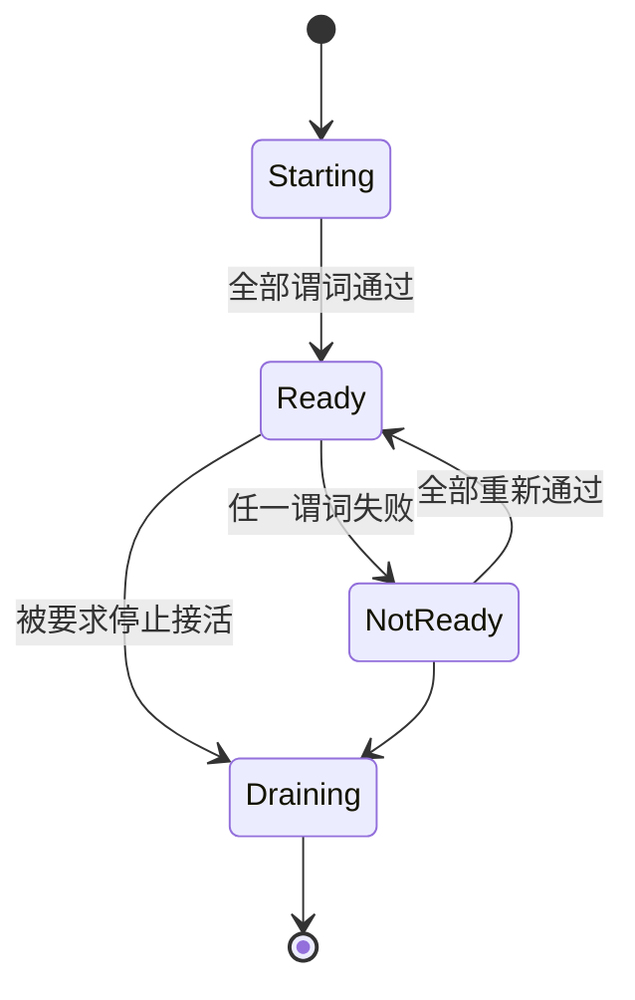
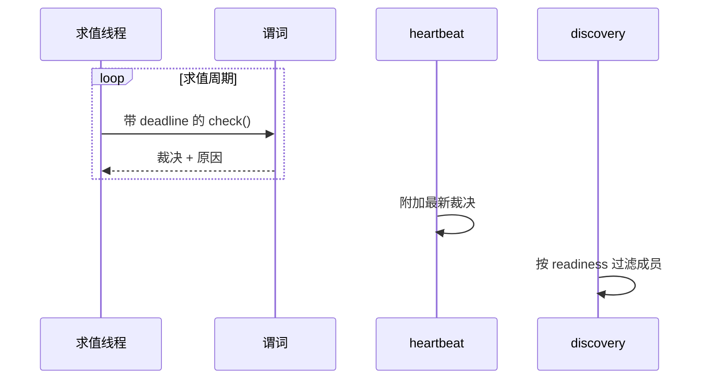

# Readiness

> 提案；当前未实现。

> membership 说一个进程存在，Readiness 说该不该给它派活。把两者混同的结果是：worker 已经
> 没用了，健康检查还在返回 `ok`。

## 1. 范围

可组合 Readiness 谓词、其求值与发布。计划源码：`python/tinyray/readiness.py`。

## 2. 职责

- 把多个谓词组合成一个 Readiness 裁决。
- 在被测量的路径**之外**求值。
- 发布裁决，以及否定时的原因。
- 提供通用谓词：进程存活、端口打开、HTTP 状态、日志匹配、队列深度、事件循环延迟。

## 3. 非职责

| 不在此处做 | 归属 |
|---|---|
| 领域谓词 —— model version、KV cache、sample spool | 应用（L3） |
| 决定 unready 之后怎么办 | 应用（L3） |
| 重启 unready 的 worker | [08-supervision](08-supervision.md) 或 L1 |
| 存活性 | [02-membership](02-membership.md) |

## 4. 系统位置

位于 membership 与 discovery 之间。一个存活但未就绪的成员出现在 membership 中，但被
ready 过滤的 lookup 排除。

## 5. 依赖

- [02-membership](02-membership.md) 用于随 heartbeat 发布裁决。
- 无其他依赖。谓词不得依赖控制面。

## 6. 公共契约

| Interface | Input | Output | Side effect | Blocking | Failure |
|---|---|---|---|---|---|
| `readiness(*predicates)` | 谓词 | `Readiness` | 无 | 否 | `TypeError` |
| `Readiness.evaluate()` | —— | `Verdict(ready, reasons)` | 运行谓词 | 有界 | 从不抛出 |
| `Predicate.check()` | —— | `bool` 或 `(bool, str)` | 谓词自身的 | 有界 | 视为未就绪 |
| `Readiness.publish(membership)` | Membership | —— | 附加到 heartbeat | 否 | 无 |

```python
tinyray.readiness(
    tinyray.ProcessAlive(),
    tinyray.HttpOk("/health", timeout=1.0),
    tinyray.QueueBelow(lambda: queue.qsize(), 1000),
    tinyray.EventLoopLagBelow(0.2),
    ModelVersionInWindow(...),      # 应用自己的
)
```

## 7. 状态所有权

| State | Owner | Created | Updated by | Read by | Lifetime | Persisted |
|---|---|---|---|---|---|---|
| 谓词列表 | worker | 构造时 | 从不 | 求值器 | 进程期 | 否 |
| 最新裁决 | worker | 首次求值 | 每次求值 | heartbeat、`/introspect` | 到下次求值 | 否 |
| 原因 | worker | 否定裁决时 | 每次求值 | 运维 | 到下次求值 | 否 |
| 已发布的 readiness | Registry | heartbeat | heartbeat | discovery | lease TTL | 否 |

## 8. 生命周期



`Draining` 与 `NotReady` 不同：draining 是有意的且会完成已有工作，not-ready 是故障。

## 9. 主流程



图中无法表达：求值器跑在自己的线程上，因此卡住的 worker 仍能产出裁决；超出 deadline 的
谓词记为未就绪；heartbeat 发布的是**上一次**裁决而非触发一次新的求值。

## 10. 并发与分布式语义

**求值发生在被测量路径之外。** 一个跑在它所测量的事件循环上的 readiness 检查，无法发现
该循环已经卡死 —— 这是内部 watchdog 的经典失效方式。求值器跑在专用线程上；服务
`/health` 的 transport 是原生的，不需要 GIL（[07-transport](07-transport.md)）。

**每个谓词都有 deadline。** 挂住的谓词产生未就绪裁决，绝不产生挂住的求值器。

**谓词彼此独立**，且无论先前是否失败每周期都全部求值，因为所有原因合起来才是诊断。短路
省下微秒，丢掉运维人员需要的信息。

**裁决是被发布的，不是被轮询的。** discovery 读取 heartbeat 携带的内容。ready 过滤的
lookup 的新鲜度等于上次 heartbeat。

## 11. 正确性不变量

- Readiness 与存活性分离；成员可以存活但未就绪。
- 超时的谓词产生未就绪。
- 否定裁决必定携带至少一条原因。
- 求值绝不阻塞 worker 自身的工作。
- 求值绝不发生在它所测量的路径上。
- 从未求值过的 worker 是未就绪的。

最后一条在启动时很重要：默认就绪意味着工作会被派给一个还没加载完的 worker。

## 12. 故障处理

| 故障 | 检测方 | 响应 |
|---|---|---|
| 谓词抛出 | 求值器 | 未就绪，以异常为原因 |
| 谓词挂住 | deadline | 未就绪，以超时为原因 |
| 求值线程死亡 | heartbeat 看到裁决陈旧 | 裁决过龄，视为未就绪 |
| worker 始终不就绪 | 应用 | tinyray 上报；升级处理属于 L3 |
| 全部成员未就绪 | discovery | ready 过滤的 lookup 返回空，由调用方决定 |

tinyray 绝不因为未就绪而重启 worker。它上报，由 L3 或 L1 动作。

## 13. 配置

| Field | Type | Default | Validation | Reader | Effect |
|---|---|---|---|---|---|
| `interval` | 秒 | 1.0 | > 0 | 求值器 | 求值频率 |
| `predicate_timeout` | 秒 | 1.0 | > 0 | 求值器 | 每谓词 deadline |
| `verdict_max_age` | 秒 | 3 × interval | > interval | heartbeat | 陈旧裁决视为未就绪 |
| `initial` | `not_ready` | `not_ready` | 固定 | 求值器 | 有意不可配置 |

## 14. 可观测性

| Metric | Producer | Meaning |
|---|---|---|
| `readiness_current` | worker | 就绪时为 1 |
| `readiness_transitions_total` | worker | 抖动检测 |
| `readiness_failures_by_reason` | worker | 哪个谓词，带标签 |
| `readiness_evaluation_seconds` | worker | 谓词开销 |
| `readiness_stale_total` | heartbeat | 求值器跟不上 |

`readiness_failures_by_reason` 是运维第一个看的字段，这就是“否定裁决无原因”属于不变量
违反的原因。

## 15. 测试

| Behavior | Test file | Test case | Level |
|---|---|---|---|
| 组合要求全部谓词通过 | `tests/test_readiness.py` | `test_all_must_pass` | Unit |
| 挂住的谓词产生未就绪 | `tests/test_readiness.py` | `test_hanging_predicate_times_out` | Unit |
| 抛异常的谓词产生未就绪 | `tests/test_readiness.py` | `test_raising_predicate` | Unit |
| 每个否定裁决都有原因 | `tests/test_readiness.py` | `test_reasons_always_present` | Unit |
| 初始状态是未就绪 | `tests/test_readiness.py` | `test_starts_not_ready` | Unit |
| 陈旧裁决视为未就绪 | `tests/test_readiness.py` | `test_stale_verdict_is_not_ready` | Unit |
| 卡住的 worker 仍能上报 | `tests/test_readiness.py` | `test_evaluator_survives_blocked_worker` | Integration |
| 未就绪成员被 lookup 排除 | `tests/test_discovery.py` | `test_ready_filter` | Integration |

`test_evaluator_survives_blocked_worker` 是关键的一条：它必须阻塞 worker 的主线程，并断言
裁决仍然产出。

## 16. 限制与取舍

- **Readiness 的新鲜度等于上次 heartbeat。** 在 worker 内最多陈旧一个周期，在 discovery
  中最多陈旧一个 lease 周期。
- **谓词消耗 worker 的 CPU。** 昂贵的谓词每周期都跑；tinyray 测量其开销但不为其设预算。
- **默认没有滞回。** 抖动的谓词产生抖动的成员。`readiness_transitions_total` 用来让它
  可见；抑制属于应用。
- **tinyray 不提供任何领域谓词。** model version、KV cache 和 spool 深度属于 L3 —— 这是
  有意的，而它们恰恰是最重要的那些。

## 17. 源码映射

计划：`python/tinyray/readiness.py`。

相关：[02-membership](02-membership.md) 发布裁决；[05-discovery](05-discovery.md) 按其
过滤；[06-admission](06-admission.md) 是直接消费方。
