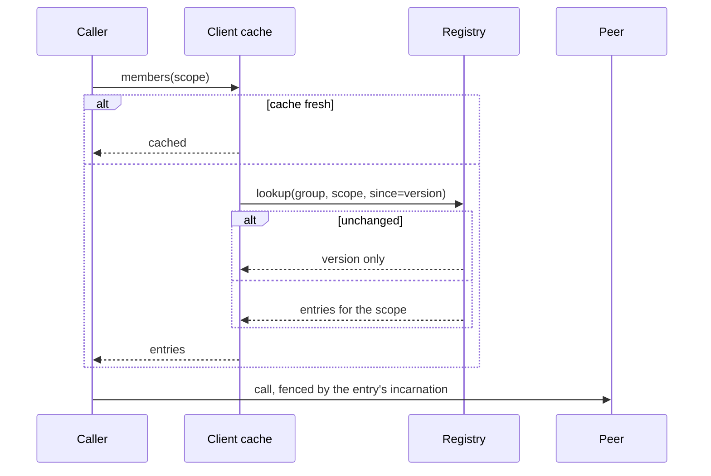

# Discovery

> Proposal; not the current implementation.

> A lookup returns what was asked for. Its size is bounded by the request and
> never by the cluster.

## 1. Scope

Scoped lookup, client caching, and change detection. Proposed source:
`python/tinyray/discovery.py`.

## 2. Responsibilities

- Answer "where are the members I need", filtered server-side.
- Cache answers and serve them when the registry is unreachable.
- Let a caller detect change without re-fetching.
- Return handles that are callable and fenced.

## 3. Non-responsibilities

| Not done here | Owner |
|---|---|
| Deciding which peers a worker needs | Application (L3) |
| Recording membership | [02-membership](02-membership.md) |
| Judging usefulness | [04-readiness](04-readiness.md) |
| Load balancing | Application (L3) |

The first row is the important one: tinyray provides scoping, the application
chooses the scope. A framework that decides which peers you talk to has decided
your parallelism strategy.

## 4. Position in the system

Reads membership; used by every process that calls another.

## 5. Dependencies

- [02-membership](02-membership.md) for the registry.
- [01-identity](01-identity.md) for the incarnation attached to each handle.
- [07-transport](07-transport.md) to turn an entry into a callable handle.

## 6. Public contract

| Interface | Input | Output | Side effect | Blocking | Failure |
|---|---|---|---|---|---|
| `group(name)` | Group name | `GroupView` | None | No | None |
| `GroupView.ranks(list)` | Ranks | `GroupView` | None | No | None |
| `GroupView.shard(i, n)` | Index, count | `GroupView` | None | No | None |
| `GroupView.ready()` | — | `GroupView` | None | No | None |
| `GroupView.members(fresh=False)` | — | Entries | Lookup | Bounded | `RegistryUnavailable` only when nothing is cached |
| `GroupView[rank]` | Rank | Handle | Lookup | Bounded | `KeyError` |
| `GroupView.wait_ready(size, timeout)` | Count | Self | Polls | Yes | `TimeoutError` |
| `GroupView.watch(callback)` | Callable | Watcher | Polls the version | No | None |

```python
peers = tinyray.group("ingest").shard(my_dp, num_dp).ready()
peers[0].accept.remote(reference)
```

## 7. State ownership

| State | Owner | Created | Updated by | Read by | Lifetime | Persisted |
|---|---|---|---|---|---|---|
| Scope | Caller | At construction | Never | Lookup | Caller's | No |
| Cached answer | Client | First lookup | Refresh | Caller | `cache_ttl` | No |
| Last seen version | Client | First lookup | Each lookup | Watch | Client | No |

A `GroupView` holds a scope, not a result. Two lookups through the same view may
differ, which is correct — membership changes.

## 8. Lifecycle

A view is a value with no lifecycle. A watcher is a thread that stops when
cancelled or when its process exits.

## 9. Main flow



The diagram cannot show: the registry filters before serialising, so an unscoped
group never crosses the wire; `since` lets an unchanged answer cost a version
number; and a lookup with every replica down returns cache and says so.

## 10. Concurrency and distributed semantics

**Filtering is server-side.** The scope travels to the registry; only matching
entries come back. Filtering client-side would put the whole cluster on the wire
and defeat the purpose.

**Answers are cached** for `cache_ttl`, and served stale without bound when no
replica answers. Correctness comes from fencing, not freshness: a stale endpoint
reused by a new incarnation rejects the call, and the caller re-looks-up.

**Change detection is by version.** A lookup carrying `since` returns the version
alone when nothing changed. Because the membership version moves only on
membership change ([02-membership](02-membership.md)), a stable cluster costs a
few bytes per poll no matter how many workers heartbeat.

**Handles are values.** They can be pickled and sent to another process, which
rebuilds them against its own transport. That is what makes a peer mesh possible
without routing through a controller.

## 11. Correctness invariants

- Response size is bounded by the request, never by cluster size.
- Filtering happens before serialisation.
- A cached answer is served only when no replica answered, and is reported as
  stale.
- Every returned entry carries an incarnation.
- `wait_ready` counts registered members, and with `.ready()` counts ready ones.
- A view never caches results across an explicit `fresh=True`.

## 12. Failure handling

| Failure | Detected by | Response |
|---|---|---|
| One replica down | Client | Fails over |
| All replicas down, cache warm | Client | Serves cache, increments the stale counter |
| All replicas down, cache cold | Client | Raises `RegistryUnavailable` |
| Peer moved | Fencing rejection on call | Re-lookup with `fresh=True` |
| Group does not exist | Registry | Empty result, not an error — it may not have started |
| `wait_ready` times out | Client | `TimeoutError` naming how many registered, and that tinyray did not start them |

## 13. Configuration

| Field | Type | Default | Validation | Reader | Effect |
|---|---|---|---|---|---|
| `cache_ttl` | seconds | 5.0 | >= 0 | Client | Freshness |
| `watch_interval` | seconds | 2.0 | > 0 | Watcher | Change detection latency |
| `lookup_timeout` | seconds | 10.0 | > 0 | Client | Per-replica deadline |
| `max_scope` | int | 1024 | > 0 | Registry | Refuses an oversized single lookup |

`max_scope` is a guard rail: a lookup asking for ten thousand entries is almost
always a design error, and refusing it early is kinder than serving it.

## 14. Observability

| Metric | Producer | Meaning |
|---|---|---|
| `discovery_lookups_total` | Client | Lookup rate |
| `discovery_cache_hits_total` | Client | Avoided round trips |
| `discovery_served_from_stale_total` | Client | Registry unreachable |
| `discovery_unchanged_total` | Client | Version-only responses |
| `discovery_response_bytes` | Registry | Must track scope, not cluster size |
| `discovery_scope_rejected_total` | Registry | Lookups above `max_scope` |

`discovery_response_bytes` correlating with cluster size means scoping has been
bypassed somewhere.

## 15. Testing

| Behaviour | Test file | Test case | Level |
|---|---|---|---|
| A scoped answer is the same size at any cluster size | `tests/test_discovery.py` | `test_scoped_lookup_is_bounded` | Unit |
| An unscoped lookup is visibly more expensive | `tests/test_discovery.py` | `test_unscoped_is_expensive` | Unit |
| Filtering happens before serialisation | `tests/test_discovery.py` | `test_filter_is_server_side` | Unit |
| An unchanged lookup returns no members | `tests/test_discovery.py` | `test_unchanged_skips_payload` | Unit |
| `ready()` excludes unready members | `tests/test_discovery.py` | `test_ready_filter` | Integration |
| A handle survives pickling | `tests/test_discovery.py` | `test_handle_round_trip` | Integration |
| Peer traffic does not reach a controller | `tests/test_discovery.py` | `test_peer_call_bypasses_controller` | Integration |
| Cache serves when every replica is down | `tests/test_chaos.py` | `test_total_registry_loss` | Chaos |

`test_scoped_lookup_is_bounded` is parameterised across cluster sizes up to
8,192 and asserts the response stays under a fixed byte budget. That single test
is the difference between this design and the one it replaces.

## 16. Limitations and trade-offs

- **Polling, not watching.** Change is noticed within `watch_interval`. A push
  watch is on the [roadmap](../08-project/03-roadmap.md); polling a version is
  cheap enough that it is not urgent.
- **Stale answers are unbounded during an outage.** Deliberate. Fencing makes
  them safe.
- **No load balancing.** `GroupView` returns members in rank order. Choosing
  among them is the application's, because the right choice depends on what they
  hold.
- **The scope must be known to the caller.** tinyray will not compute "the
  rollouts paired with my data-parallel group" — that mapping is L3's.

## 17. Source mapping

Proposed: `python/tinyray/discovery.py`.

Related: [02-membership](02-membership.md) for the data,
[07-transport](07-transport.md) for the handles.
