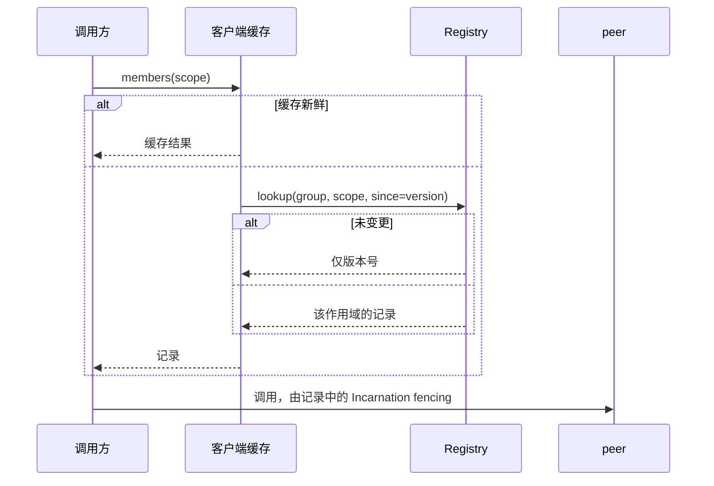

# Discovery

> 提案；当前未实现。

> 一次 lookup 只返回被请求的内容。它的大小由请求决定，绝不由集群决定。

## 1. 范围

作用域 lookup、客户端缓存、变更检测。计划源码：`python/tinyray/discovery.py`。

## 2. 职责

- 回答“我需要的成员在哪”，并在服务端过滤。
- 缓存结果，并在 Registry 不可达时提供它们。
- 让调用方无需重新拉取即可检测变更。
- 返回可调用且带 fencing 的句柄。

## 3. 非职责

| 不在此处做 | 归属 |
|---|---|
| 决定一个 worker 需要哪些 peer | 应用（L3） |
| 记录 membership | [02-membership](02-membership.md) |
| 判断是否可用 | [04-readiness](04-readiness.md) |
| 负载均衡 | 应用（L3） |

第一行最重要：tinyray 提供作用域机制，应用选择作用域。一个决定你和谁通信的框架，已经
决定了你的并行策略。

## 4. 系统位置

读取 membership；被每个要调用别人的进程使用。

## 5. 依赖

- [02-membership](02-membership.md) 提供 Registry。
- [01-identity](01-identity.md) 提供附在每个句柄上的 Incarnation。
- [07-transport](07-transport.md) 把一条记录变成可调用句柄。

## 6. 公共契约

| Interface | Input | Output | Side effect | Blocking | Failure |
|---|---|---|---|---|---|
| `group(name)` | group 名 | `GroupView` | 无 | 否 | 无 |
| `GroupView.ranks(list)` | rank 列表 | `GroupView` | 无 | 否 | 无 |
| `GroupView.shard(i, n)` | 索引、总数 | `GroupView` | 无 | 否 | 无 |
| `GroupView.ready()` | —— | `GroupView` | 无 | 否 | 无 |
| `GroupView.members(fresh=False)` | —— | 记录 | lookup | 有界 | 仅在无缓存时 `RegistryUnavailable` |
| `GroupView[rank]` | rank | 句柄 | lookup | 有界 | `KeyError` |
| `GroupView.wait_ready(size, timeout)` | 数量 | 自身 | 轮询 | 是 | `TimeoutError` |
| `GroupView.watch(callback)` | 可调用对象 | Watcher | 轮询版本号 | 否 | 无 |

```python
peers = tinyray.group("ingest").shard(my_dp, num_dp).ready()
peers[0].accept.remote(reference)
```

## 7. 状态所有权

| State | Owner | Created | Updated by | Read by | Lifetime | Persisted |
|---|---|---|---|---|---|---|
| 作用域 | 调用方 | 构造时 | 从不 | lookup | 调用方生命期 | 否 |
| 缓存结果 | 客户端 | 首次 lookup | 刷新 | 调用方 | `cache_ttl` | 否 |
| 上次见到的版本号 | 客户端 | 首次 lookup | 每次 lookup | watch | 客户端生命期 | 否 |

`GroupView` 持有的是作用域，不是结果。同一个 view 的两次 lookup 可能不同 —— 这是正确的，
membership 会变。

## 8. 生命周期

view 是一个没有生命周期的值。watcher 是一个线程，在被取消或进程退出时结束。

## 9. 主流程



图中无法表达：Registry 在序列化之前就过滤，因此完整 group 从不上 wire；`since` 让未变更
的应答只花一个版本号；全部副本宕机时的 lookup 返回缓存并说明这一点。

## 10. 并发与分布式语义

**过滤在服务端。** 作用域被发往 Registry，只有匹配的记录返回。客户端过滤会把整个集群放上
wire，正好抵消目的。

**结果缓存** `cache_ttl` 时长，且在无副本应答时无上界地提供陈旧结果。正确性来自 fencing
而非新鲜度：被新 Incarnation 复用的陈旧 endpoint 会拒绝调用，调用方随即重新 lookup。

**变更检测靠版本号。** 携带 `since` 的 lookup 在未变更时只返回版本号。由于 membership
版本号只在 membership 变更时前进（[02-membership](02-membership.md)），一个稳定集群
无论有多少 worker 在 heartbeat，每次轮询都只花几个字节。

**句柄是值。** 它们可以被 pickle 并发给另一个进程，由对方基于自己的 transport 重建。这正是
无需经由控制器即可构成 peer mesh 的原因。

## 11. 正确性不变量

- 响应大小由请求决定，绝不由集群规模决定。
- 过滤发生在序列化之前。
- 缓存结果只在无副本应答时提供，且必须上报陈旧。
- 每条返回记录都携带 Incarnation。
- `wait_ready` 统计已注册成员，加 `.ready()` 后统计已就绪成员。
- view 绝不跨越显式的 `fresh=True` 使用缓存。

## 12. 故障处理

| 故障 | 检测方 | 响应 |
|---|---|---|
| 单副本宕机 | 客户端 | 失败转移 |
| 全部副本宕机，缓存已预热 | 客户端 | 提供缓存，陈旧计数器加一 |
| 全部副本宕机，缓存为空 | 客户端 | 抛 `RegistryUnavailable` |
| peer 迁移 | 调用时的 fencing 拒绝 | 以 `fresh=True` 重新 lookup |
| group 不存在 | Registry | 返回空而非报错 —— 它可能还没启动 |
| `wait_ready` 超时 | 客户端 | `TimeoutError`，说明已注册多少个，并指出这些进程不是 tinyray 拉起的 |

## 13. 配置

| Field | Type | Default | Validation | Reader | Effect |
|---|---|---|---|---|---|
| `cache_ttl` | 秒 | 5.0 | >= 0 | 客户端 | 新鲜度 |
| `watch_interval` | 秒 | 2.0 | > 0 | Watcher | 变更检测延迟 |
| `lookup_timeout` | 秒 | 10.0 | > 0 | 客户端 | 每副本 deadline |
| `max_scope` | int | 1024 | > 0 | Registry | 拒绝过大的单次 lookup |

`max_scope` 是护栏：一次请求一万条记录的 lookup 几乎总是设计错误，早点拒绝比照单全收更
友善。

## 14. 可观测性

| Metric | Producer | Meaning |
|---|---|---|
| `discovery_lookups_total` | 客户端 | lookup 频率 |
| `discovery_cache_hits_total` | 客户端 | 省掉的往返 |
| `discovery_served_from_stale_total` | 客户端 | Registry 不可达 |
| `discovery_unchanged_total` | 客户端 | 仅返回版本号的应答 |
| `discovery_response_bytes` | Registry | 必须跟随作用域而非集群规模 |
| `discovery_scope_rejected_total` | Registry | 超过 `max_scope` 的 lookup |

`discovery_response_bytes` 与集群规模相关，说明作用域机制在某处被绕过了。

## 15. 测试

| Behavior | Test file | Test case | Level |
|---|---|---|---|
| 作用域应答在任何集群规模下大小相同 | `tests/test_discovery.py` | `test_scoped_lookup_is_bounded` | Unit |
| 无作用域 lookup 明显更昂贵 | `tests/test_discovery.py` | `test_unscoped_is_expensive` | Unit |
| 过滤发生在序列化之前 | `tests/test_discovery.py` | `test_filter_is_server_side` | Unit |
| 未变更的 lookup 不返回成员 | `tests/test_discovery.py` | `test_unchanged_skips_payload` | Unit |
| `ready()` 排除未就绪成员 | `tests/test_discovery.py` | `test_ready_filter` | Integration |
| 句柄经 pickle 后仍可用 | `tests/test_discovery.py` | `test_handle_round_trip` | Integration |
| peer 流量不到达控制器 | `tests/test_discovery.py` | `test_peer_call_bypasses_controller` | Integration |
| 全部副本宕机时缓存可服务 | `tests/test_chaos.py` | `test_total_registry_loss` | Chaos |

`test_scoped_lookup_is_bounded` 在直到 8,192 的集群规模上参数化，并断言响应保持在固定
字节预算之内。这一条测试就是本设计与它所取代的那个设计之间的差别。

## 16. 限制与取舍

- **轮询而非 watch。** 变更在 `watch_interval` 内被察觉。推送式 watch 在
  [roadmap](../08-project/03-roadmap.md) 上；轮询一个版本号足够便宜，所以不急。
- **故障期间陈旧结果无上界。** 这是有意的，fencing 使其安全。
- **不做负载均衡。** `GroupView` 按 rank 顺序返回成员。在其中挑选属于应用，因为正确的
  选择取决于它们各自持有什么。
- **作用域必须由调用方知道。** tinyray 不会计算“与我的 DP 组配对的那些 rollout” —— 这个
  映射属于 L3。

## 17. 源码映射

计划：`python/tinyray/discovery.py`。

相关：[02-membership](02-membership.md) 提供数据，[07-transport](07-transport.md) 提供句柄。
