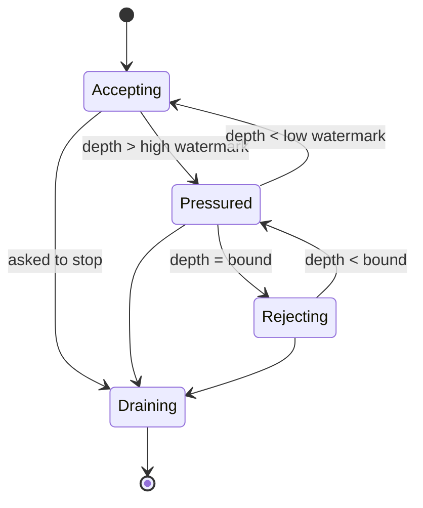

# Admission

> Proposal; not the current implementation.

> A worker that is full says so. Accepting work and then waiting forever is how
> a control plane converts overload into an outage.

## 1. Scope

Bounded queues, explicit rejection, retry classification and credit-based flow
control. Proposed source: `python/tinyray/admission.py`.

## 2. Responsibilities

- Bound what a worker accepts.
- Reject beyond the bound, explicitly and retryably.
- Distinguish retryable rejection from terminal failure.
- Carry credits so a producer learns the consumer's capacity before sending.
- Report pressure through readiness and metrics.

## 3. Non-responsibilities

| Not done here | Owner |
|---|---|
| Choosing the bound | Application (L3) |
| What a rejection means for a task | Application (L3) |
| Durable buffering of rejected work | Application (L3) |
| Scheduling among workers | Application (L3) |

## 4. Position in the system

At the entry to every worker, and at each tier boundary. Pressure propagates
upward through readiness.

## 5. Dependencies

- [04-readiness](04-readiness.md) to publish pressure.
- [07-transport](07-transport.md) to signal rejection on the wire.

## 6. Public contract

| Interface | Input | Output | Side effect | Blocking | Failure |
|---|---|---|---|---|---|
| `admission(max_pending, on_reject=Backpressure)` | Bound | `Admission` | None | No | `ValueError` |
| `Admission.try_admit()` | — | `Ticket` or `Rejected` | Reserves a slot | **No** | Never raises |
| `Ticket.release()` | — | — | Frees the slot | No | None |
| `Admission.credits()` | — | Remaining capacity | None | No | None |
| `Admission.depth()` | — | Current depth | None | No | None |

```python
gate = tinyray.admission(max_pending=1000)
with gate.try_admit() as ticket:
    if ticket.rejected:
        return Overloaded(retry_after=ticket.retry_after)
    ...
```

`try_admit` never blocks. A blocking admission gate is a queue with extra steps.

## 7. State ownership

| State | Owner | Created | Updated by | Read by | Lifetime | Persisted |
|---|---|---|---|---|---|---|
| Bound | Application | At construction | Never | Gate | Process | No |
| Current depth | Gate | First admit | Admit and release | Readiness, metrics | Process | No |
| Credits advertised | Gate | Continuously | Depth change | Producers | Until next report | No |
| Rejection counters | Gate | First rejection | Each rejection | Metrics | Process | No |

## 8. Lifecycle



`Pressured` exists so readiness can degrade **before** the bound is reached.
Going straight from accepting to rejecting gives producers no warning and turns
a gradual overload into a cliff. Hysteresis between the watermarks prevents
flapping.

## 9. Main flow

```mermaid
sequenceDiagram
    participant P as Producer
    participant G as Admission gate
    participant W as Worker

    P->>G: submit
    alt below bound
        G-->>P: accepted (credits remaining)
        G->>W: enqueue
        W->>G: release on completion
    else at bound
        G-->>P: rejected, retryable, retry_after
        P->>P: back off; try another member
    end
```

The diagram cannot show: rejection is immediate; `retry_after` is derived from
observed drain rate; and credits ride on the acceptance so the producer knows
how much room is left without asking.

## 10. Concurrency and distributed semantics

**Rejection is immediate and explicit.** Never accept-then-wait. A producer
holding an accepted request that will not run cannot make a different choice,
and the queue becomes invisible memory.

**Only backpressure is retried automatically.** It is the one failure where
resending the identical request is safe. A user exception, a lost object and a
dead peer are facts about state, and retrying a stateful call because it was
refused would apply it twice.

**Backoff is linear, not exponential.** The peer is draining a queue, not
collapsing; exponential backoff overshoots a queue that clears in milliseconds.

**Credits are advisory.** They ride on responses so a producer can pace itself,
but the gate is authoritative. A producer that ignores credits gets rejections,
not corruption.

**Pressure propagates through readiness, not through blocking.** A pressured
worker degrades its readiness verdict; a scheduler stops choosing it. That is
the ladder: worker gate → readiness → discovery filter → producer choice.

## 11. Correctness invariants

- `try_admit` never blocks.
- Depth never exceeds the bound.
- Every ticket is released exactly once, including on exception.
- Rejection is classified retryable and carries `retry_after`.
- Only backpressure is retried automatically.
- Pressure is visible in readiness before the bound is reached.
- A rejected request leaves no state behind.

## 12. Failure handling

| Failure | Detected by | Response |
|---|---|---|
| Producer ignores rejection and retries immediately | Gate | Rejects again; `retry_after` grows |
| Ticket leaked | Depth never falls | `admission_leaked_total`; tickets are context managers to make this hard |
| Consumer stalls | Depth pinned at bound | Readiness degrades; producers move on |
| Every member rejects | Producer | Application decides: wait, shed, or fail |
| Bound set too low | Rejection rate | Reported, not adjusted; tinyray does not tune the application's bound |

## 13. Configuration

| Field | Type | Default | Validation | Reader | Effect |
|---|---|---|---|---|---|
| `max_pending` | int | 1000 | > 0 | Gate | The bound |
| `high_watermark` | ratio | 0.8 | 0..1 | Gate | Enter `Pressured` |
| `low_watermark` | ratio | 0.6 | < high | Gate | Leave `Pressured` |
| `retry_after_base` | seconds | 0.025 | > 0 | Gate | Linear backoff step |
| `retry_after_max` | seconds | 1.0 | > base | Gate | Backoff ceiling |
| `max_retries` | int | 16 | >= 0 | Client | Backpressure retries before failing |

1000 is high enough that a normal burst does not trip it and low enough that a
runaway producer is caught before memory is gone. It is **to be measured** per
deployment.

## 14. Observability

| Metric | Producer | Meaning |
|---|---|---|
| `admission_depth` | Gate | Current occupancy |
| `admission_rejections_total` | Gate | Refusals |
| `admission_pressured_seconds` | Gate | Time above the high watermark |
| `admission_leaked_total` | Gate | Tickets never released — always a bug |
| `admission_retry_after_seconds` | Gate | Advertised backoff |
| `control_retries_total` | Client | Producer-side retry pressure |

A rising `control_retries_total` means a consumer is slower than its producers.
That is the number to alert on; the rejection count alone does not say who is
at fault.

## 15. Testing

| Behaviour | Test file | Test case | Level |
|---|---|---|---|
| `try_admit` never blocks | `tests/test_admission.py` | `test_admit_is_non_blocking` | Unit |
| Depth never exceeds the bound | `tests/test_admission.py` | `test_bound_is_respected` | Unit |
| Rejection carries retry_after | `tests/test_admission.py` | `test_rejection_is_classified` | Unit |
| Pressure precedes rejection | `tests/test_admission.py` | `test_readiness_degrades_before_bound` | Unit |
| Tickets release on exception | `tests/test_admission.py` | `test_ticket_released_on_raise` | Unit |
| Hysteresis prevents flapping | `tests/test_admission.py` | `test_watermark_hysteresis` | Unit |
| Only backpressure is retried | `tests/test_admission.py` | `test_only_backpressure_retries` | Unit |
| A stateful call is not replayed on failure | `tests/test_admission.py` | `test_no_replay_of_stateful_call` | Integration |
| Sustained overload sheds rather than stalls | `tests/test_fake_cluster.py` | `test_overload_sheds` | Scale |

`test_no_replay_of_stateful_call` is the one that protects correctness rather
than throughput.

## 16. Limitations and trade-offs

- **The bound is a count, not bytes or time.** A thousand small calls and a
  thousand expensive ones occupy the same room. Weighted admission is on the
  [roadmap](../08-project/03-roadmap.md).
- **Credits are advisory.** A misbehaving producer is rejected, not throttled.
- **tinyray does not tune the bound.** It reports rejection rate and pressure
  time; adaptive sizing needs a model of the work, which is L3's.
- **No fairness between producers.** A loud producer can consume the whole
  allowance. Per-producer quotas are on the roadmap.

## 17. Source mapping

Proposed: `python/tinyray/admission.py`; rejection signalling in
`crates/tinyray-runtime/src/queue.rs`.

Related: [04-readiness](04-readiness.md) publishes pressure;
[04-protocols/03-control-rpc.md](../04-protocols/03-control-rpc.md) carries the
rejection.
