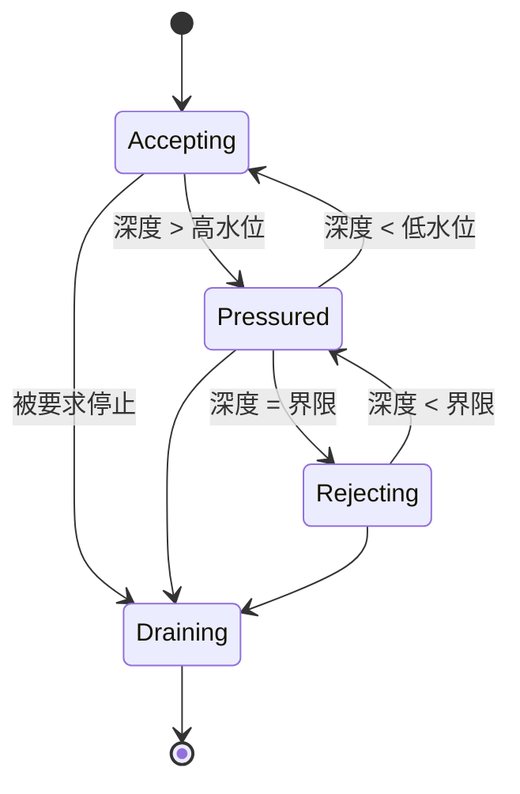
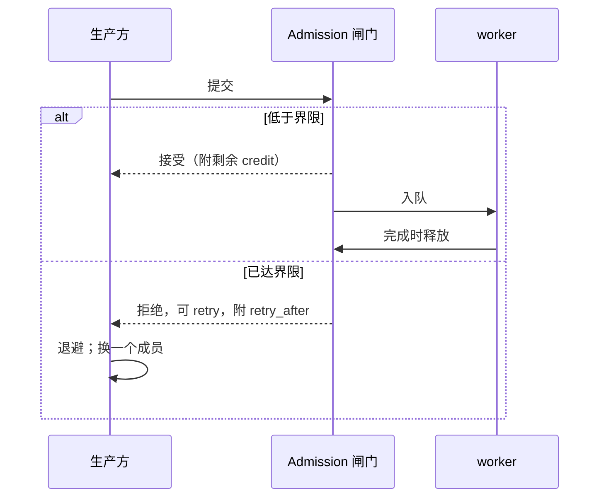

# Admission

> 提案；当前未实现。

> 满了的 worker 要说出来。先接受再无限等待，是控制面把过载变成事故的方式。

## 1. 范围

有界队列、显式拒绝、retry 分类和基于 credit 的流控。计划源码：
`python/tinyray/admission.py`。

## 2. 职责

- 限定一个 worker 接受的量。
- 超出界限时显式拒绝，并标注可 retry。
- 区分可 retry 的拒绝与终态失败。
- 携带 credit，使生产方在发送前就知道消费方的余量。
- 通过 Readiness 和指标上报压力。

## 3. 非职责

| 不在此处做 | 归属 |
|---|---|
| 选择界限值 | 应用（L3） |
| 拒绝对一个 task 意味着什么 | 应用（L3） |
| 被拒工作的持久缓冲 | 应用（L3） |
| 在多个 worker 之间调度 | 应用（L3） |

## 4. 系统位置

在每个 worker 的入口，以及每个层边界上。压力经 Readiness 向上传播。

## 5. 依赖

- [04-readiness](04-readiness.md) 用于发布压力。
- [07-transport](07-transport.md) 用于在 wire 上传递拒绝。

## 6. 公共契约

| Interface | Input | Output | Side effect | Blocking | Failure |
|---|---|---|---|---|---|
| `admission(max_pending, on_reject=Backpressure)` | 界限 | `Admission` | 无 | 否 | `ValueError` |
| `Admission.try_admit()` | —— | `Ticket` 或 `Rejected` | 占一个槽 | **否** | 从不抛出 |
| `Ticket.release()` | —— | —— | 释放槽 | 否 | 无 |
| `Admission.credits()` | —— | 剩余容量 | 无 | 否 | 无 |
| `Admission.depth()` | —— | 当前深度 | 无 | 否 | 无 |

```python
gate = tinyray.admission(max_pending=1000)
with gate.try_admit() as ticket:
    if ticket.rejected:
        return Overloaded(retry_after=ticket.retry_after)
    ...
```

`try_admit` 从不阻塞。一个会阻塞的 Admission 闸门，就是多绕了几步的队列。

## 7. 状态所有权

| State | Owner | Created | Updated by | Read by | Lifetime | Persisted |
|---|---|---|---|---|---|---|
| 界限 | 应用 | 构造时 | 从不 | 闸门 | 进程期 | 否 |
| 当前深度 | 闸门 | 首次准入 | 准入与释放 | Readiness、指标 | 进程期 | 否 |
| 广告的 credit | 闸门 | 持续 | 深度变化 | 生产方 | 到下次上报 | 否 |
| 拒绝计数 | 闸门 | 首次拒绝 | 每次拒绝 | 指标 | 进程期 | 否 |

## 8. 生命周期



`Pressured` 的存在，是为了让 Readiness 在触及界限**之前**就开始降级。从接受直接跳到拒绝
不给生产方任何预警，会把渐进过载变成断崖。两个水位之间的滞回防止抖动。

## 9. 主流程



图中无法表达：拒绝是立即的；`retry_after` 由观测到的排空速率导出；credit 随接受一起返回，
生产方无需再问就知道还剩多少余量。

## 10. 并发与分布式语义

**拒绝是立即且显式的。** 绝不先接受再等待。一个握着注定不会执行的请求的生产方，无法做出
不同的选择，而队列变成了不可见的内存。

**只有 backpressure 会被自动 retry。** 它是唯一一种重发相同请求是安全的失败。用户异常、
对象丢失和 peer 死亡都是关于状态的事实，因为被拒绝就重试一个有状态调用，会把它执行两次。

**退避是线性而非指数的。** peer 在排空队列，不是在崩溃；指数退避会大幅超调一个几毫秒就
排空的队列。

**credit 是建议性的。** 它随应答返回以便生产方自我调速，但闸门是权威。忽略 credit 的生产方
得到的是拒绝，不是数据损坏。

**压力经 Readiness 传播，不经阻塞传播。** 承压的 worker 降低自己的 Readiness 裁决，
调度方就不再选它。这就是那条阶梯：worker 闸门 → Readiness → discovery 过滤 → 生产方选择。

## 11. 正确性不变量

- `try_admit` 从不阻塞。
- 深度绝不超过界限。
- 每个 ticket 恰好释放一次，包括异常路径。
- 拒绝被标注为可 retry 并携带 `retry_after`。
- 只有 backpressure 被自动 retry。
- 在触及界限之前，压力已在 Readiness 中可见。
- 被拒绝的请求不留下任何状态。

## 12. 故障处理

| 故障 | 检测方 | 响应 |
|---|---|---|
| 生产方忽略拒绝立即重试 | 闸门 | 再次拒绝；`retry_after` 增大 |
| ticket 泄漏 | 深度不下降 | `admission_leaked_total`；ticket 是上下文管理器以增加泄漏难度 |
| 消费方停滞 | 深度顶在界限 | Readiness 降级；生产方转向别处 |
| 全部成员都拒绝 | 生产方 | 应用决定：等待、丢弃或失败 |
| 界限设得太低 | 拒绝率 | 上报而不自动调整；tinyray 不调应用的界限 |

## 13. 配置

| Field | Type | Default | Validation | Reader | Effect |
|---|---|---|---|---|---|
| `max_pending` | int | 1000 | > 0 | 闸门 | 界限 |
| `high_watermark` | 比例 | 0.8 | 0..1 | 闸门 | 进入 pressured |
| `low_watermark` | 比例 | 0.6 | < high | 闸门 | 离开 pressured |
| `retry_after_base` | 秒 | 0.025 | > 0 | 闸门 | 线性退避步长 |
| `retry_after_max` | 秒 | 1.0 | > base | 闸门 | 退避上限 |
| `max_retries` | int | 16 | >= 0 | 客户端 | 失败前的 backpressure retry 次数 |

1000 这个值高到正常突发不会触发，低到失控的生产方在内存耗尽前就被拦住。它在每次部署中
**待测**。

## 14. 可观测性

| Metric | Producer | Meaning |
|---|---|---|
| `admission_depth` | 闸门 | 当前占用 |
| `admission_rejections_total` | 闸门 | 拒绝次数 |
| `admission_pressured_seconds` | 闸门 | 高于高水位的时长 |
| `admission_leaked_total` | 闸门 | 从未释放的 ticket —— 永远是 bug |
| `admission_retry_after_seconds` | 闸门 | 广告的退避值 |
| `control_retries_total` | 客户端 | 生产方侧的 retry 压力 |

`control_retries_total` 上升意味着某个消费方比它的生产方慢。这才是该告警的数字；单看
拒绝计数说明不了是谁的问题。

## 15. 测试

| Behavior | Test file | Test case | Level |
|---|---|---|---|
| `try_admit` 从不阻塞 | `tests/test_admission.py` | `test_admit_is_non_blocking` | Unit |
| 深度不超过界限 | `tests/test_admission.py` | `test_bound_is_respected` | Unit |
| 拒绝携带 retry_after | `tests/test_admission.py` | `test_rejection_is_classified` | Unit |
| 压力先于拒绝出现 | `tests/test_admission.py` | `test_readiness_degrades_before_bound` | Unit |
| 异常时 ticket 被释放 | `tests/test_admission.py` | `test_ticket_released_on_raise` | Unit |
| 滞回防止抖动 | `tests/test_admission.py` | `test_watermark_hysteresis` | Unit |
| 只有 backpressure 被 retry | `tests/test_admission.py` | `test_only_backpressure_retries` | Unit |
| 失败的有状态调用不被重放 | `tests/test_admission.py` | `test_no_replay_of_stateful_call` | Integration |
| 持续过载时丢弃而非停滞 | `tests/test_fake_cluster.py` | `test_overload_sheds` | Scale |

`test_no_replay_of_stateful_call` 保护的是正确性而不是吞吐。

## 16. 限制与取舍

- **界限是个数，不是字节或时间。** 一千个小调用和一千个昂贵调用占用同样的空间。带权
  Admission 在 [roadmap](../08-project/03-roadmap.md) 上。
- **credit 是建议性的。** 行为不端的生产方会被拒绝，而不是被限流。
- **tinyray 不调整界限。** 它上报拒绝率和承压时长；自适应定容需要工作负载模型，那属于 L3。
- **生产方之间没有公平性。** 一个吵闹的生产方可以吃掉全部配额。按生产方配额在 roadmap 上。

## 17. 源码映射

计划：`python/tinyray/admission.py`；拒绝信号位于
`crates/tinyray-runtime/src/queue.rs`。

相关：[04-readiness](04-readiness.md) 发布压力；
[04-protocols/03-control-rpc.md](../04-protocols/03-control-rpc.md) 传递拒绝。
