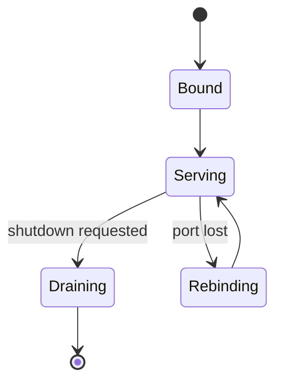
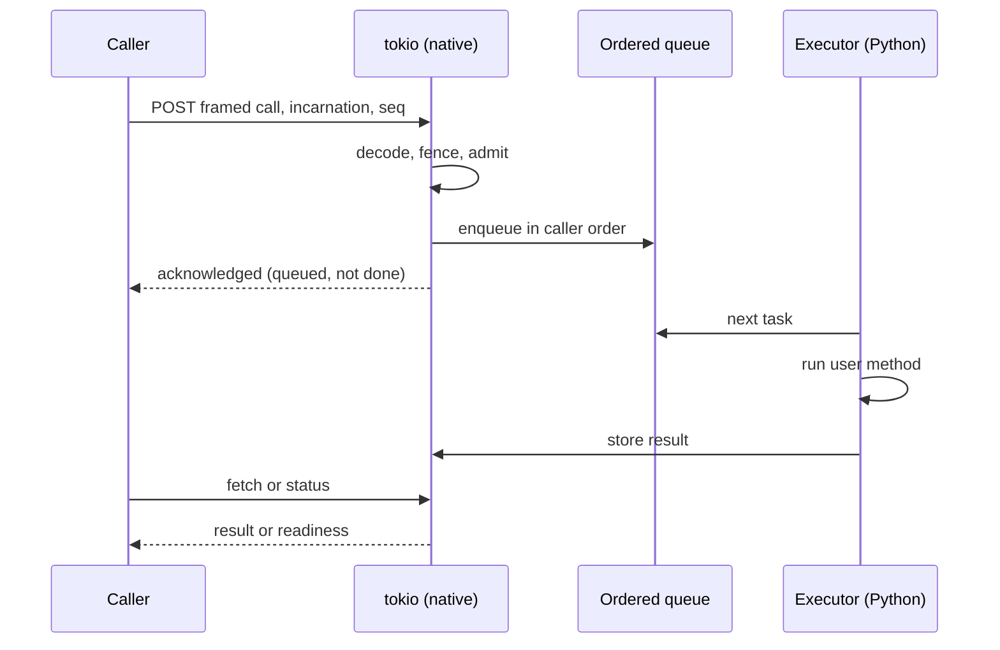

# Transport

> Proposal; not the current implementation.

> The serving path is native and never needs the GIL, so a worker saturated by
> its own framework still answers control messages. That property is the reason
> there is Rust in this project.

## 1. Scope

Control RPC: framing, connection management, ordering, fencing enforcement and
retry classification. Source: `crates/tinyray-core/`,
`crates/tinyray-runtime/`, `crates/tinyray-py/`.

## 2. Responsibilities

- Serve control requests without acquiring the GIL.
- Frame messages so large arguments are not copied through a serialiser.
- Enforce fencing on every inbound call.
- Preserve per-caller ordering.
- Retry only what is safe to retry.
- Account for bytes moved, per peer.

## 3. Non-responsibilities

| Not done here | Owner |
|---|---|
| Bulk data transfer | L0 — NCCL, UCX, NIXL, storage |
| What a message means | Application (L3) |
| Deciding whom to call | [05-discovery](05-discovery.md) |
| Deciding whether to accept | [06-admission](06-admission.md) |
| Encryption and authentication | Not provided — see §16 |

## 4. Position in the system

Beneath every module. Membership, discovery, reconciliation and admission all
speak through it.

## 5. Dependencies

- `hyper` for HTTP/1.1, `tokio` for the runtime, `pyo3` for the boundary.
- [01-identity](01-identity.md) for the tokens it enforces.

## 6. Public contract

| Interface | Input | Output | Side effect | Blocking | Failure |
|---|---|---|---|---|---|
| `serve(target, bind, background)` | Object, address | `Server` | Binds a port | Optional | `ServeError` |
| `handle.method.remote(*args)` | Arguments | Reference | Enqueues remotely | **No** | `Backpressure`, `Fenced`, `Unreachable` |
| `get(reference, timeout)` | Reference | Value | Fetches | Yes | Remote exception with traceback |
| `wait(references, num_returns)` | References | Ready, pending | Status only | Yes | `TimeoutError` |
| `transport_stats()` | — | Per-peer counters | None | No | None |

`.remote()` returns before the call runs. `wait` asks for status and never
transfers a payload — the distinction that
[02-architecture/04-planes.md](../02-architecture/04-planes.md) exists to
protect.

## 7. State ownership

| State | Owner | Created | Updated by | Read by | Lifetime | Persisted |
|---|---|---|---|---|---|---|
| Connection pool | Client | First call to a peer | Use | Client | Process | No |
| Per-caller sequence | Client | First call | Each call | Server queue | Process | No |
| Pending queue | Server | On arrival | Admission | Executor | Until dispatched | No |
| Result store | Server | On completion | Fetch, release, eviction | Consumers | TTL or watermark | No |
| Byte counters | Client | First call | Each call | Metrics | Process | No |

## 8. Lifecycle

`Rebinding` matters for a sidecar: losing the control port must not end the
process that the framework is using for real work.

## 9. Main flow

The diagram cannot show: everything left of the executor happens without the
GIL; the acknowledgement means queued, not completed; and a status request
returns no payload.

## 10. Concurrency and distributed semantics

**Three threads per serving process:**

| Thread | Language | Job |
|---|---|---|
| tokio pool | Rust | Accept, decode, fence, admit, serve fetches |
| Executor | Python | Run user methods |
| Collective | Python | Blocking framework calls only |

The tokio pool never needs the GIL. **Measured**: decoding 10 MB while four
GIL-bound Python threads run costs 1.04x from a native thread and 49x when
initiated from Python. Same code; the difference is who holds the GIL when the
work starts.

This is not an optimisation. A worker that only answered between method calls
would be unobservable exactly when observation is needed, and a stalled worker
could not be distinguished from a busy one.

**The executor must return to Python periodically.** Python runs signal handlers
only while the main thread executes bytecode, so an indefinite block in Rust
makes `SIGTERM` unreachable. **Measured**: shutdown fell from 10.00 s — the
supervisor's `SIGKILL` — to 0.24 s once the blocking call took a deadline.

**Ordering is per caller.** HTTP gives none, and several connections per peer
deliver concurrent calls out of order. Each call carries a monotonic sequence
per caller, and the server dispatches in order. Different callers are
independent, so one slow caller does not block the rest.

**Fencing is enforced here**, not by callers. Every inbound call carries an
incarnation and is rejected if superseded.

**Only backpressure is retried.** Linear backoff, bounded. See
[06-admission](06-admission.md).

## 11. Correctness invariants

- The serving path acquires the GIL only to run a user method.
- No blocking call holds the GIL.
- Every inbound call is fenced before it is queued.
- Calls from one caller execute in submission order.
- A repeated sequence number is acknowledged, never re-executed.
- A status request transfers no payload.
- Every operation's byte cost is counted per peer.
- A framing error poisons the connection rather than attempting resynchronisation.

## 12. Failure handling

| Failure | Detected by | Response |
|---|---|---|
| Peer unreachable | Connect error | `Unreachable`; caller re-looks-up |
| Peer superseded | Fencing | `Fenced`; caller re-looks-up |
| Peer overloaded | 429 | Retried with linear backoff |
| Framing error | Decoder | Connection closed; no resynchronisation attempted |
| Message over limit | Decoder | Rejected before allocation |
| Result evicted | Store | `ObjectLost`, distinct from "never existed" |
| Executor blocked | Queue depth, readiness | Reported; not interrupted |
| Control port lost | Server | Rebind and re-register; the process survives |

## 13. Configuration

| Field | Type | Default | Validation | Reader | Effect |
|---|---|---|---|---|---|
| `connections_per_peer` | int | 4 | > 0 | Client | Head-of-line mitigation |
| `request_timeout` | seconds | 300 | > 0 | Client | Per-request deadline |
| `max_pending_calls` | int | 1000 | > 0 | Server | Admission bound |
| `max_header_len` | bytes | 1 MiB | > 0 | Decoder | Allocation guard |
| `max_message_len` | bytes | 8 GiB | > 0 | Decoder | Allocation guard |
| `backoff` | seconds | 0.025 | > 0 | Client | Linear step |
| `max_retries` | int | 16 | >= 0 | Client | Backpressure only |

Four connections per peer because HTTP/1.1 has head-of-line blocking: on one
connection a large response stalls every small control message behind it.

## 14. Observability

| Metric | Producer | Meaning |
|---|---|---|
| `control_bytes_sent`, `control_bytes_received` | Client, per peer | Enforces the plane split in production |
| `control_requests_total`, `control_retries_total` | Client | Retry pressure |
| `control_failures_total` | Client | By class |
| `fencing_rejections_total` | Server | Stale writers |
| `queue_depth`, `queue_waiting_for` | Server | Ordering stalls |
| `executor_inflight_seconds` | Server | Straggler detection |

`queue_waiting_for` names the caller and sequence a worker is stuck behind. A
lost call stalls that caller permanently, with no automatic recovery; making it
visible in one query is the mitigation.

## 15. Testing

| Behaviour | Test file | Test case | Level |
|---|---|---|---|
| Native decode is unaffected by GIL contention | `benchmarks/` | `bench_gil_contention` | Benchmark |
| Serving continues during a long method | `tests/test_transport.py` | `test_serves_while_busy` | Integration |
| Shutdown is prompt under load | `tests/test_transport.py` | `test_sigterm_is_reachable` | Integration |
| Out-of-order arrival is reordered | `tests/test_transport.py` | `test_ordering_restored` | Unit |
| A repeated sequence is not re-executed | `tests/test_transport.py` | `test_duplicate_seq_absorbed` | Unit |
| A stale incarnation is rejected | `tests/test_identity.py` | `test_peer_rejects_stale_incarnation` | Integration |
| A status request moves no payload | `tests/test_driver_byte_budget.py` | `test_status_only_is_cheap` | Integration |
| Oversized messages are refused before allocation | `tests/test_framing.py` | `test_limits_enforced` | Unit |

The GIL benchmark is a regression guard on the claim the whole Rust core rests
on. If it stopped holding, the design would need revisiting.

## 16. Limitations and trade-offs

- **No TLS and no authentication.** tinyray assumes a trusted network. Do not
  expose a control port outside a cluster. Authentication is on the
  [roadmap](../08-project/03-roadmap.md) and is a genuine gap for shared
  clusters.
- **The wire format is not versioned** beyond magic bytes. Client and server must
  be the same release.
- **A framing error is unrecoverable** by design; a binary framing has no
  resynchronisation point.
- **A stalled ordering queue does not self-heal.** It is reported, not repaired.
- **One Python wheel per version.** The limited API omits the buffer protocol,
  which is the zero-copy mechanism, so `abi3` is unavailable.

## 17. Source mapping

`crates/tinyray-core/` — framing, identifiers, envelopes.
`crates/tinyray-runtime/` — transport, queue, store, actor loop.
`crates/tinyray-py/` — the boundary; all `unsafe` confined to `buffers.rs`.

Related: [04-protocols/01-wire-format.md](../04-protocols/01-wire-format.md) and
[04-protocols/03-control-rpc.md](../04-protocols/03-control-rpc.md).
