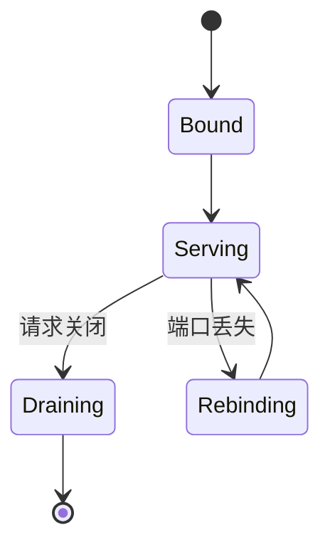
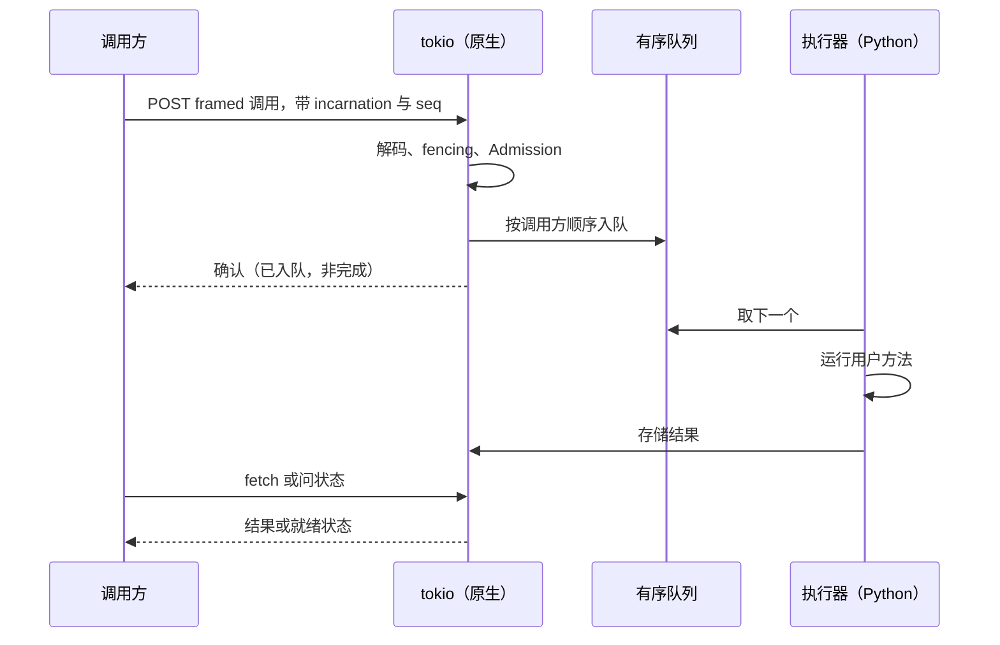

# Transport

> 提案；当前未实现。

> 服务路径是原生的且从不需要 GIL，因此一个被自身框架压满的 worker 仍能应答控制消息。
> 这个性质就是本项目里存在 Rust 的原因。

## 1. 范围

控制 RPC：framing、连接管理、顺序、fencing 强制和 retry 分类。源码：
`crates/tinyray-core/`、`crates/tinyray-runtime/`、`crates/tinyray-py/`。

## 2. 职责

- 在不获取 GIL 的情况下服务控制请求。
- 对消息 framing，使大参数不经序列化器复制。
- 对每个入站调用强制 fencing。
- 保持 per-caller 顺序。
- 只 retry 可安全 retry 的东西。
- 按 peer 统计搬运的字节数。

## 3. 非职责

| 不在此处做 | 归属 |
|---|---|
| 大数据传输 | L0 —— NCCL、UCX、NIXL、存储 |
| 消息的含义 | 应用（L3） |
| 决定调用谁 | [05-discovery](05-discovery.md) |
| 决定是否接受 | [06-admission](06-admission.md) |
| 加密与认证 | 不提供 —— 见 §16 |

## 4. 系统位置

在所有模块之下。membership、discovery、reconciliation 和 Admission 都经它通信。

## 5. 依赖

- `hyper` 提供 HTTP/1.1，`tokio` 提供运行时，`pyo3` 提供边界。
- [01-identity](01-identity.md) 提供它所强制的 token。

## 6. 公共契约

| Interface | Input | Output | Side effect | Blocking | Failure |
|---|---|---|---|---|---|
| `serve(target, bind, background)` | 对象、地址 | `Server` | 绑定端口 | 可选 | `ServeError` |
| `handle.method.remote(*args)` | 参数 | 引用 | 远端入队 | **否** | `Backpressure`、`Fenced`、`Unreachable` |
| `get(reference, timeout)` | 引用 | 值 | 取回 | 是 | 带 traceback 的远端异常 |
| `wait(references, num_returns)` | 引用 | ready、pending | 只问状态 | 是 | `TimeoutError` |
| `transport_stats()` | —— | 按 peer 的计数 | 无 | 否 | 无 |

`.remote()` 在调用运行之前就返回。`wait` 只问状态，从不传输 payload —— 这个区别正是
[02-architecture/04-planes.md](../02-architecture/04-planes.md) 要保护的。

## 7. 状态所有权

| State | Owner | Created | Updated by | Read by | Lifetime | Persisted |
|---|---|---|---|---|---|---|
| 连接池 | 客户端 | 首次调用某 peer | 使用时 | 客户端 | 进程期 | 否 |
| per-caller 序号 | 客户端 | 首次调用 | 每次调用 | 服务端队列 | 进程期 | 否 |
| 待处理队列 | 服务端 | 到达时 | Admission | 执行器 | 到派发为止 | 否 |
| 结果存储 | 服务端 | 完成时 | fetch、release、驱逐 | 消费方 | TTL 或水位 | 否 |
| 字节计数 | 客户端 | 首次调用 | 每次调用 | 指标 | 进程期 | 否 |

## 8. 生命周期

`Rebinding` 对 sidecar 很重要：失去控制端口绝不能终结那个框架正在用来干真活的进程。

## 9. 主流程

图中无法表达：执行器左侧的一切都不持有 GIL；确认意味着已入队而非已完成；状态请求不返回
payload。

## 10. 并发与分布式语义

**每个服务进程三类线程：**

| 线程 | 语言 | 职责 |
|---|---|---|
| tokio 池 | Rust | 接受、解码、fencing、Admission、服务 fetch |
| 执行器 | Python | 运行用户方法 |
| collective | Python | 只跑阻塞的框架调用 |

tokio 池从不需要 GIL。**实测**：在四个 GIL 绑定的 Python 线程运行时解码 10 MB，原生线程
发起为 1.04 倍，Python 发起为 49 倍。代码相同，差别在于工作开始时谁持有 GIL。

这不是优化。一个只在方法调用之间才应答的 worker，恰好在最需要观察它的时候不可观察，而且
卡住的 worker 与繁忙的 worker 无法区分。

**执行器必须周期性返回 Python。** Python 只在主线程执行字节码时运行 signal handler，因此
在 Rust 中无限阻塞会使 `SIGTERM` 无法送达。**实测**：把阻塞调用改为带 deadline 之后，
关闭时间从 10.00 秒（监督者的 `SIGKILL`）降到 0.24 秒。

**顺序是 per-caller 的。** HTTP 不提供顺序，而每个 peer 有多条连接，会并发地乱序投递。
每次调用携带一个 per-caller 单调序号，服务端按序派发。不同调用方彼此独立，因此一个慢的
调用方不阻塞其余。

**fencing 在这里强制**，不由调用方负责。每个入站调用携带 Incarnation，被取代则拒绝。

**只有 backpressure 被 retry。** 线性退避，有上界。见 [06-admission](06-admission.md)。

## 11. 正确性不变量

- 服务路径只在运行用户方法时获取 GIL。
- 没有阻塞调用持有 GIL。
- 每个入站调用在入队之前完成 fencing。
- 同一调用方的调用按提交顺序执行。
- 重复的序号被确认，绝不重复执行。
- 状态请求不传输 payload。
- 每个操作的字节代价按 peer 统计。
- framing 错误使连接中毒，不尝试重新同步。

## 12. 故障处理

| 故障 | 检测方 | 响应 |
|---|---|---|
| peer 不可达 | 连接错误 | `Unreachable`；调用方重新 lookup |
| peer 被取代 | fencing | `Fenced`；调用方重新 lookup |
| peer 过载 | 429 | 线性退避后 retry |
| framing 错误 | 解码器 | 关闭连接；不尝试重新同步 |
| 消息超限 | 解码器 | 在分配之前拒绝 |
| 结果被驱逐 | 存储 | `ObjectLost`，与“从未存在”区分 |
| 执行器阻塞 | 队列深度、Readiness | 上报；不中断 |
| 控制端口丢失 | 服务端 | 重新绑定并重新注册；进程存活 |

## 13. 配置

| Field | Type | Default | Validation | Reader | Effect |
|---|---|---|---|---|---|
| `connections_per_peer` | int | 4 | > 0 | 客户端 | 缓解队头阻塞 |
| `request_timeout` | 秒 | 300 | > 0 | 客户端 | 每请求 deadline |
| `max_pending_calls` | int | 1000 | > 0 | 服务端 | Admission 界限 |
| `max_header_len` | 字节 | 1 MiB | > 0 | 解码器 | 分配护栏 |
| `max_message_len` | 字节 | 8 GiB | > 0 | 解码器 | 分配护栏 |
| `backoff` | 秒 | 0.025 | > 0 | 客户端 | 线性步长 |
| `max_retries` | int | 16 | >= 0 | 客户端 | 仅 backpressure |

每 peer 四条连接，是因为 HTTP/1.1 有队头阻塞：单条连接上一个大响应会把排在它后面的每条
小控制消息都堵住。

## 14. 可观测性

| Metric | Producer | Meaning |
|---|---|---|
| `control_bytes_sent`、`control_bytes_received` | 客户端，按 peer | 在生产中强制面拆分 |
| `control_requests_total`、`control_retries_total` | 客户端 | retry 压力 |
| `control_failures_total` | 客户端 | 按类别 |
| `fencing_rejections_total` | 服务端 | 过期写入者 |
| `queue_depth`、`queue_waiting_for` | 服务端 | 顺序停滞 |
| `executor_inflight_seconds` | 服务端 | 掉队者检测 |

`queue_waiting_for` 指出一个 worker 卡在哪个调用方的哪个序号后面。丢失的调用会永久卡住
该调用方且无自动恢复，把它做成一条命令就能看见，就是缓解手段。

## 15. 测试

| Behavior | Test file | Test case | Level |
|---|---|---|---|
| 原生解码不受 GIL 争用影响 | `benchmarks/` | `bench_gil_contention` | Benchmark |
| 长方法运行期间仍能服务 | `tests/test_transport.py` | `test_serves_while_busy` | Integration |
| 高负载下关闭及时 | `tests/test_transport.py` | `test_sigterm_is_reachable` | Integration |
| 乱序到达被重排 | `tests/test_transport.py` | `test_ordering_restored` | Unit |
| 重复序号不重复执行 | `tests/test_transport.py` | `test_duplicate_seq_absorbed` | Unit |
| 过期 Incarnation 被拒绝 | `tests/test_identity.py` | `test_peer_rejects_stale_incarnation` | Integration |
| 状态请求不搬运 payload | `tests/test_driver_byte_budget.py` | `test_status_only_is_cheap` | Integration |
| 超大消息在分配前被拒 | `tests/test_framing.py` | `test_limits_enforced` | Unit |

GIL benchmark 是整个 Rust 核心所依赖的那个论断的回归护栏。如果它不再成立，设计需要重审。

## 16. 限制与取舍

- **没有 TLS，没有认证。** tinyray 假设可信网络。不要把控制端口暴露到集群之外。认证在
  [roadmap](../08-project/03-roadmap.md) 上，且对共享集群是真实缺口。
- **wire format 除魔数外没有版本协商。** 客户端与服务端必须是同一发布版本。
- **framing 错误按设计不可恢复**；二进制 framing 没有重新同步点。
- **停滞的顺序队列不会自愈。** 它被上报，而不是被修复。
- **每个 Python 版本一个 wheel。** limited API 不含 buffer protocol，而那正是零拷贝机制，
  所以 `abi3` 不可用。

## 17. 源码映射

`crates/tinyray-core/` —— framing、标识符、消息封装。
`crates/tinyray-runtime/` —— transport、队列、存储、actor 循环。
`crates/tinyray-py/` —— 边界；全部 `unsafe` 集中在 `buffers.rs`。

相关：[04-protocols/01-wire-format.md](../04-protocols/01-wire-format.md) 和
[04-protocols/03-control-rpc.md](../04-protocols/03-control-rpc.md)。
