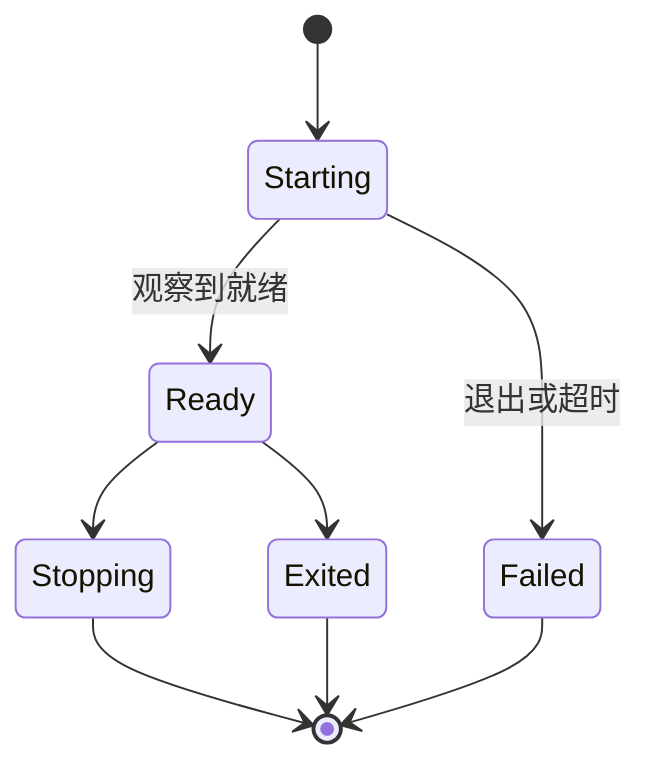
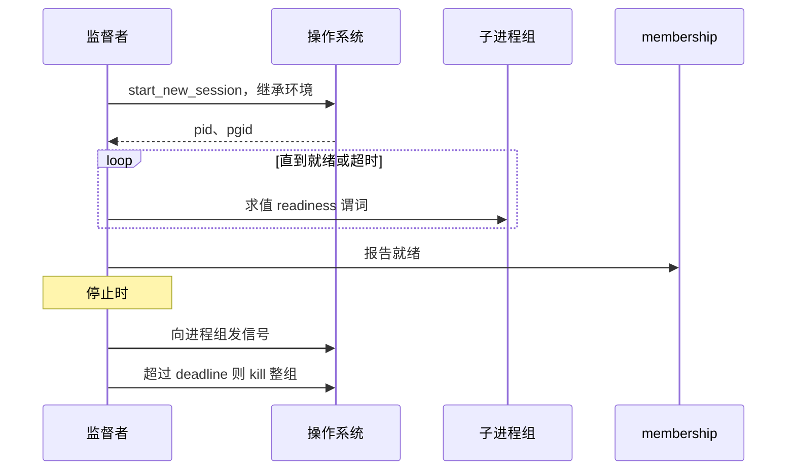

# Node Supervision

> 提案；当前未实现。

> tinyray 唯一触碰进程生命周期的地方：在调度器已经给它的节点内，运行调度器要求的进程。
> 它仍然既不选节点，也不选设备。

## 1. 范围

节点内进程监督、readiness 观察和进程树清理。计划源码：
`python/tinyray/supervision.py`。

## 2. 职责

- 在 L1 已分配的节点内拉起一条命令。
- 通过观察判断 readiness，而不是假定。
- 用有界环形缓冲收集输出。
- 杀掉整个进程组，而不是单个进程。
- 经 membership 向上报告本地健康。

## 3. 非职责

| 不在此处做 | 归属 |
|---|---|
| 选择节点 | L1 调度器 |
| 选择设备 | L1 调度器 |
| 决定跑多少个进程 | 应用（L3） |
| 重启策略 | 应用（L3） |
| 跨节点放置 | L1 调度器 |

## 4. 系统位置

可选。每个进程一个容器、由 Kubernetes 拉起的部署不需要本模块。调度器授予一个节点、并期望
作业自行组织节点内进程的部署才需要。

## 5. 依赖

- [02-membership](02-membership.md) 用于上报健康。
- [04-readiness](04-readiness.md) 提供 readiness 谓词。
- POSIX 进程组。

## 6. 公共契约

| Interface | Input | Output | Side effect | Blocking | Failure |
|---|---|---|---|---|---|
| `supervise(command, ready_when, env, cwd)` | 命令与 readiness 判据 | `Process` | 启动一个进程组 | 直到就绪 | `StartupError`，附子进程最后输出 |
| `Process.is_alive()` | —— | bool | 无 | 否 | 无 |
| `Process.tail(n)` | 行数 | 输出 | 无 | 否 | 无 |
| `Process.stop(timeout)` | deadline | —— | 向进程组发信号，再 kill | 是 | 从不抛出 |
| `Process.exit_code()` | —— | int 或 None | 无 | 否 | 无 |

没有 `num_gpus`，没有 `num_cpus`。进程继承节点被授予的一切。

## 7. 状态所有权

| State | Owner | Created | Updated by | Read by | Lifetime | Persisted |
|---|---|---|---|---|---|---|
| 子进程句柄 | 监督者 | `supervise()` | 退出时 | 健康检查 | 进程期 | 否 |
| 进程组 id | 操作系统 | `start_new_session` | 从不 | 清理 | 进程期 | 否 |
| 输出环形缓冲 | 监督者 | 首行 | 每一行 | 诊断 | 进程期 | 否 |
| readiness 裁决 | 监督者 | 首次求值 | 周期性 | membership | 进程期 | 否 |

## 8. 生命周期

## 9. 主流程

图中无法表达：readiness 通过观察判定，绝不因进程存在就假定；信号发往**进程组**，这是
触达子进程自己 fork 出的孙进程的唯一方式。

## 10. 并发与分布式语义

**进程组是强制的。** 没有 `start_new_session=True` 启动的子进程，在停止时会留下孤儿。
对 `torchrun` 来说这些孤儿是仍占着 GPU 显存的 worker 进程，于是下一次分配对着一张实际
已满的设备成功，作业在毫不相干的地方以 OOM 失败。会 fork 出 scheduler 和 detokenizer 的
推理引擎同理。

**启动是先派发后等待。** 拉起多个进程时，全部先 spawn，再等待任何一个。否则一个在启动期
会合的框架会死锁：rank 0 阻塞等待 rank 1，而 rank 1 因为 rank 0 还没返回而尚未被拉起。
这个故障在此前的实现中出现过三次，是 [P6](../01-overview/03-principles.md)。

**readiness 靠观察，不靠假定。** 默认谓词是“进程存活”，它几乎什么都证明不了。任何提供
服务的东西都应使用端口、HTTP 状态或日志匹配 —— 引擎绑定端口的时间远早于它能应答的时间。

## 11. 正确性不变量

- 每个子进程都在自己的 session 中启动，并按进程组停止。
- 监督者停止后没有子进程幸存，包括孙进程。
- 进程被报告为就绪之前，readiness 必须被观察到。
- 启动期输出被保留，并包含在启动失败信息中。
- 拉起多个进程时全部先 spawn 再等待。
- 此处不接受也不强制任何资源数量。

## 12. 故障处理

| 故障 | 检测方 | 响应 |
|---|---|---|
| 子进程在启动期退出 | 等待 | `StartupError`，含其最后输出 |
| 子进程始终不就绪 | deadline | `StartupError`，指明哪个谓词从未通过 |
| 子进程后续退出 | 轮询 | 经 membership 上报；重启属于 L3 |
| 子进程忽略终止信号 | deadline | kill 整个进程组 |
| 孙进程幸存 | —— | 由构造方式杜绝 |
| 监督者死亡 | 外部 watchdog | Node Agent 重启它；子进程按组回收 |

**watchdog 必须在被监督进程之外。** 与被监视工作共享事件循环的 watchdog，在该循环卡死时
无法触发 —— 而那正是需要它的时刻。

## 13. 配置

| Field | Type | Default | Validation | Reader | Effect |
|---|---|---|---|---|---|
| `ready_when` | 谓词 | `alive` | 谓词 | 监督者 | 如何观察 readiness |
| `startup_timeout` | 秒 | 600 | > 0 | 监督者 | deadline；模型加载很慢 |
| `stop_timeout` | 秒 | 30 | > 0 | 监督者 | kill 整组前的宽限 |
| `log_lines` | int | 200 | > 0 | 监督者 | 环形缓冲深度 |
| `env`、`cwd` | 映射、路径 | 继承 | —— | 监督者 | 子进程环境 |

## 14. 可观测性

| Metric | Producer | Meaning |
|---|---|---|
| `supervised_processes` | 监督者 | 当前运行数 |
| `supervised_starts_total` | 监督者 | 含重启 |
| `supervised_startup_seconds` | 监督者 | 到观察到就绪的时间 |
| `supervised_exits_total` | 监督者 | 按退出码打标签 |
| `supervised_group_kills_total` | 监督者 | 忽略终止信号的子进程数 |

输出以 `[name:pid]` 前缀转发，并保存在环形缓冲中。进程死亡时，环形缓冲就是剩下的一切。

## 15. 测试

| Behavior | Test file | Test case | Level |
|---|---|---|---|
| 孙进程随进程组一同死亡 | `tests/test_supervision.py` | `test_process_tree_is_cleaned` | Integration |
| readiness 靠观察而非假定 | `tests/test_supervision.py` | `test_ready_when_port_waits` | Integration |
| 启动失败携带子进程输出 | `tests/test_supervision.py` | `test_startup_error_includes_output` | Integration |
| 全部先 spawn 再等待 | `tests/test_supervision.py` | `test_group_start_does_not_deadlock` | Integration |
| 无响应的子进程被 kill | `tests/test_supervision.py` | `test_stop_escalates_to_kill` | Integration |
| 没有 API 接受资源数量 | `tests/test_suite_quality.py` | `test_no_resource_arguments` | Structural |

`test_process_tree_is_cleaned` 必须启动一个自身还会 fork 的子进程，并断言孙进程也消失了。
只测直接子进程什么都证明不了。

## 16. 限制与取舍

- **仅限 POSIX。** 进程组和 `killpg` 在 Windows 上没有等价物。
- **不提供重启策略。** tinyray 上报退出，判断它意味着什么属于 L3 —— 因为在不重建
  communicator 的情况下重启 collective 中的一个 rank，会让其余 rank 永久阻塞。
- **输出是环形缓冲。** 长跑之后才失败的进程会丢掉早期输出。持久日志在
  [roadmap](../08-project/03-roadmap.md) 上。
- **本模块是边界上最薄弱的一环。** 它是 tinyray 唯一触碰生命周期的地方，未来每一个便利
  功能都会想住进这里。新增参数应对照
  [01-overview/02-positioning.md §5](../01-overview/02-positioning.md#5-tinyray-拒绝什么)
  检查。

## 17. 源码映射

计划：`python/tinyray/supervision.py`，基于已有的 `python/tinyray/process.py`。

相关：[02-architecture/01-layering.md §4.1](../02-architecture/01-layering.md)
说明这条 L1 边界例外为何存在。
