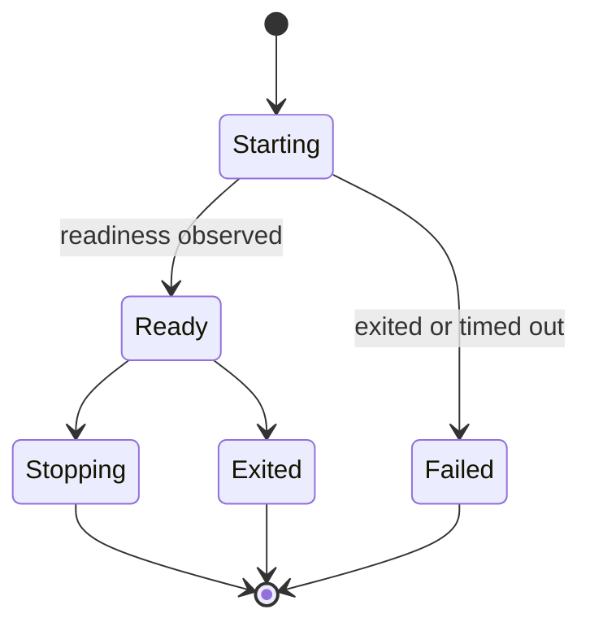
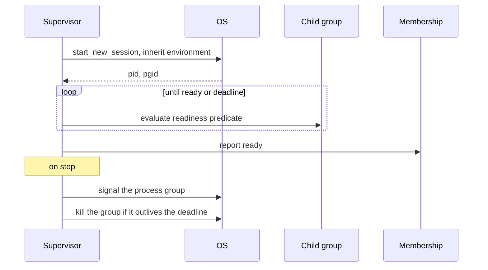

# Node supervision

> Proposal; not the current implementation.

> The one place tinyray touches process lifecycle: within a node the scheduler
> already gave it, running processes the scheduler asked for. It still chooses
> neither the node nor the devices.

## 1. Scope

Node-local process supervision, readiness observation and process-tree cleanup.
Proposed source: `python/tinyray/supervision.py`.

## 2. Responsibilities

- Start a command inside a node already allocated by L1.
- Observe readiness rather than assume it.
- Collect output with a bounded ring buffer.
- Kill the whole process group, not one process.
- Report local health upward through membership.

## 3. Non-responsibilities

| Not done here | Owner |
|---|---|
| Choosing the node | L1 scheduler |
| Choosing devices | L1 scheduler |
| Deciding how many processes | Application (L3) |
| Restart policy | Application (L3) |
| Cross-node placement | L1 scheduler |

## 4. Position in the system

Optional. A deployment where Kubernetes runs one container per process does not
need this module. A deployment where the scheduler grants a node and expects the
job to organise it does.

## 5. Dependencies

- [02-membership](02-membership.md) to report health.
- [04-readiness](04-readiness.md) for readiness predicates.
- POSIX process groups.

## 6. Public contract

| Interface | Input | Output | Side effect | Blocking | Failure |
|---|---|---|---|---|---|
| `supervise(command, ready_when, env, cwd)` | Command and readiness | `Process` | Starts a process group | Until ready | `StartupError` with the child's last output |
| `Process.is_alive()` | — | bool | None | No | None |
| `Process.tail(n)` | Lines | Output | None | No | None |
| `Process.stop(timeout)` | Deadline | — | Signals the group, then kills | Yes | Never raises |
| `Process.exit_code()` | — | int or None | None | No | None |

There is no `num_gpus` and no `num_cpus`. The process inherits what the node was
given.

## 7. State ownership

| State | Owner | Created | Updated by | Read by | Lifetime | Persisted |
|---|---|---|---|---|---|---|
| Child handle | Supervisor | `supervise()` | Exit | Health | Process | No |
| Process group id | OS | `start_new_session` | Never | Cleanup | Process | No |
| Output ring | Supervisor | First line | Each line | Diagnosis | Process | No |
| Readiness verdict | Supervisor | First evaluation | Interval | Membership | Process | No |

## 8. Lifecycle

## 9. Main flow

The diagram cannot show: readiness is evaluated by observation, never assumed
from the process existing; and the signal goes to the **group**, which is the
only way to reach the children the child forked.

## 10. Concurrency and distributed semantics

**Process groups are mandatory.** A child started without
`start_new_session=True` leaves orphans when stopped. For `torchrun` those
orphans are worker processes still holding GPU memory, so the next allocation
succeeds against a device that is actually full and the job fails with an
out-of-memory error somewhere unrelated. The same is true of inference engines
that fork a scheduler and a detokeniser.

**Startup is dispatch-then-await.** When several processes are started, all are
spawned before any is awaited. A framework that rendezvous during startup
deadlocks otherwise: rank 0 blocks waiting for rank 1, which has not been
started because rank 0 has not returned. This failure appeared three times in
the previous implementation and is [P6](../01-overview/03-principles.md).

**Readiness is observed, not assumed.** The default predicate is that the
process is alive, which proves almost nothing. Anything that serves should use a
port, an HTTP status or a log match — an engine binds its port long before it can
answer.

## 11. Correctness invariants

- Every child is started in its own session and stopped by process group.
- No child outlives its supervisor's stop, including grandchildren.
- Readiness is observed before a process is reported ready.
- Startup output is retained and included in a startup failure.
- Several processes are all spawned before any is awaited.
- No resource quantity is accepted or enforced here.

## 12. Failure handling

| Failure | Detected by | Response |
|---|---|---|
| Child exits during startup | Wait | `StartupError` including its last output |
| Child never becomes ready | Deadline | `StartupError` naming the predicate that never passed |
| Child exits later | Poll | Reported through membership; restart is L3's |
| Child ignores termination | Deadline | Group killed |
| Grandchildren survive | Group kill | Prevented by construction |
| Supervisor dies | External watchdog | Node agent restarts it; children reclaimed by group |

**The watchdog must be outside the supervised process.** A watchdog sharing an
event loop with the work it watches cannot fire when that loop is stuck — which
is precisely when it is needed.

## 13. Configuration

| Field | Type | Default | Validation | Reader | Effect |
|---|---|---|---|---|---|
| `ready_when` | predicate | `alive` | Predicate | Supervisor | How readiness is observed |
| `startup_timeout` | seconds | 600 | > 0 | Supervisor | Deadline; model loading is slow |
| `stop_timeout` | seconds | 30 | > 0 | Supervisor | Grace before the group is killed |
| `log_lines` | int | 200 | > 0 | Supervisor | Ring buffer depth |
| `env`, `cwd` | mapping, path | inherited | — | Supervisor | Child environment |

## 14. Observability

| Metric | Producer | Meaning |
|---|---|---|
| `supervised_processes` | Supervisor | Currently running |
| `supervised_starts_total` | Supervisor | Including restarts |
| `supervised_startup_seconds` | Supervisor | Time to observed readiness |
| `supervised_exits_total` | Supervisor | Labelled by exit code |
| `supervised_group_kills_total` | Supervisor | Children that ignored termination |

Output is forwarded with a `[name:pid]` prefix and kept in the ring buffer.
When a process dies, the ring is what remains.

## 15. Testing

| Behaviour | Test file | Test case | Level |
|---|---|---|---|
| Grandchildren die with the group | `tests/test_supervision.py` | `test_process_tree_is_cleaned` | Integration |
| Readiness is observed, not assumed | `tests/test_supervision.py` | `test_ready_when_port_waits` | Integration |
| Startup failure carries the child's output | `tests/test_supervision.py` | `test_startup_error_includes_output` | Integration |
| All spawned before any awaited | `tests/test_supervision.py` | `test_group_start_does_not_deadlock` | Integration |
| An unresponsive child is killed | `tests/test_supervision.py` | `test_stop_escalates_to_kill` | Integration |
| No API accepts a resource quantity | `tests/test_suite_quality.py` | `test_no_resource_arguments` | Structural |

`test_process_tree_is_cleaned` must start a child that itself forks, and assert
the grandchild is gone. Testing only the direct child proves nothing.

## 16. Limitations and trade-offs

- **POSIX only.** Process groups and `killpg` have no Windows equivalent here.
- **No restart policy.** tinyray reports an exit; deciding what it means is
  L3's, because restarting one rank of a collective without rebuilding the
  communicator leaves the others blocked forever.
- **Output is a ring buffer.** A process that fails after a long run loses its
  early output. Persistent logs are on the
  [roadmap](../08-project/03-roadmap.md).
- **This module is the boundary's weakest point.** It is the only place tinyray
  touches lifecycle, and every future convenience will want to live here. New
  arguments should be checked against
  [01-overview/02-positioning.md §5](../01-overview/02-positioning.md#5-what-tinyray-refuses).

## 17. Source mapping

Proposed: `python/tinyray/supervision.py`, built from the existing
`python/tinyray/process.py`.

Related: [02-architecture/01-layering.md §4.1](../02-architecture/01-layering.md)
for why this exception to the L1 boundary exists.
