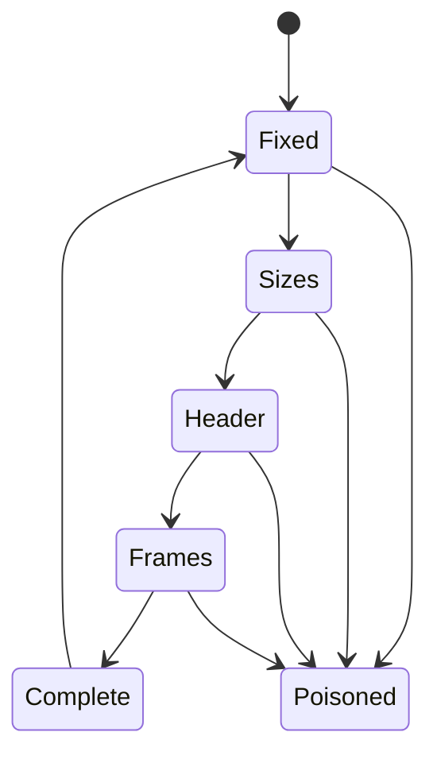

# Wire format

## 1. Purpose

Frame control messages so that a small header and any number of out-of-band
byte ranges travel together without being copied through a serialiser, and so
that a corrupt message cannot desynchronise the stream.

## 2. Participants

Any two tinyray processes. The format is symmetric.

## 3. Preconditions

- A TCP connection with `TCP_NODELAY` set.
- Client and server built from the same release. The format is not versioned
  beyond its magic bytes.

## 4. Data model

```
offset 0        magic         b"TRY1"          4 bytes
offset 4        header_len    u32 big endian   4 bytes
offset 8        n_frames      u32 big endian   4 bytes
offset 12       frame_sizes   u32 big endian x n_frames
offset 12+4n    header        msgpack, header_len bytes
then            frames        concatenated, sizes as declared
```

Content type: `application/x-tinyray`.

Two decisions carry weight.

**Frame sizes live in the fixed prefix, not in the header.** The framing layer
never parses msgpack, so it stays purely mechanical and a corrupt header cannot
misalign the byte stream.

**Frames are out of band.** Large buffers are handed to the transport separately
from the small serialised body and reach the socket without being concatenated.
Inlining them copies every buffer through the serialiser; **measured** on the
previous implementation, a 10 MB array produced a 400,153-byte body instead of
135 bytes when this was configured wrongly.

### 4.1 Limits

Decoding allocates based on values read off the wire, so every one is bounded.

| Limit | Default |
|---|---|
| `max_header_len` | 1 MiB |
| `max_frames` | 4096 |
| `max_frame_len` | 4 GiB |
| `max_message_len` | 8 GiB |

## 5. Normal sequence

1. Sender writes the fixed prefix.
2. Sender writes the frame size table.
3. Sender writes the msgpack header.
4. Sender writes each frame in declared order.
5. Receiver reads the prefix, validates the limits, allocates, then reads.

The receiver never allocates before validating.

## 6. State transitions



`Poisoned` is terminal for the connection. See §11.

## 7. Ordering constraints

- Frames arrive in declared order.
- A message is complete only when every declared frame has been read.
- Messages on one connection do not interleave.

Ordering *between* messages is not provided here; it is the control RPC's, using
per-caller sequence numbers
([03-control-rpc.md](03-control-rpc.md)).

## 8. Timeouts

Framing itself imposes none. The transport applies a per-request deadline
(default 300 s), and a partially read message at the deadline closes the
connection.

## 9. Retry and idempotence

Framing is not retryable. A message that failed to decode is not re-requested at
this layer; the connection is closed and the caller retries at the RPC layer, if
the operation permits.

## 10. Backpressure

None here. Backpressure is applied after decoding, by admission
([03-modules/06-admission.md](../03-modules/06-admission.md)), because a
rejection must name the request it refuses.

## 11. Failure semantics

| Failure | Detection | Response |
|---|---|---|
| Bad magic | Prefix read | Poison, close |
| Any limit exceeded | Before allocation | Poison, close |
| Truncated stream | Read returns short | Poison, close |
| Header not valid msgpack | Header decode | Poison, close |

**A framing error is never recovered from.** A binary framing has no
resynchronisation point: after a bad length there is no way to find the next
message boundary without guessing. The decoder poisons itself deliberately so
that a corrupt stream fails loudly instead of producing plausible garbage.

## 12. Correctness invariants

- No allocation occurs before the corresponding limit is checked.
- A poisoned decoder never returns a message.
- Frame bytes are never copied through the header serialiser.
- The framing layer never interprets the header's contents.
- Decoding is byte-for-byte reversible with encoding.

## 13. Compatibility

The magic bytes identify the format. There is no negotiation: mixed versions in
one cluster are unsupported, and the failure is a clean rejection rather than a
misparse.

Adding a field to the header is compatible if readers ignore unknown keys.
Changing the prefix layout is not.

## 14. Testing

| Behaviour | Test file | Test case | Level |
|---|---|---|---|
| Encode and decode round-trip | `tests/test_framing.py` | `test_roundtrip` | Unit |
| Round-trip with many frames | `tests/test_framing.py` | `test_roundtrip_with_frames` | Unit |
| Each limit is enforced | `tests/test_framing.py` | `test_limits_enforced` | Unit |
| A poisoned decoder stays poisoned | `tests/test_framing.py` | `test_poison_is_terminal` | Unit |
| Frames are not copied | `tests/test_buffers.py` | `test_zero_copy_out` | Unit |
| Large buffers stay out of the body | `tests/test_serde.py` | `test_body_stays_small` | Unit |
| Arbitrary byte streams do not panic | `tests/test_framing.py` | `test_fuzz_decoder` | Fuzz |

`test_body_stays_small` asserts the *cost*, not just that the value survives.
The round-trip test alone passed while the payload was silently doubling.
