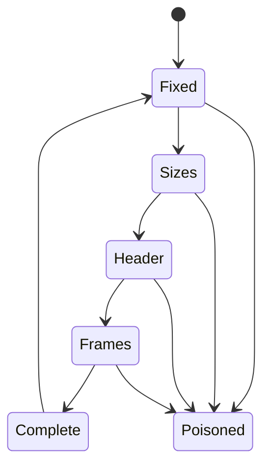

# Wire Format

## 1. 目的

对控制消息做 framing，使一个小 header 和任意数量的带外字节区一起传输而不经序列化器复制，
并使一条损坏的消息无法让字节流失去同步。

## 2. 参与者

任意两个 tinyray 进程。格式是对称的。

## 3. 前置条件

- 一条设置了 `TCP_NODELAY` 的 TCP 连接。
- 客户端与服务端由同一发布版本构建。除魔数外该格式没有版本协商。

## 4. 数据模型

```
偏移 0        magic         b"TRY1"          4 字节
偏移 4        header_len    u32 大端          4 字节
偏移 8        n_frames      u32 大端          4 字节
偏移 12       frame_sizes   u32 大端 × n_frames
偏移 12+4n    header        msgpack，header_len 字节
其后          frames        依次拼接，大小如声明
```

Content type：`application/x-tinyray`。

两个决定值得说明。

**frame 大小放在固定前缀里，不放在 header 里。** framing 层因此从不解析 msgpack，保持
纯机械，且损坏的 header 无法让字节流错位。

**frame 是带外的。** 大缓冲区与小的序列化体分开交给 transport，不经拼接即抵达 socket。
内联它们会让每个缓冲区都被复制穿过序列化器；在此前的实现上**实测**，配置错误时一个 10 MB
数组产生了 400,153 字节的 body 而不是 135 字节。

### 4.1 上限

解码会依据从 wire 上读到的值分配内存，因此每个值都有上限。

| 上限 | 默认值 |
|---|---|
| `max_header_len` | 1 MiB |
| `max_frames` | 4096 |
| `max_frame_len` | 4 GiB |
| `max_message_len` | 8 GiB |

## 5. 正常顺序

1. 发送方写入固定前缀。
2. 发送方写入 frame 大小表。
3. 发送方写入 msgpack header。
4. 发送方按声明顺序写入每个 frame。
5. 接收方读取前缀，校验上限，分配，然后读取。

接收方在校验之前从不分配。

## 6. 状态转换



`Poisoned` 对该连接是终态。见 §11。

## 7. 顺序约束

- frame 按声明顺序到达。
- 只有在每个声明的 frame 都读完后消息才算完整。
- 同一连接上的消息不交错。

消息**之间**的顺序不在此处提供，那属于控制 RPC，使用 per-caller 序号
（[03-control-rpc.md](03-control-rpc.md)）。

## 8. Timeout

framing 本身不施加任何 timeout。transport 施加每请求 deadline（默认 300 s），到期时仍
读到一半的消息会关闭连接。

## 9. Retry 与幂等性

framing 不可 retry。解码失败的消息不在这一层重新请求；连接被关闭，调用方在 RPC 层按操作
是否允许来决定是否重试。

## 10. Backpressure

此处没有。Backpressure 在解码之后由 Admission 施加
（[03-modules/06-admission.md](../03-modules/06-admission.md)），因为拒绝必须指明它拒绝的
是哪个请求。

## 11. 故障语义

| 故障 | 检测 | 响应 |
|---|---|---|
| 魔数错误 | 读前缀时 | 中毒，关闭 |
| 任一上限被超出 | 分配之前 | 中毒，关闭 |
| 流被截断 | 读取返回不足 | 中毒，关闭 |
| header 不是合法 msgpack | header 解码 | 中毒，关闭 |

**framing 错误绝不恢复。** 二进制 framing 没有重新同步点：读到一个错误长度之后，除了猜
没有办法找到下一个消息边界。解码器有意让自己中毒，使损坏的流大声失败，而不是产出看似合理
的垃圾。

## 12. 正确性不变量

- 在对应上限被检查之前不发生分配。
- 中毒的解码器绝不返回消息。
- frame 字节绝不经 header 序列化器复制。
- framing 层从不解释 header 内容。
- 解码与编码逐字节可逆。

## 13. 兼容性

魔数标识格式。没有协商：一个集群内混用版本不被支持，且失败表现为干净的拒绝而不是错误解析。

向 header 增加字段是兼容的，只要读取方忽略未知键。改变前缀布局不兼容。

## 14. 测试

| Behavior | Test file | Test case | Level |
|---|---|---|---|
| 编解码往返一致 | `tests/test_framing.py` | `test_roundtrip` | Unit |
| 多 frame 往返一致 | `tests/test_framing.py` | `test_roundtrip_with_frames` | Unit |
| 每个上限被强制 | `tests/test_framing.py` | `test_limits_enforced` | Unit |
| 中毒的解码器保持中毒 | `tests/test_framing.py` | `test_poison_is_terminal` | Unit |
| frame 未被复制 | `tests/test_buffers.py` | `test_zero_copy_out` | Unit |
| 大缓冲区不进入 body | `tests/test_serde.py` | `test_body_stays_small` | Unit |
| 任意字节流不导致 panic | `tests/test_framing.py` | `test_fuzz_decoder` | Fuzz |

`test_body_stays_small` 断言的是**代价**，不只是值能存活。仅有往返测试时，payload 在
悄悄翻倍而测试全绿。
