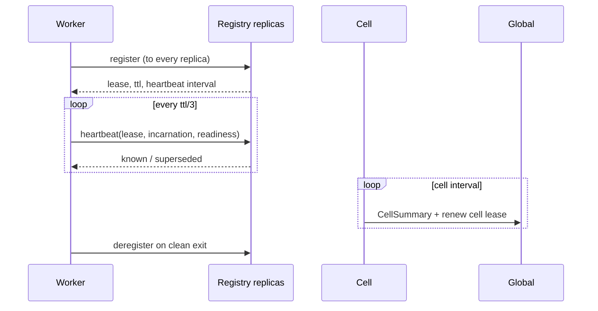
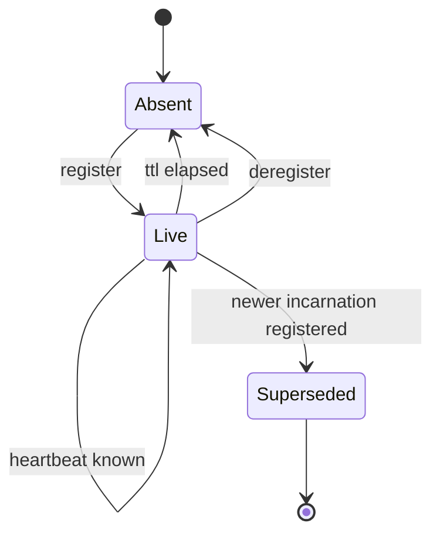

# Membership protocol

## 1. Purpose

Let a process assert its own existence, keep that assertion alive, and be
removed when it stops — without anything supervising it.

## 2. Participants

| Role | Responsibility |
|---|---|
| Worker | Registers a slot, heartbeats, deregisters |
| Registry replica | Records, expires, answers lookups |
| Cell | Aggregates its workers into one summary |
| Global | Holds cell leases; never sees a worker |

## 3. Preconditions

- The worker knows its slot ([03-modules/01-identity.md](../03-modules/01-identity.md)).
- The worker has bound a control port.
- At least one registry replica address is known, from `TINYRAY_REGISTRY`.

The registry need not be running yet. See §8.

## 4. Data model

```
Registration:
  slot            string      "collector/c07/3"
  incarnation     string      unique to this process, ordered per slot
  endpoint        host:port
  meta            map         launcher facts: local_rank, visible devices, pid, host
  readiness       verdict     optional; absent means not ready

Lease:
  lease           string      identifies the registration
  ttl             seconds
  heartbeat       seconds     ttl / 3
  version         int         membership version at acceptance

Heartbeat:
  lease           string
  incarnation     string
  readiness       verdict     optional

HeartbeatReply:
  known           bool
  superseded      bool
  version         int

Lookup:
  group           string
  ranks           list or null
  since           int         -1 to always receive members

LookupReply:
  version         int
  unchanged       bool
  members         list of public registration fields

CellSummary:
  cell, generation, lease_epoch
  total, ready
  ready_by_class  bounded map, application-supplied
  counters        registrations, evictions, rejections
```

`CellSummary` is fixed-size by construction: counts and bounded maps, never a
member list. That is what keeps the global tier's input independent of worker
count.

## 5. Normal sequence



## 6. State transitions



## 7. Ordering constraints

- A registration for a slot supersedes any earlier registration for that slot.
- Supersession is decided by **arrival order at the registry**, not by comparing
  incarnation values. This keeps the protocol free of clock assumptions.
- A heartbeat never creates a registration.
- The membership version increases only on a membership change; a heartbeat must
  not move it.

The last rule is load-bearing. If a heartbeat moved the version, every watcher
would re-fetch once per heartbeat per worker — a quadratic hiding inside a
protocol that looks linear.

## 8. Timeouts

| Timeout | Default | Meaning |
|---|---:|---|
| `lease_ttl` | 30 s | Time without a heartbeat before eviction |
| `heartbeat` | 10 s | `ttl / 3`, so two losses are survivable |
| `sweep_interval` | 5 s | Eviction granularity; a worker may outlive its TTL by this much |
| `startup_window` | 300 s | How long a worker retries a registry that has not started |
| `request_timeout` | 10 s | Per replica, per request |

`startup_window` exists because a launcher starts ranks in an arbitrary order.
A worker that gave up because it was early would make startup a race.

## 9. Retry and idempotence

| Operation | Idempotent | Retry |
|---|---|---|
| `register` | Yes — same slot and incarnation is a no-op | To every replica; success if any accepts |
| `heartbeat` | Yes | Next interval; a single loss is not an error |
| `deregister` | Yes | Best effort; the lease expires anyway |
| `lookup` | Yes | Failover across replicas, then cache |

**A worker never re-registers on `superseded`.** It re-registers only on
`known: false`. A superseded worker that re-registered would fight its successor
indefinitely, alternately publishing a dead address.

## 10. Backpressure

The registry does not reject registrations: refusing a worker's existence
achieves nothing, because the worker exists either way.

Overload appears instead as latency, and the client's response is to fail over.
Sustained pressure means too few replicas — a capacity decision, visible in
`registry_request_latency`.

## 11. Failure semantics

| Failure | Detected by | Bound | Effect |
|---|---|---|---|
| Worker dies | Absent heartbeat | ttl + sweep | Removed from lookups |
| Worker partitioned | Absent heartbeat | ttl + sweep | Removed; re-registers on reconnect |
| One replica down | Client | One request | Failover; the replica catches up next heartbeat |
| Every replica down | Client | One request | Lookups from cache; registrations retried |
| Replica restarted empty | `known: false` | One interval | All workers re-register |
| Two processes claim a slot | Registry | Immediate | Later wins; earlier learns on its next heartbeat |

## 12. Correctness invariants

- A slot has at most one live registration.
- Liveness is asserted by the owner; nothing infers it from process parenthood.
- Worker heartbeats terminate at the cell.
- `CellSummary` size is independent of worker count.
- The membership version changes only on membership change.
- A replica that lost all state converges within one lease period without
  contacting another replica.
- Replicas exchange no messages.
- Consensus holds cell leases only, never worker leases.

## 13. Compatibility

Unknown fields in a registration's `meta` are stored and returned untouched, so
an application can add facts without a protocol change.

Adding a field to `HeartbeatReply` is compatible: an older worker ignores it.
Removing `known` or `superseded` is not.

## 14. Testing

| Behaviour | Test file | Test case | Level |
|---|---|---|---|
| A silent worker is evicted | `tests/test_membership.py` | `test_silent_worker_is_evicted` | Unit |
| A heartbeat does not create a registration | `tests/test_membership.py` | `test_heartbeat_does_not_create` | Unit |
| A heartbeat does not move the version | `tests/test_membership.py` | `test_version_moves_only_on_change` | Unit |
| Re-registration replaces, never duplicates | `tests/test_membership.py` | `test_restart_replaces_entry` | Unit |
| `superseded` does not trigger re-registration | `tests/test_identity.py` | `test_superseded_does_not_reregister` | Unit |
| `known: false` does trigger it | `tests/test_membership.py` | `test_unknown_lease_reregisters` | Unit |
| Summary size is bounded | `tests/test_membership.py` | `test_summary_size_is_bounded` | Unit |
| Two replicas converge without talking | `tests/test_membership.py` | `test_replicas_converge_independently` | Integration |
| Losing one replica is survivable | `tests/test_chaos.py` | `test_replica_failover` | Chaos |
| Losing every replica does not stop work | `tests/test_chaos.py` | `test_total_registry_loss` | Chaos |
| Consensus write rate is flat in worker count | `tests/test_fake_cluster.py` | `test_consensus_writes_are_flat` | Scale |

Replica tests run with **at least two replicas and kill one**. The previous
prototype passed every single-replica test while two replicas were permanently
broken, because both were given the same identity and calls were submitted to one
and fetched from the other.
