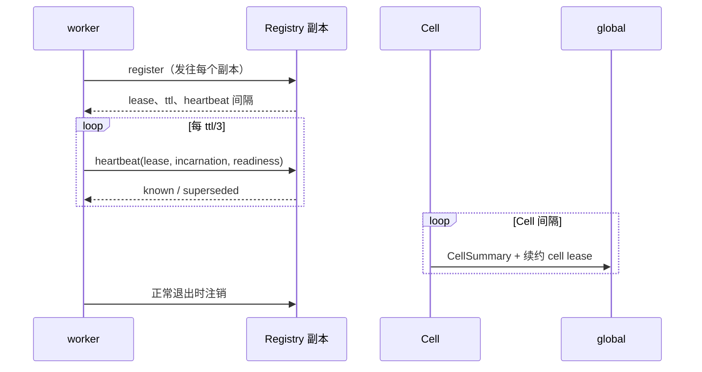
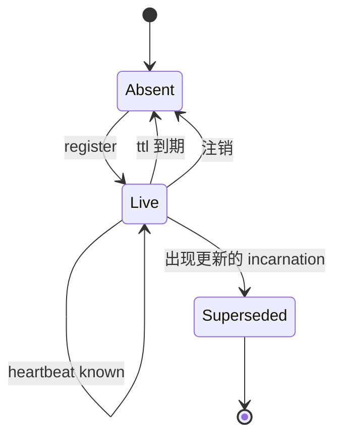

# Membership Protocol

## 1. 目的

让一个进程声明自己的存在、维持该声明、并在停止时被移除 —— 全程不需要任何东西监督它。

## 2. 参与者

| 角色 | 职责 |
|---|---|
| worker | 注册 Slot、heartbeat、注销 |
| Registry 副本 | 记录、过期、应答 lookup |
| Cell | 把自己的 worker 聚合成一份 summary |
| global | 持有 cell lease；从不看到 worker |

## 3. 前置条件

- worker 知道自己的 Slot（[03-modules/01-identity.md](../03-modules/01-identity.md)）。
- worker 已绑定控制端口。
- 至少知道一个 Registry 副本地址，来自 `TINYRAY_REGISTRY`。

Registry 不必已经在运行。见 §8。

## 4. 数据模型

```
Registration:
  slot            string      "collector/c07/3"
  incarnation     string      本进程唯一，在该 Slot 内有序
  endpoint        host:port
  meta            map         launcher 事实：local_rank、可见设备、pid、host
  readiness       verdict     可选；缺失表示未就绪

Lease:
  lease           string      标识该注册
  ttl             seconds
  heartbeat       seconds     ttl / 3
  version         int         接受时的 membership 版本号

Heartbeat:
  lease           string
  incarnation     string
  readiness       verdict     可选

HeartbeatReply:
  known           bool
  superseded      bool
  version         int

Lookup:
  group           string
  ranks           list 或 null
  since           int         传 -1 表示总是返回成员

LookupReply:
  version         int
  unchanged       bool
  members         list，注册记录的公开字段

CellSummary:
  cell, generation, lease_epoch
  total, ready
  ready_by_class  有界 map，由应用提供
  counters        registrations、evictions、rejections
```

`CellSummary` 在构造上就是固定大小的：只有计数和有界 map，绝不含成员列表。这正是让 global
层的输入与 worker 数无关的原因。

## 5. 正常顺序



## 6. 状态转换



## 7. 顺序约束

- 对某 Slot 的注册取代该 Slot 此前的注册。
- 取代关系由**到达 Registry 的顺序**判定，而非比较 Incarnation 数值。这使协议不依赖任何
  时钟假设。
- heartbeat 从不创建注册。
- membership 版本号只在 membership 变更时增加；heartbeat 绝不推进它。

最后一条是承重的。若 heartbeat 会推进版本号，每个 watcher 都会按每 worker 每 heartbeat 的
频率重新拉取 —— 一个藏在看似线性协议里的二次复杂度。

## 8. Timeout

| Timeout | 默认 | 含义 |
|---|---:|---|
| `lease_ttl` | 30 s | 无 heartbeat 多久后被驱逐 |
| `heartbeat` | 10 s | `ttl / 3`，因此可承受丢两次 |
| `sweep_interval` | 5 s | 驱逐粒度；worker 可能多活这么久 |
| `startup_window` | 300 s | worker 重试尚未启动的 Registry 多久 |
| `request_timeout` | 10 s | 每副本每请求 |

`startup_window` 存在是因为 launcher 以任意顺序拉起 rank。一个因为启动太早而放弃的
worker 会把启动变成竞态。

## 9. Retry 与幂等性

| 操作 | 幂等 | Retry |
|---|---|---|
| `register` | 是 —— 相同 Slot 与 Incarnation 是空操作 | 发往每个副本；任一接受即成功 |
| `heartbeat` | 是 | 下个周期；丢一次不算错误 |
| `deregister` | 是 | 尽力而为；lease 无论如何都会过期 |
| `lookup` | 是 | 跨副本失败转移，然后走缓存 |

**worker 在收到 `superseded` 时绝不重新注册**，只在收到 `known: false` 时重新注册。一个被
取代的 worker 若重新注册，会与其后继无休止争夺，交替发布一个已死的地址。

## 10. Backpressure

Registry 不拒绝注册：拒绝一个 worker 的存在毫无意义，因为它无论如何都存在。

过载表现为延迟，客户端的响应是失败转移。持续压力意味着副本太少 —— 这是容量决定，在
`registry_request_latency` 中可见。

## 11. 故障语义

| 故障 | 检测方 | 时限 | 影响 |
|---|---|---|---|
| worker 死亡 | 缺失 heartbeat | ttl + 扫描 | 从 lookup 移除 |
| worker 被分区 | 缺失 heartbeat | ttl + 扫描 | 移除；重连后重新注册 |
| 单副本宕机 | 客户端 | 一次请求 | 失败转移；该副本下次 heartbeat 补齐 |
| 全部副本宕机 | 客户端 | 一次请求 | lookup 走缓存；注册持续重试 |
| 副本空重启 | `known: false` | 一个间隔 | 所有 worker 重新注册 |
| 两个进程争夺一个 Slot | Registry | 立即 | 后者胜出；前者在下次 heartbeat 得知 |

## 12. 正确性不变量

- 一个 Slot 至多一条存活注册。
- 存活性由 owner 声明；没有任何东西从父子进程关系推断它。
- worker heartbeat 终止于 Cell。
- `CellSummary` 大小与 worker 数无关。
- membership 版本号只在 membership 变更时改变。
- 丢光状态的副本在一个 lease 周期内收敛，且无需联系其他副本。
- 副本之间不交换消息。
- 共识只持有 cell lease，绝不持有 worker lease。

## 13. 兼容性

注册记录 `meta` 中的未知字段被原样存储和返回，因此应用可以增加事实而无需改协议。

向 `HeartbeatReply` 增加字段是兼容的：旧 worker 忽略它。移除 `known` 或 `superseded`
不兼容。

## 14. 测试

| Behavior | Test file | Test case | Level |
|---|---|---|---|
| 沉默的 worker 被驱逐 | `tests/test_membership.py` | `test_silent_worker_is_evicted` | Unit |
| heartbeat 不创建注册 | `tests/test_membership.py` | `test_heartbeat_does_not_create` | Unit |
| heartbeat 不推进版本号 | `tests/test_membership.py` | `test_version_moves_only_on_change` | Unit |
| 重新注册是替换而非重复 | `tests/test_membership.py` | `test_restart_replaces_entry` | Unit |
| `superseded` 不触发重新注册 | `tests/test_identity.py` | `test_superseded_does_not_reregister` | Unit |
| `known: false` 触发重新注册 | `tests/test_membership.py` | `test_unknown_lease_reregisters` | Unit |
| summary 大小有界 | `tests/test_membership.py` | `test_summary_size_is_bounded` | Unit |
| 两个副本不通信也能收敛 | `tests/test_membership.py` | `test_replicas_converge_independently` | Integration |
| 失去一个副本可存活 | `tests/test_chaos.py` | `test_replica_failover` | Chaos |
| 失去全部副本不停止工作 | `tests/test_chaos.py` | `test_total_registry_loss` | Chaos |
| 共识写入速率与 worker 数无关 | `tests/test_fake_cluster.py` | `test_consensus_writes_are_flat` | Scale |

副本测试必须**至少两个副本并杀掉一个**。此前的原型通过了全部单副本测试，而两个副本因为
被赋予了同一个 identity 而永久损坏 —— 调用提交给其中一个、结果却去另一个取。
