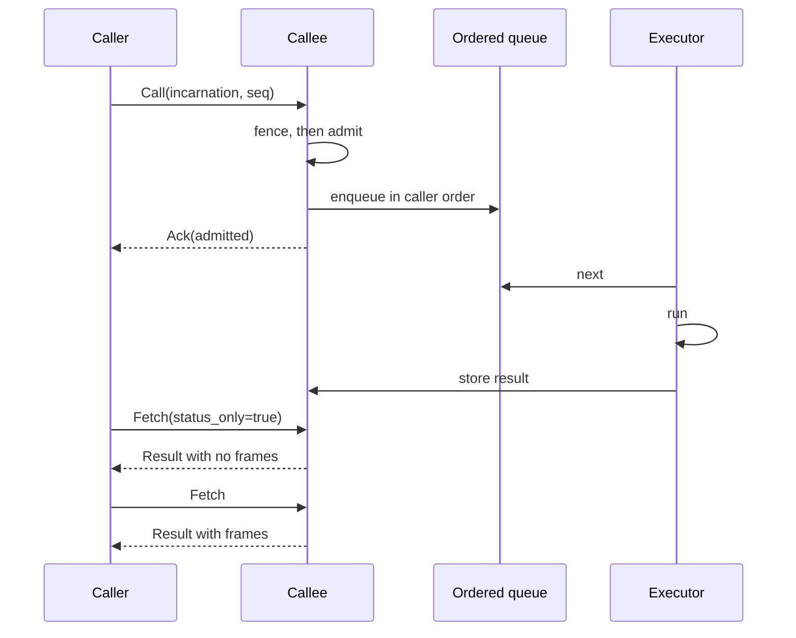
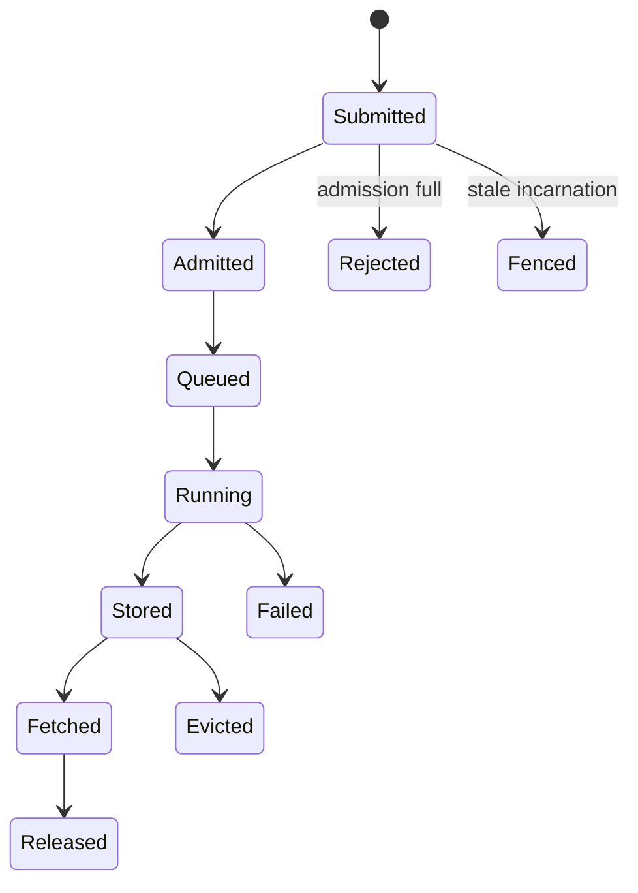

# Control RPC

## 1. Purpose

Deliver a method call to another process, in submission order per caller, fenced
against stale writers, with rejection where the callee is full and retry only
where retry is safe.

## 2. Participants

| Role | Responsibility |
|---|---|
| Caller | Submits, carries its incarnation and sequence, retries backpressure |
| Callee | Fences, admits, orders, executes, stores the result |
| Consumer | Fetches a result, possibly a different process from the caller |

## 3. Preconditions

- The caller has an endpoint and incarnation from discovery.
- The callee is serving.
- Both are the same release ([01-wire-format.md §13](01-wire-format.md#13-compatibility)).

## 4. Data model

```
Call:
  task_id       identifier of the result
  target        slot
  incarnation   the callee's incarnation as the caller believes it
  caller        caller identity
  caller_inc    the caller's own incarnation
  seq           monotonic per (caller, target)
  method        string
frames:         [serialised body, *out-of-band buffers]

Ack:
  task_id
  admitted      bool
  retry_after   seconds, when not admitted

Fetch:
  task_id
  timeout_ms
  status_only   bool

Result:
  task_id
frames:         [body, *buffers]   empty when status_only

Error:
  task_id
  kind          see section 11
  message
  traceback     the remote Python traceback
```

`status_only` is the field that keeps readiness questions off the data plane.
**Measured**: answering "is this ready" by fetching cost 237 ms for a settled
200 MB result; with `status_only`, 0.14 ms.

## 5. Normal sequence



The `Ack` means **queued**, not completed. Treating it as completion is the
mistake the field name exists to prevent.

## 6. State transitions



## 7. Ordering constraints

- Calls from one caller to one callee execute in `seq` order.
- Different callers are independent; one slow caller does not block another.
- A repeated `seq` is acknowledged and **not** re-executed.
- Ordering is per `(caller, target)`, not global.

HTTP provides no ordering and several connections per peer deliver concurrently,
so the callee buffers arrivals that overtake their predecessors and dispatches in
order.

A call genuinely lost in flight stalls that caller permanently. There is no
automatic recovery; the condition is reported as `queue_waiting_for` naming the
caller and sequence.

## 8. Timeouts

| Timeout | Default | Applies to |
|---|---:|---|
| `request_timeout` | 300 s | One request |
| `fetch_timeout` | caller-supplied | How long the callee holds a fetch open |
| `result_ttl` | 300 s | Unfetched results |

A fetch for a pending result long-polls rather than spinning; when the deadline
passes the callee replies "ask again".

## 9. Retry and idempotence

| Outcome | Retryable | Why |
|---|---|---|
| `Backpressure` | **Yes** | The identical request is safe to resend |
| `Fenced` | No | Re-look-up first; the target moved |
| `Unreachable` | No | Re-look-up first |
| `UserException` | No | A fact about state |
| `ObjectLost` | No | A fact about state |
| `NotFound` | No | A fact about state |
| `Internal` | No | Unknown effect |

Backoff is linear — `base x min(attempt, 8)` — because the peer is draining a
queue, not collapsing. Exponential backoff overshoots a queue that clears in
milliseconds.

**Retrying a stateful call because it failed would apply it twice.** Backpressure
is the only outcome where the call provably did not run.

## 10. Backpressure

Rejection is immediate and carries `retry_after`. The callee never accepts a call
it cannot run: accept-then-wait makes the queue invisible and removes the
caller's ability to choose another peer.

HTTP `429` carries the same signal for non-tinyray clients.

## 11. Failure semantics

| `kind` | Python exception | Meaning |
|---|---|---|
| `UserException` | `UserCodeError` | The method raised |
| `ObjectLost` | `ObjectLost` | The result existed and is gone |
| `NotFound` | `NotFound` | It never existed |
| `Fenced` | `Fenced` | The caller addressed a superseded incarnation |
| `Backpressure` | `Backpressure` | Full; retry |
| `Internal` | `RemoteCallError` | tinyray's fault |

`ObjectLost` and `NotFound` are distinct on purpose. Collapsed into one, a fetch
after eviction is indistinguishable from a typo.

The remote traceback travels on the wire because in a distributed run it is
usually the only useful artefact.

## 12. Correctness invariants

- Every call is fenced before it is admitted.
- Fencing is enforced by the callee, never assumed by the caller.
- A repeated `seq` is never executed twice.
- An `Ack` is sent on admission, never on completion.
- A `status_only` fetch transfers no payload.
- Only `Backpressure` is retried automatically.
- Every error carries a kind distinguishable from every other.
- A rejected call leaves no state on the callee.

## 13. Compatibility

Unversioned beyond the framing magic. Adding a header field is compatible if
readers ignore unknown keys; adding an `ErrorKind` is not, because callers switch
on it — a new kind must map to `Internal` for older callers.

## 14. Testing

| Behaviour | Test file | Test case | Level |
|---|---|---|---|
| Out-of-order arrivals are reordered | `tests/test_transport.py` | `test_ordering_restored` | Unit |
| Callers do not block each other | `tests/test_transport.py` | `test_callers_are_independent` | Unit |
| A repeated seq is absorbed | `tests/test_transport.py` | `test_duplicate_seq_absorbed` | Unit |
| A stale incarnation is rejected | `tests/test_identity.py` | `test_peer_rejects_stale_incarnation` | Integration |
| An Ack does not imply completion | `tests/test_transport.py` | `test_ack_means_queued` | Unit |
| `status_only` moves no payload | `tests/test_driver_byte_budget.py` | `test_status_only_is_cheap` | Integration |
| Only backpressure is retried | `tests/test_admission.py` | `test_only_backpressure_retries` | Unit |
| Each ErrorKind is reachable and distinct | `tests/test_transport.py` | `test_error_taxonomy` | Unit |
| A stalled queue is reported | `tests/test_transport.py` | `test_waiting_for_is_visible` | Integration |

`test_status_only_is_cheap` asserts the byte cost across payload sizes. A budget
checked at one size is a budget that will be violated at another.
