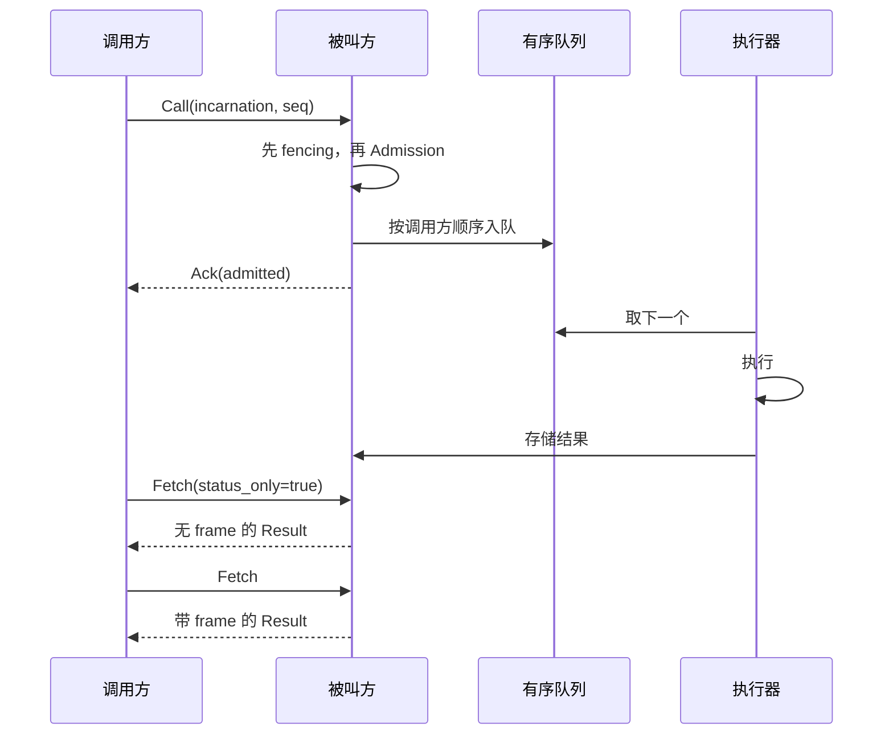
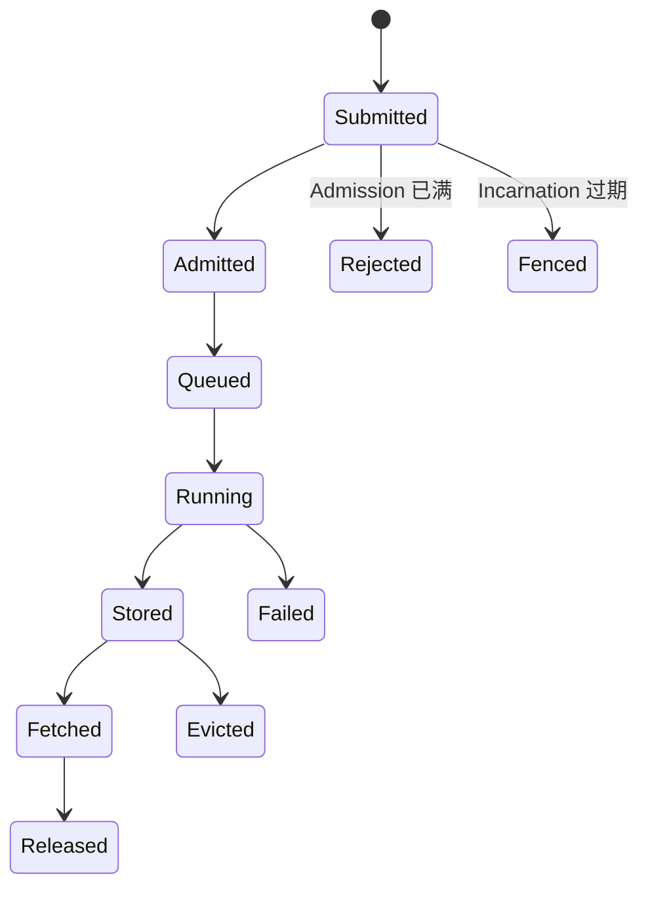

# Control RPC

## 1. 目的

把一次方法调用投递到另一个进程，保持 per-caller 提交顺序，对过期写入者做 fencing，在被叫方
满载时拒绝，并且只在 retry 安全时 retry。

## 2. 参与者

| 角色 | 职责 |
|---|---|
| 调用方 | 提交，携带自身 Incarnation 与序号，retry backpressure |
| 被叫方 | fencing、Admission、排序、执行、存储结果 |
| 消费方 | 取回结果，可能与调用方不是同一个进程 |

## 3. 前置条件

- 调用方已从 discovery 获得 endpoint 与 Incarnation。
- 被叫方正在服务。
- 两者是同一发布版本（[01-wire-format.md §13](01-wire-format.md#13-兼容性)）。

## 4. 数据模型

```
Call:
  task_id       结果的标识
  target        slot
  incarnation   调用方所认为的被叫方 Incarnation
  caller        调用方身份
  caller_inc    调用方自身的 Incarnation
  seq           per (caller, target) 单调
  method        string
frames:         [序列化体, *带外缓冲区]

Ack:
  task_id
  admitted      bool
  retry_after   未被接纳时的秒数

Fetch:
  task_id
  timeout_ms
  status_only   bool

Result:
  task_id
frames:         [体, *缓冲区]   status_only 时为空

Error:
  task_id
  kind          见第 11 节
  message
  traceback     远端 Python traceback
```

`status_only` 是把 readiness 问题挡在数据面之外的那个字段。**实测**：通过取回来回答
“好了吗”，对一个已就绪的 200 MB 结果耗时 237 ms；用 `status_only` 是 0.14 ms。

## 5. 正常顺序



`Ack` 意味着**已入队**，不是已完成。把它当作完成，正是这个字段名要防止的错误。

## 6. 状态转换



## 7. 顺序约束

- 同一调用方发往同一被叫方的调用按 `seq` 顺序执行。
- 不同调用方彼此独立；一个慢调用方不阻塞另一个。
- 重复的 `seq` 被确认，**不**重复执行。
- 顺序是 per `(caller, target)` 的，不是全局的。

HTTP 不提供顺序，而每 peer 多条连接会并发投递，因此被叫方缓冲越过前序的到达并按序派发。

真正在途丢失的调用会永久卡住该调用方。没有自动恢复；该状况以 `queue_waiting_for` 上报，
并指明调用方与序号。

## 8. Timeout

| Timeout | 默认 | 作用于 |
|---|---:|---|
| `request_timeout` | 300 s | 一次请求 |
| `fetch_timeout` | 调用方提供 | 被叫方保持 fetch 挂起的时长 |
| `result_ttl` | 300 s | 未被取回的结果 |

对尚未就绪结果的 fetch 采用长轮询而非自旋；deadline 到期时被叫方回复“再问一次”。

## 9. Retry 与幂等性

| 结果 | 可 retry | 原因 |
|---|---|---|
| `Backpressure` | **是** | 重发相同请求是安全的 |
| `Fenced` | 否 | 先重新 lookup；目标已迁移 |
| `Unreachable` | 否 | 先重新 lookup |
| `UserException` | 否 | 关于状态的事实 |
| `ObjectLost` | 否 | 关于状态的事实 |
| `NotFound` | 否 | 关于状态的事实 |
| `Internal` | 否 | 影响未知 |

退避是线性的 —— `base × min(attempt, 8)` —— 因为 peer 在排空队列而不是在崩溃。指数退避会
大幅超调一个几毫秒就排空的队列。

**因为失败就重试一个有状态调用，会把它执行两次。** backpressure 是唯一一种可以证明该调用
没有执行过的结果。

## 10. Backpressure

拒绝是立即的并携带 `retry_after`。被叫方绝不接受一个它跑不了的调用：先接受再等待会让队列
不可见，并剥夺调用方另选 peer 的能力。

HTTP `429` 为非 tinyray 客户端携带同样的信号。

## 11. 故障语义

| `kind` | Python 异常 | 含义 |
|---|---|---|
| `UserException` | `UserCodeError` | 方法抛出了异常 |
| `ObjectLost` | `ObjectLost` | 结果曾经存在，现已消失 |
| `NotFound` | `NotFound` | 它从未存在 |
| `Fenced` | `Fenced` | 调用方寻址了一个已被取代的 Incarnation |
| `Backpressure` | `Backpressure` | 已满；retry |
| `Internal` | `RemoteCallError` | tinyray 自身的问题 |

`ObjectLost` 与 `NotFound` 有意区分。合并成一个之后，驱逐后的 fetch 与拼错名字无法区分。

远端 traceback 走 wire 传输，因为在分布式运行中它通常是唯一有用的证据。

## 12. 正确性不变量

- 每次调用在被接纳之前完成 fencing。
- fencing 由被叫方强制，绝不由调用方假定。
- 重复的 `seq` 绝不执行两次。
- `Ack` 在接纳时发送，绝不在完成时发送。
- `status_only` 的 fetch 不传输 payload。
- 只有 `Backpressure` 被自动 retry。
- 每个错误携带一个可与其他错误区分的 kind。
- 被拒绝的调用不在被叫方留下任何状态。

## 13. 兼容性

除 framing 魔数外没有版本化。向 header 增加字段是兼容的，只要读取方忽略未知键；增加一个
`ErrorKind` 不兼容，因为调用方会对它做分支 —— 新增 kind 必须对旧调用方映射为 `Internal`。

## 14. 测试

| Behavior | Test file | Test case | Level |
|---|---|---|---|
| 乱序到达被重排 | `tests/test_transport.py` | `test_ordering_restored` | Unit |
| 调用方之间互不阻塞 | `tests/test_transport.py` | `test_callers_are_independent` | Unit |
| 重复的 seq 被吸收 | `tests/test_transport.py` | `test_duplicate_seq_absorbed` | Unit |
| 过期 Incarnation 被拒绝 | `tests/test_identity.py` | `test_peer_rejects_stale_incarnation` | Integration |
| Ack 不意味着完成 | `tests/test_transport.py` | `test_ack_means_queued` | Unit |
| `status_only` 不搬运 payload | `tests/test_driver_byte_budget.py` | `test_status_only_is_cheap` | Integration |
| 只有 backpressure 被 retry | `tests/test_admission.py` | `test_only_backpressure_retries` | Unit |
| 每个 ErrorKind 可达且可区分 | `tests/test_transport.py` | `test_error_taxonomy` | Unit |
| 停滞的队列被上报 | `tests/test_transport.py` | `test_waiting_for_is_visible` | Integration |

`test_status_only_is_cheap` 跨多个 payload 大小断言字节代价。只在一个大小上检查过的预算，
是一个会在另一个大小上被违反的预算。
