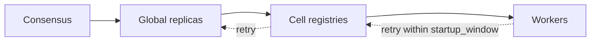

# Deployment

> Proposal; not the current implementation.

> The same worker code runs at every scale. Tiers collapse; they are never
> removed.

## 1. Problem

Development happens on a laptop and production runs on ten thousand GPUs. If
those are different code paths, the tested one is not the deployed one.

## 2. Goals

- One `join()` call, unchanged from a laptop to a cluster.
- No tinyray component on the critical path of resource allocation.
- Every tier independently restartable.

## 3. Non-goals

- Packaging, images, or scheduler configuration.
- Choosing a consensus store.

## 4. Design

### 4.1 Shapes

| Shape | Global | Cells | Node Agents | Consensus |
|---|---|---|---|---|
| Laptop | In-process | 1 in-process | 0 | None |
| Single node | In-process | 1 | 1 | None |
| Small cluster | 1 replica | 1 per node | 1 per node | Optional |
| Production | 3 or 5 replicas | 1 per fault domain | 1 per node | Required |

A tier that is collapsed still exists as an object, so the code path is
identical. Only the address changes.

### 4.2 Startup order

Nothing requires a specific order, which is the point.



A worker started before its registry retries for `startup_window` (default 300 s)
rather than failing. Schedulers start ranks in arbitrary order, and a worker that
gave up because it was early would make startup a race.

### 4.3 What the scheduler does

Everything about resources. tinyray reads the result:

| Variable | Read for |
|---|---|
| `RANK`, `SLURM_PROCID`, `OMPI_COMM_WORLD_RANK` | Rank |
| `WORLD_SIZE`, `SLURM_NTASKS` | World size |
| `LOCAL_RANK`, `SLURM_LOCALID` | Local rank |
| `CUDA_VISIBLE_DEVICES` | Reported in `meta`, never written |
| `HOSTNAME` | Reported in `meta` |

tinyray writes none of these.

### 4.4 A worker

```python
import tinyray
import torch.distributed as dist

dist.init_process_group("nccl")     # yours
trainer = build_trainer()           # yours
tinyray.join(trainer, group="trainer")   # returns immediately
```

Launched by `torchrun`, `srun` or a Kubernetes Job, with no change to how.

### 4.5 A registry replica

```bash
tinyray registry --bind 0.0.0.0:7777 --ttl 30
```

Stateless. Run two or three per cell. They do not talk to each other.

## 5. Normal flow

Consensus starts, global replicas elect a leader, cell registries start, workers
register. Any component may start before or after any other.

## 6. State and ownership

See [02-architecture/03-state-model.md](../02-architecture/03-state-model.md).
Only the consensus store needs backing up.

## 7. Correctness invariants

- No component requires another to have started first.
- No tinyray component writes a launcher environment variable.
- Restarting any single component loses no state that its owners cannot
  re-assert, except consensus.

## 8. Failure and recovery

| Component restarted | Recovery | Job impact |
|---|---|---|
| Registry replica | Repopulated in one heartbeat interval | None |
| Every registry replica | Repopulated on restart | Lookups from cache meanwhile |
| Cell registry | Its workers re-register | Cell schedules nothing briefly |
| Global replica | Leader election if it was the leader | No configuration changes briefly |
| Consensus | Restore from backup | No leadership or configuration change |
| Worker | Re-registers with a new incarnation | Its work is L3's concern |

## 9. Observability

Every component serves `/health` and `/introspect` as plain JSON, so `curl`
works without a tinyray client. See
[03-observability.md](03-observability.md).

## 10. Trade-offs

- **Two stores to operate**, one of which needs backup.
- **No packaging opinion.** tinyray provides processes, not images or charts.
- **Consensus is optional below production scale**, which means the smaller
  shapes do not exercise leadership. The fake cluster covers that gap —
  [06-testing/02-fake-cluster.md](../06-testing/02-fake-cluster.md).

## 11. Implementation and testing

| Behaviour | Test |
|---|---|
| All four shapes run identical worker code | `tests/test_deployment_shapes.py` |
| A worker started before its registry succeeds | `tests/test_membership.py` |
| No component writes launcher variables | `tests/test_suite_quality.py` |
| Every component answers `/health` without a client | `tests/test_observability.py` |
