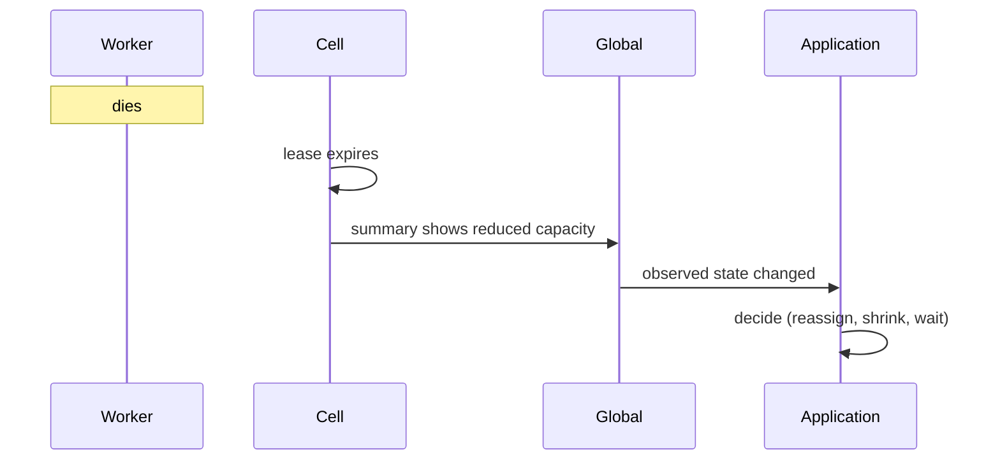

# Failure model

> Proposal; not the current implementation.

> Assume a failure is in progress. At the target scale one always is.

## 1. Problem

Public data on clusters of this size:

| System | Scale | Reliability |
|---|---:|---|
| Llama 3 405B | 16,384 H100 | 419 unplanned interruptions in 54 days — **derived** 3.09 h mean interval |
| Meta research clusters | 16,384 GPU | Predicted MTTF **1.8 hours** |
| MegaScale | 12,288 GPU | Over 100 automatic repairs in one run |

Sources: [Llama 3](https://arxiv.org/abs/2407.21783),
[Reliability in large-scale ML clusters](https://arxiv.org/abs/2410.21680),
[MegaScale](https://arxiv.org/abs/2402.15627).

A control plane whose recovery unit is the job spends most of its life
recovering.

## 2. Goals

- Every failure has a detector, a bound and a stated blast radius.
- No single failure stops the job.
- Degrade capacity rather than availability.

## 3. Non-goals

- Recovering application work. tinyray reports; L3 decides.
- Preventing hardware failure.
- Exactly-once anything.

## 4. Design

### 4.1 Detection

| What | Detector | Bound |
|---|---|---|
| Worker death or hang | Lease expiry at its cell | `lease_ttl + sweep` ~35 s |
| Worker unready but alive | Readiness predicate | `readiness interval` ~1 s |
| Supervised process exit | Node agent poll | ~1 s |
| Cell death | Cell lease expiry at global | `cell_ttl` ~15 s |
| Leader loss | Consensus lease | `leader_ttl` ~15 s |
| Stale writer | Fencing on the receive path | Immediate |
| Overload | Admission depth | Immediate |

Readiness is faster than membership, deliberately: a worker that is alive and
useless should stop receiving work long before anything concludes it is dead.

### 4.2 Blast radius

| Failure | Radius | Job impact |
|---|---|---|
| Worker | 1 worker | Capacity drops by one |
| Supervised process | 1 process | Its worker becomes unready |
| Node | 1 node | Its workers expire |
| Cell registry | Lookups in that cell | Cache serves; no membership change observed |
| Cell controller | Scheduling in that cell | Running work continues |
| Cell | 1 cell | **Derived** 2.56% of rollout capacity at 128 GPU cells |
| Global leader | New decisions | Cells continue |
| Consensus | Leadership and configuration | Everything else continues |

No row is "the job".

### 4.3 The rule that makes this hold

> No operation may require every member.

**Derived**: five million control operations all succeed with probability 0.67%
even at 99.9999% per-operation reliability. The full table is in
[01-overview/01-problem.md §8](../01-overview/01-problem.md#8-global-operations-degrade-superlinearly-in-success-probability).

Where an operation genuinely needs a fixed set — a collective communicator —
membership is frozen into an epoch and the operation requires all members *of
that epoch*. A member that returns joins the next one.

### 4.4 Partition behaviour

| Partition | Behaviour |
|---|---|
| Worker from cell | Lease expires; worker re-registers on reconnect |
| Node from cell | Node lease expires; its processes are reclaimed |
| Cell from global | Cell finishes valid work, requests none; stops when its lease expires |
| Global from consensus | No leadership or configuration change; existing state stands |
| Reader from every replica | Lookups from cache, reported as stale |

Recovery from any partition passes through fencing. Nothing resumes its previous
write authority automatically.

## 5. Normal flow

The diagram cannot show: tinyray makes no decision in the last step; the cell
noticed within one TTL while global learned within one cell interval; and no
component attempted to restart anything.

## 6. State and ownership

Failure state is soft. There is no failure log in tinyray beyond metrics and
recent output; an application needing failure history keeps it.

## 7. Correctness invariants

- Every failure mode has a named detector and a stated bound.
- No detector infers liveness from process parenthood.
- Recovery from a partition is fenced.
- A degraded component reports degradation rather than failing silently.
- No failure of one cell changes another cell's membership or communicators.

## 8. Failure and recovery

| Failure | Recovery | Automatic |
|---|---|---|
| Worker dies | Expires; re-registers if restarted | Detection yes, restart no |
| Worker hangs | Expires | Yes |
| Supervised process exits | Reported | Detection yes, restart no |
| Node lost | Its workers expire | Yes |
| Registry replica lost | Failover; catches up | Yes |
| Every replica lost | Cache; repopulates | Yes |
| Cell controller lost | Standby takes over with a new generation | Yes |
| Global leader lost | Election | Yes |
| Consensus lost | Restore from backup | No |
| Stale process returns | Fenced out | Yes |

**tinyray does not restart anything it did not start**, and does not restart a
member of a collective even when it did. Restarting one rank without rebuilding
the communicator leaves the others blocked forever — a hang, not an error.

## 9. Observability

| Metric | Purpose |
|---|---|
| `membership_evictions_total` | Failure rate |
| `fencing_rejections_total` | Split brain, expected during restarts |
| `registry_served_from_stale` | Registry reachability |
| `leader_changes_total` | Control-plane churn |
| `cell_ready_capacity` | Degradation, per cell |
| `readiness_failures_by_reason` | Why a worker is not usable |

## 10. Trade-offs

- **Detection is not instant.** Bounded and reported; shortening TTLs evicts
  healthy workers during pauses.
- **tinyray never heals.** It detects and reports. Every recovery policy needs
  application knowledge tinyray refuses to have.
- **A cell controller is a local single point** for scheduling, though not for
  running work.
- **Cell sizing is the operator's decision** and determines blast radius.

## 11. Implementation and testing

Every row of §4.2 has a chaos case —
[06-testing/03-chaos.md](../06-testing/03-chaos.md). A failure mode with no
injection test is an assumption, not a design.
