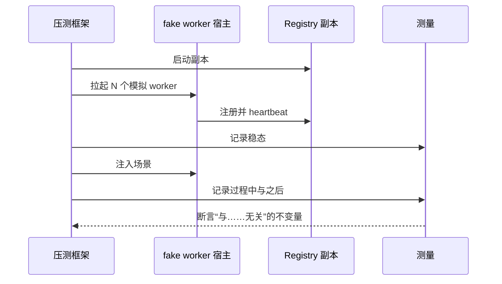

# Fake Cluster

> 提案；当前未实现。

> 在预约任何一张 GPU 之前，用 100,000 个 worker 验证控制面。这是整个计划里回报最高的一项。

## 1. 问题

控制面的故障模式是二次复杂度关系、lease 风暴和基数爆炸。它们全都只在规模上出现，而且没有
一个需要 GPU 才能复现。等到有集群时间才去发现它们，意味着在实验过程中发现它们。

## 2. 目标

- 在普通硬件上运行 10,000 到 100,000 个模拟 worker。
- 走真实 worker 走的同一条代码路径。
- 产出用于冻结设计的规模数据。
- 让 membership 抖动、分区和过载可复现。

## 3. 非目标

- 模拟 GPU、模型或数据面。
- 预测真实网络行为。

## 4. 设计

### 4.1 fake worker 是什么

fake worker 是一个**没有应用的真实 tinyray worker**。它注册、heartbeat、发布 readiness、
应答控制调用、提供 `/introspect` —— 使用的是 trainer 会用的同一批模块。它缺的只是 L3 和 L4。

这只有在分层把它们分开之后才可能
（[02-architecture/01-layering.md](../02-architecture/01-layering.md)）。因此 fake cluster
不是额外工作，而是边界的必然产物 —— 而且它本身就是对边界的测试：如果一个 fake worker 需要
某个领域概念才能注册，说明边界已经被越过。

### 4.2 密度

模拟 worker 不是一个进程一个。三种模式：

| 模式 | 每进程 worker 数 | 保真度 | 用途 |
|---|---:|---|---|
| 线程 | 约 1,000 | 共享一个 transport | membership 与 discovery 负载 |
| 异步 | 约 10,000 | 共享一个事件循环 | lease 与抖动风暴 |
| 进程 | 1 | 完整 | 正确性抽查 |

线程与异步模式对 Registry 和协议的压力是真实的；它们不演练每进程隔离，那是进程模式的用途。
一次运行会混合使用。

**推导**目标：异步模式下 100,000 个 worker 约需在若干台机器上共 10 个宿主进程。

### 4.3 场景

| 场景 | 产出 |
|---|---|
| 稳态 | 基线 heartbeat 与 lookup 速率；共识写入速率 |
| 冷启动 | N 个 worker 从零注册完毕的时间 |
| 抖动 | 持续重启下的注册与驱逐速率 |
| 大规模故障 | 同时杀掉 5% 的 worker |
| 分区 | 一个 Cell 与 global 隔离超过其 lease |
| Registry 丢失 | lookup 持续进行时杀掉全部副本 |
| 过载 | 生产方持续超过 Admission 界限 |
| 版本风暴 | 全部 worker 同时改变 readiness |

### 4.4 冻结设计所需的测量

以下全部**待测**，且是上真实硬件之前的门禁：

| 测量 | 目标 | 原因 |
|---|---|---|
| 每副本 Registry 吞吐 | > 3 倍稳态负载 | 为抖动留余量 |
| 控制延迟 p99 | < 200 ms | SLO |
| 控制延迟 p99.9 | < 1 s | SLO |
| 共识写入/s | 与 worker 数无关 | 验证状态拆分 |
| lookup 响应字节 | 与集群规模无关 | 验证作用域机制 |
| Cell summary 字节 | 与 worker 数无关 | 验证聚合 |
| global 指标基数 | 与 worker 数无关 | 验证归约 |
| worker 检测时间 | Cell 处 < 5 s | 故障模型 |
| Cell 切换 | < 30 s | 故障模型 |
| 10 万 worker 冷启动 | 待确定 | 运维规划 |
| Registry 每千 worker 内存 | 待确定 | 容量规划 |

那四条“与……无关”是本设计的核心论断。任一条开始跟随 worker 数，就说明某处退回到了旧架构。

### 4.5 规模阶梯

```
1 进程 -> 1 Cell -> 4 Cell -> 1 万 worker -> 10 万 worker -> 真实 GPU
```

每一级通过后才进入下一级。真实硬件排在最后，且只用于模拟无法覆盖的部分：NCCL 行为、设备
分配和数据面。

## 5. 正常流程



图中无法表达：fake worker 使用的是生产模块；框架**断言**不变量而不只是记录；场景若让某条
“无关”指标不再无关，本次运行即失败。

## 6. 状态与所有权

框架拥有场景与测量。fake worker 拥有自己的注册，与真实 worker 完全一致。

## 7. 正确性不变量

- fake worker 使用与真实 worker 相同的 membership、Readiness、discovery 和 transport 模块。
- 没有 fake worker 引入任何应用概念。
- 每条“与 worker 数无关”的指标都被断言，而不只是被绘图。
- 不可复现的场景不算结果。

## 8. 故障与恢复

框架区分三种结果：控制面表现正常、控制面在声明的界限内降级、控制面失败。降级是带记录界限的
通过，只有失败才是失败。

## 9. 可观测性

框架记录与生产相同的序列，外加自己的注入时间线，因此指标变化可以归因到某个场景步骤。

## 10. 取舍

- **模拟 worker 不是真实 worker。** 没有真实框架带来的 GIL 争用，没有 page cache 压力，
  没有 NCCL。框架测量的是控制面，不宣称别的。
- **线程与异步密度掩盖了每进程限制** —— 文件描述符、内存、调度行为。进程模式只在小 N 下
  覆盖这些。
- **网络保真度低。** loopback 或单一 fabric，不是真实的多机架拓扑。延迟数字偏乐观。

之所以逐条写明，是因为很容易把一次通过的 10 万模拟当成“集群一定能跑”的证明。它证明的是：
集群跑不起来时，原因不会是控制面。

## 11. 实现与测试

计划：不变量断言在 `tests/test_fake_cluster.py`，长时场景运行在
`scripts/fake_cluster.py`。

| Behavior | Test case |
|---|---|
| 共识写入与 worker 数无关 | `test_consensus_writes_are_flat` |
| lookup 字节与集群规模无关 | `test_lookup_bytes_are_flat` |
| Cell summary 字节与 worker 数无关 | `test_summary_bytes_are_flat` |
| global 基数与 worker 数无关 | `test_cardinality_is_flat` |
| 5% 同时丢失可存活 | `test_mass_failure` |
| 持续过载时丢弃而非停滞 | `test_overload_sheds` |
| fake worker 不引入应用概念 | `test_fake_worker_is_pure_l2` |

最后一条是伪装成规模测试的边界测试，也是这套框架造起来很便宜的原因。
