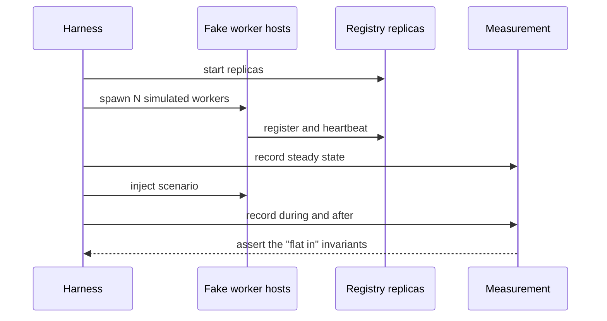

# Fake cluster

> Proposal; not the current implementation.

> Validate the control plane at 100,000 workers before booking a single GPU.
> This is the highest-return item in the whole plan.

## 1. Problem

The control plane's failure modes are quadratic relationships, lease storms and
cardinality explosions. All of them appear at scale and none of them need a GPU
to reproduce. Waiting for cluster time to discover them means discovering them
during an experiment.

## 2. Goals

- Run 10,000 to 100,000 simulated workers on commodity hardware.
- Exercise the same code path a real worker uses.
- Produce the scaling numbers the design is frozen against.
- Make membership churn, partition and overload reproducible.

## 3. Non-goals

- Simulating GPUs, models or the data plane.
- Predicting real network behaviour.

## 4. Design

### 4.1 What a fake worker is

A fake worker is a **real tinyray worker with no application**. It registers,
heartbeats, publishes readiness, answers control calls and serves
`/introspect` — using the same modules a trainer would. What it lacks is L3 and
L4.

That is only possible because the layering separates them
([02-architecture/01-layering.md](../02-architecture/01-layering.md)). The fake
cluster is therefore not extra work; it is a consequence of the boundary, and it
is a test *of* the boundary: if a fake worker needs a domain concept to
register, the boundary has been crossed.

### 4.2 Density

Simulated workers are not one process each. Three modes:

| Mode | Workers per process | Fidelity | Use |
|---|---:|---|---|
| Threaded | ~1,000 | Shares one transport | Membership and discovery load |
| Async | ~10,000 | Shares one event loop | Lease and churn storms |
| Process | 1 | Full | Correctness spot checks |

Threaded and async modes exercise the registry and the protocol truthfully; they
do not exercise per-process isolation, which is what the process mode is for. A
run mixes them.

**Derived** target: 100,000 workers in async mode is ~10 host processes across a
handful of machines.

### 4.3 Scenarios

| Scenario | What it produces |
|---|---|
| Steady state | Baseline heartbeat and lookup rates; consensus write rate |
| Cold start | Time for N workers to register from nothing |
| Churn | Registration and eviction rate under continuous restart |
| Mass failure | 5% of workers killed simultaneously |
| Partition | A cell isolated from global for longer than its lease |
| Registry loss | Every replica killed while lookups continue |
| Overload | Producers exceeding admission for a sustained period |
| Version storm | Every worker changing readiness at once |

### 4.4 The measurements to freeze the design

These are **to be measured** and are the gate before real hardware:

| Measurement | Target | Why |
|---|---|---|
| Registry throughput per replica | > 3x steady-state load | Headroom for churn |
| Control latency p99 | < 200 ms | SLO |
| Control latency p99.9 | < 1 s | SLO |
| Consensus writes/s | Flat in worker count | Validates the state split |
| Lookup response bytes | Flat in cluster size | Validates scoping |
| Cell summary bytes | Flat in worker count | Validates aggregation |
| Global metric cardinality | Flat in worker count | Validates reduction |
| Worker detection time | < 5 s at the cell | Failure model |
| Cell failover | < 30 s | Failure model |
| Cold start, 100k workers | To be established | Operational planning |
| Memory per 1,000 workers at the registry | To be established | Sizing |

The four "flat in" rows are the design's central claims. If any tracks worker
count, something has regressed to the previous architecture.

### 4.5 Scale ladder

```
1 process -> 1 cell -> 4 cells -> 10k workers -> 100k workers -> real GPUs
```

Each rung must pass before the next. Real hardware is last, and only for what
simulation cannot cover: NCCL behaviour, device assignment, and the data plane.

## 5. Normal flow



The diagram cannot show: fake workers use the production modules; the harness
asserts invariants rather than only recording them; and a scenario fails the run
if a flat metric stops being flat.

## 6. State and ownership

The harness owns the scenario and the measurements. Fake workers own their own
registrations, exactly as real ones do.

## 7. Correctness invariants

- A fake worker uses the same membership, readiness, discovery and transport
  modules as a real one.
- No fake worker imports an application concept.
- Every "flat in worker count" metric is asserted, not merely plotted.
- A scenario that cannot be reproduced is not a result.

## 8. Failure and recovery

The harness distinguishes three outcomes: the control plane behaved, the control
plane degraded within stated bounds, or the control plane failed. Degradation is
a pass with a recorded bound; only failure is a failure.

## 9. Observability

The harness records the same series production does, plus its own injection
timeline, so a metric change can be attributed to a scenario step.

## 10. Trade-offs

- **Simulated workers are not real workers.** No GIL contention from a real
  framework, no page cache pressure, no NCCL. The harness measures the control
  plane and claims nothing else.
- **Threaded and async density hides per-process limits** — file descriptors,
  memory, scheduler behaviour. The process mode covers those at small N only.
- **Network fidelity is low.** Loopback or a single fabric, not a real
  multi-rack topology. Latency numbers are optimistic.

Each is stated because the temptation is to treat a passing 100k simulation as
proof the cluster will work. It is proof that the control plane is not the
reason it will not.

## 11. Implementation and testing

Proposed: `tests/test_fake_cluster.py` for the invariant assertions, and
`scripts/fake_cluster.py` for long-running scenario runs.

| Behaviour | Test case |
|---|---|
| Consensus writes flat in worker count | `test_consensus_writes_are_flat` |
| Lookup bytes flat in cluster size | `test_lookup_bytes_are_flat` |
| Cell summary bytes flat in worker count | `test_summary_bytes_are_flat` |
| Global cardinality flat in worker count | `test_cardinality_is_flat` |
| 5% simultaneous loss is survived | `test_mass_failure` |
| Sustained overload sheds rather than stalls | `test_overload_sheds` |
| A fake worker imports no application concept | `test_fake_worker_is_pure_l2` |

The last one is the boundary test disguised as a scale test, and it is the
reason this harness is cheap to build.
